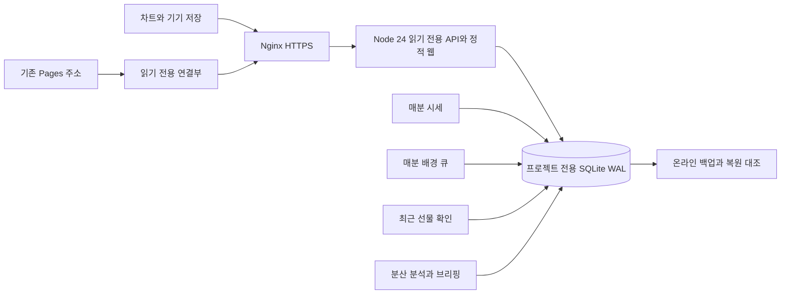

# Coin Desk VPS 이전과 배포

2026-10-10 KST: **0.25는 150개 종목 개편**입니다. 현재 코드·서비스별 이미지·원천 상태·배포와 복구 검증은 [0.25 운영 기록](docs/audit-25/README.md)을 따릅니다. 아래 0.21 식별자와 8개 종목 검사는 최초 VPS 이전 당시 기록입니다. 주소·포트·프로젝트 격리는 유지합니다.

2026-10-03 KST 기준 **VPS 운영 전환과 PR #43 차트 수정 배포 완료**입니다. [최신 검증](docs/audit-21/completion/README.md). 사용자 요청으로 48시간 점검·대기 조건은 폐지했습니다. [실제 전환 기록](docs/audit-21/live/README.md)과 [앞선 UX 배포](docs/audit-21/closeout/deployment/README.md)는 당시 이력입니다. 운영 D1 19개 테이블·149,190행을 검증해 이관했습니다. `/srv/services/coin-desk/current`와 API는 `vps-7e72771fa7feac35`, 수집기·hub·백업은 `vps-f1546991c2aab31a`입니다. 루프백 포트는 `18420`, HTTPS는 `https://coin-desk.62.171.141.206.sslip.io`입니다. 기존 Pages도 동일 VPS의 읽기 API에 연결합니다.

**이관 후 `npm run deploy`와 `npm run deploy:collectors`를 실행하지 마세요.** 이 명령은 과거 Cloudflare 수집기를 다시 배포합니다. 예전 프로젝트 Cron은 중지했고 VPS 네 수집기가 운영 쓰기를 담당합니다. D1은 최소 30일 보존합니다. 후속 웹 배포는 기존 해시 자산 보존 후 `npm run deploy:pages`, 서버 변경은 검증된 새 VPS 릴리스만 배포합니다. 아래 단계는 재배포 명령 묶음이 아니라 최초 이관 절차와 복구 안내입니다.

## 유지하는 제품

### 전송·운영 확인 도구

Nginx 1.24에서 새 HTTPS를 구성하는 스크립트는 `listen 443 ssl http2;`를 사용합니다. [공식 HTTP/2 문서](https://nginx.org/en/docs/http/ngx_http_v2_module.html)의 `http2 on`은 1.25.1 이상 문법입니다. **현재 VPS는 기존 설정으로 이미 실제 ALPN `h2`를 제공합니다.** 명시 설정 실험은 공유 listener 경고와 성능 이득 미확인 때문에 원래 파일로 복원했습니다. 현재 서버에 이 설정을 다시 적용할 필요가 없습니다. 향후 독립 환경에서 HTTP/2를 활성화할 경우 `enable_http2.py`는 소유 파일만 백업·수정하며 플랫폼 잠금, `nginx -t`, 무중단 reload와 실제 ALPN 확인을 수행하고 실패하면 복구합니다.

검증된 운영 도구는 `/srv/services/coin-desk/ops/current`에 설치했습니다(PR #42, `1a2f6a792fa3`). 과거 릴리스의 `route_port.py`는 API·SSE 두 경로를 처리하지 못하므로 직접 사용하지 않습니다. 설치한 도구는 수집기나 DB를 변경하지 않습니다.

`route_port.py`는 API와 `/api/v1/quotes/stream`의 두 upstream을 함께 변경합니다. 서로 다른 포트나 외부 upstream이 섞인 설정은 수정하지 않습니다. 이 도구로 수동 포트 변경 시에도 `/srv/platform/nginx-edit.lock`을 잡고 실행합니다.

운영 집계는 `python3 deploy/vps/operations_report.py --database /srv/services/coin-desk/shared/data/coin-desk.sqlite --day YYYY-MM-DD --backup-status /srv/services/coin-desk/shared/data/backup-status.json --backup-dir /srv/services/coin-desk/backups --output /srv/services/coin-desk/audit/operations-YYYY-MM-DD.json`으로 만듭니다. SQLite는 읽기 전용으로 열고 UTC 하루·부분 구간, 예약 누락·오류, 브리핑·원천 상태·백업·파일 용량을 구분합니다. `--baseline`으로 이전 보고서를 지정하면 실제 경과 구간의 용량 차이를 계산하며 부분 구간을 하루 증가량으로 환산하지 않습니다. 48시간 대기나 새 수집을 시작하는 명령이 아닙니다.

웹 0.21은 여덟 코인 시장을 첫 화면으로 제공하고 코인 상세에서 지표를 선택합니다. BTC 상세의 기본 MVRV, 가격 위치 밴드와 자체 BTC 로그회귀 레인보우를 유지합니다. React·Lightweight Charts·계산 코드·읽기 API를 그대로 사용합니다. DB에는 기존 데이터와 예약 이력을 이관합니다. 원천·단위·결측·확정 봉·730일 계산 조건을 유지합니다. 48시간 통계는 과거 실행 이력을 설명하는 참고값이며 출시 조건이 아닙니다. X 추가 수집이나 새 자료함 기능은 이번 이전에 추가하지 않습니다.

API만 수정할 때는 기존 전역 `COIN_DESK_IMAGE`·`COIN_DESK_RELEASE`를 보존하고 `COIN_DESK_API_IMAGE`·`COIN_DESK_API_RELEASE`만 새 값으로 지정합니다. 새 릴리스에서 다른 서비스의 Compose 설정이 기존과 동일한지 비교한 뒤 `up -d --no-deps --wait api`로 해당 서비스만 교체합니다. 이후 실제 읽기 API·HTTPS와 다른 컨테이너의 ID·시작 시각을 확인하고 `current`를 승격합니다. 실패하면 이전 릴리스의 env와 Compose로 API만 복구하며 DB와 수집기를 재시작하지 않습니다. 전체 코드 복구용 `rollback.sh`는 API만 복구하는 명령과 구분합니다. 이미지와 env는 프로젝트의 비공개 릴리스별 파일을 사용합니다.

## 새 구조



- API의 SQLite 연결은 실제 `readOnly`입니다. 방문자가 시세 수집이나 DB 쓰기를 시작하지 않습니다.
- 수집 4개 프로세스는 기존 `worker/collector-entry.ts`, `scheduled.ts`, `observations.ts`를 재사용합니다. 공개 프록시 없이 기존 허용 원천에 직접 연결합니다.
- 정시 실행은 작업 완료와 독립적으로 예약하며, 겹친 실행·실패·실제 시작/완료를 기록합니다. 늦은 작업의 따라잡기 요청을 한꺼번에 발생시키지 않습니다. 정상 실행 기록과 원천 데이터의 최신성은 별도로 확인합니다.
- SQLite WAL, 10초 잠금 대기, 원자적 batch, 수집별 기존 lease와 재시도를 유지합니다. 한 서버·현재 데이터 규모에 맞춘 구조이며 다중 서버 DB 구성은 아닙니다.
- 백업은 SQLite 온라인 백업 API로 일관된 스냅샷을 만들고, 별도 DB에 복원해 전체 사용자 테이블·스키마·인덱스·행 해시·무결성을 대조합니다. 14일·2 GiB 예산을 기본으로 하며 최소 최신 2개를 보존합니다. 예산 초과와 실패는 상태에 남깁니다. **동일 VPS의 백업은 외부 재해 복구 백업이 아닙니다.**
- 원래 `/api/v1/status`, `/health`와 응답 필드를 유지합니다. VPS의 `/healthz`는 프로세스·스키마·DB 검사만, `/api/v1/runtime`은 수집 실행부·백업 상태만 표시합니다. 원천 정상은 기존 상태 API로 별도 판단합니다.

## 격리와 자원

프로젝트 루트는 `/srv/services/coin-desk`, Compose 이름은 `coin-desk`, 네트워크는 `coin-desk-private`입니다. 외부에 DB 포트를 열지 않습니다. API는 소유권을 검증한 `127.0.0.1:18420`에 바인딩합니다.

```text
/srv/services/coin-desk/
  releases/vps-<내용해시>/     변경 없는 릴리스 소스
  shared/data/                coin-desk.sqlite와 백업 상태
  shared/secrets/             릴리스별 env, 디렉터리 700·파일 600
  backups/                    검증된 DB 스냅샷
  audit/                      비공개 운영·전환 증거
  current -> releases/...     검증 이후에만 승격
```

ACME 공개 챌린지는 `/var/www/coin-desk-acme`에 분리했습니다. 서비스 루트 접근 권한을 넓히지 않습니다. Nginx·라우팅·코드 롤백 중 전역 Nginx를 변경할 때는 `flock -w 30 /srv/platform/nginx-edit.lock`으로 해당 작업을 직렬화합니다.

컨테이너는 UID 10001, 읽기 전용 루트, 권한 제거, 임시 공간 제한, 로그 10 MiB×3, `restart: unless-stopped`를 사용합니다. API 1 CPU/768 MiB, 각 수집 0.25 CPU/384 MiB, 백업 0.25 CPU/512 MiB를 제안합니다. 배포 전 **실제 여유 메모리 3 GiB·디스크 8 GiB 이상**을 요구하며 부족하면 설치를 중단합니다. 실제 사전 검사에서 여유 자원을 확인했습니다. Node 이미지는 `24.18.0-bookworm-slim` 태그를 고정했으며 서버 Docker 빌드와 실행을 검증했습니다.

`/srv/hannun`, `/opt/codex-gateway`, `/opt/llama.cpp`, 기존 포트·Nginx·DB·플랫폼 timer를 보존합니다. 삭제된 `/srv/mirae`를 복원하지 않습니다. 전역 Docker prune나 다른 Compose 프로젝트의 down을 실행하지 않습니다.

## 로컬 검사와 배포 묶음

```powershell
npm run check
npm run test:server
npm run test:recovery
npm run build
npm run package:vps
```

[릴리스 생성기](scripts/vps_release.py)는 허용한 소스만 `deployment-artifacts/vps-<해시>.tar.gz`에 넣고 모든 파일과 압축 파일의 SHA-256을 확인합니다. `.env`, 키, DB, `work`, 개인 원본을 포함하지 않습니다. [Compose](deploy/vps/compose.yaml)와 [Dockerfile](Dockerfile)을 함께 제공합니다. 빌드/원격 실행 성공을 패키지 생성 성공과 혼동하지 않습니다.

## 실제 이전 순서

1. 승인된 `chanhee-vps` SSH로 접속하고 실제 서버와 `/srv/platform`의 상태·템플릿을 확인합니다. [preflight.py](deploy/vps/preflight.py)는 컨테이너 건강 상태·활성 서비스/timer·여유 자원·포트·Nginx를 읽기 전용으로 확인합니다. 키·서비스 환경변수는 출력하지 않습니다. SSH 호스트 검증을 끄지 않습니다.
2. Cloudflare 공식 D1 export로 **운영 전체 SQL**을 비공개로 확보합니다. 쿼리 표본이나 로컬 캐시는 운영 export의 대체물이 아닙니다. 운영 쪽 자동 발견 테이블 수·행 수·스키마를 export와 대조합니다. 원본을 보존합니다.
3. 서버의 비공개 별도 폴더에서 신규 DB에 이관합니다. [import_d1_export.py](scripts/import_d1_export.py)는 기존 파일 덮어쓰기, 외부 DB ATTACH, 확장 로딩, 스키마 불일치를 거부합니다. 과거 마이그레이션을 검증된 원장으로 기록하므로 `0008`을 재실행해 예약 이력을 재구성하지 않습니다.

   ```bash
   python3 scripts/import_d1_export.py --source /private/export.sql --destination /private/coin-desk.sqlite
   ```

   검증 보고서는 새 DB 옆 `coin-desk.import.json`입니다. 신규 DB와 보고서를 프로젝트 `shared/data`에 설치하고 원본 export는 비공개로 보관합니다. Node 부트스트랩에서 import 검증 없이 기존 DB에 마이그레이션을 재적용하지 않습니다.
4. 내용을 검증한 릴리스 압축을 **새** `releases/vps-<해시>` 폴더에 풀고 그 폴더에서 `bash deploy/vps/stage.sh <빈 포트>`를 실행합니다. 소스 체크섬→기존 서비스 기준선→Docker 빌드→추가형 마이그레이션→읽기 전용 API·백업 검사 순서입니다. 수집 프로파일과 `current` 승격은 아직 꺼져 있습니다. 이 단계의 shadow 검사는 정지된 수집에 따른 `/health` 503을 그대로 기록하며 원천 정상이라고 판정하지 않습니다. 활성화 이후 검사는 이 예외 없이 health 200을 요구합니다.
5. 소유한 호스트 또는 DNS를 확인한 sslip.io 호스트를 지정합니다. 현재 운영 호스트는 coin-desk.62.171.141.206.sslip.io입니다. 기존 Certbot·갱신 timer를 확인한 뒤 `bash deploy/vps/https.sh <검증된 호스트> <포트>`를 실행합니다. DNS가 승인된 VPS로 향하는지 확인하고 다른 사이트의 호스트 소유권을 검사합니다. 새 Coin Desk 설정만 작성하며 기존 설정을 백업하고 `nginx -t` 후 reload합니다. 인증서 발급 실패 때 해당 새 라우트를 복구합니다. 자체 서명 인증서나 `--insecure`로 통과시키지 않습니다. HTTPS와 갱신 예약도 실제로 검증합니다.
6. 공개 주소의 읽기 API·BTC MVRV 실제 이력·여덟 코인·데이터 단위와 백업을 검사합니다. stage는 DB 쓰기 없이 8개 원천의 제한된 접근 검사를 수행하며 실패하면 중단합니다. 이것은 103개 원천의 전체 정상 검사가 아닙니다. 운영 원천 접근성이 아직 확인되지 않은 상태에서 Cloudflare 수집을 끄지 않습니다.
7. 전환 때 기존 `btc-desk` main과 `btc-desk-quotes`의 예약 및 **overview 수동 갱신**까지 모두 동결합니다. 실행 중 수집이 끝났는지 확인하고 마지막 전체 D1 export를 다시 대조합니다. 배경·분석 Worker의 서비스 호출도 멈춘 상태인지 확인합니다. 다른 프로젝트 Cron을 변경하지 않습니다. 필요하면 잠깐 읽기 전용 전환 안내를 표시합니다.
8. VPS 프로젝트 컨테이너를 정지한 동안 **최종 검증 DB**를 설치합니다. 기존 스냅샷은 프로젝트 백업에 보존하며 라이브 DB 파일을 실행 중 덮어쓰지 않습니다. 원장·스키마·행 수·내용 해시·예산과 커서를 최종 대조합니다. 예산/커서 키가 원래 없으면 유실로 표시하지 않습니다.
9. 수행한 실제 동결 증거를 `audit/legacy-writers-frozen.json`에 기록합니다. `allProjectWritersFrozen`, `includesOnDemandOverview`, `inflightDrained`, `productionSnapshotInstalled`는 실제 확인한 경우에만 true이며 `finalExportSha256`, `checkedAt`을 포함합니다. 이것은 추가 승인 질문이 아니라 작업 증거입니다. 이 파일이 없거나 1시간 이상 오래됐으면 활성화가 거부됩니다.
10. `bash deploy/vps/activate.sh <HTTPS 호스트>`를 실행합니다. 수집 4개를 시작하고 직접 수집/overview 호출 없이 300초 동안 읽기 전용 DB 비교를 합니다. 각 실행부 2회 이상 성공, 핵심 시세 6개의 실제 체결·확인 시각 증가, 최근 선물 9개 확인 증가를 요구합니다. 실패하면 증거를 보존하고 승격하지 않습니다. 성공 후 기존 서비스/timer가 악화되지 않았는지 확인하고 `current`와 `/srv/platform/SERVICES.md`에 해당 프로젝트만 기록합니다. 이는 짧은 표본이며 무방문 하루 전체 증거가 아닙니다.
11. 기존 Pages 주소를 유지하려면 [vps-gateway.ts](worker/vps-gateway.ts)와 [별도 gateway 설정](wrangler.vps-gateway.jsonc)의 `VPS_BASE_URL`을 검증된 HTTPS로 설정하고 **그 설정만** 배포합니다. 이 설정에는 D1·예약·수집 바인딩이 없습니다. 브라우저 쿠키나 인증 헤더도 VPS로 넘기지 않습니다. 검증 전 빈 URL로 배포하지 않습니다. 원래 `npm run deploy`는 Cloudflare 수집을 다시 켜므로 이전 후 실행하지 않습니다. 앞 단계 7의 동결 중에도 gateway 설정으로 읽기 전용 VPS를 연결할 수 있습니다.

기존 주소를 유지하면 기기 IndexedDB와 저장 설정도 같은 origin에서 유지됩니다. 새 VPS 호스트를 직접 쓰면 다른 origin이므로 기존 개인 자료함에서 **기기 백업→새 주소에서 기기 복원**해야 합니다. 개인 백업을 서버나 저장소로 전송하지 않습니다. 확장의 지정 사이트 권한은 현재 기존 Pages 주소이므로 새 호스트에서 자동 작동한다고 표현하지 않습니다.

## 복구와 운영 마감

- **코드 복구:** `bash deploy/vps/rollback.sh <이전에 검증한 릴리스>`를 사용합니다. 기존 스키마와의 호환 검사·API 건강·프로젝트 Nginx 포트·공개 HTTPS를 검사하고 `current`를 복구합니다. DB를 이전 시각으로 되돌리지 않습니다. 현재 릴리스 자료와 이미지는 유지합니다.
- **데이터 복구:** 프로젝트의 API·수집·백업을 모두 정지하고 아래 명령으로 새로운 경로에 복원합니다. 원본 백업과 기존 DB는 보존합니다. 검증 후 신규 DB를 설치하고 API→수집→백업을 다시 확인합니다.

  ```bash
  python3 scripts/vps_backup.py restore --snapshot backups/<시각>/snapshot.sqlite --manifest backups/<시각>/manifest.json --destination /private/restored.sqlite
  ```

- 기존 D1을 최소 30일 읽기 전용으로 유지해 대조·복구에 사용합니다. 이전이 끝났다고 DB나 과거 비용 증거를 삭제하지 않습니다. 기존 Cloudflare의 미확인 하루 비용과 엄격한 공백 실패를 VPS의 정상 결과로 소급해 바꾸지 않습니다.
- 2026-10-03 사용자 요청으로 48시간 대기·합격 조건을 폐지했습니다. 배포 직후 실제 API·핵심 시세/선물/온체인 갱신·검증된 백업을 확인합니다. 기존 완전 UTC 하루의 자원·디스크·DB 증가량·브리핑·백업 검증은 별도로 유지합니다. 기존 수집 이력과 오류·공백은 삭제하지 않습니다.
- 외부 저장소에 별도 암호화 백업을 둘 위치는 아직 지정하지 않았습니다. 동일 서버 고장까지 대비했다고 표현하지 않습니다. 실제 Apple Safari·VoiceOver는 기기가 없어 검증 대기입니다.

## 근거와 검사 범위

SQLite 온라인 백업과 Node 내장 SQLite를 사용합니다. [SQLite 공식 백업 API](https://sqlite.org/backup.html) · [Node 24 SQLite](https://nodejs.org/docs/latest-v24.x/api/sqlite.html) · [Compose 준비 상태와 의존 순서](https://docs.docker.com/compose/how-tos/startup-order/).

최신 검사는 [실제 운영 기록](docs/audit-21/live/README.md), 이전 단계는 [VPS 검증 기록](docs/audit-vps/README.md)에 보관합니다. 로컬 코드 검사, Docker 실행, 운영 데이터 이전, HTTPS 전환, 하루 안정성을 각각 구분합니다.


## 0.21 시장·실시간 가격 추가

`quote-hub`는 공개 거래소 스트림을 중앙 수신하고 API가 SSE를 중계합니다. 외부 포트와 DB 볼륨을 갖지 않습니다. `stage.sh`는 api·backup·quote-hub를 올리되 기존 수집기는 활성화하지 않습니다. Nginx의 `/api/v1/quotes/stream`은 버퍼링을 끕니다. 기존 quote 수집의 분 단위 저장은 유지하며 tick은 DB에 저장하지 않습니다.

새 릴리스의 `/assets` 파일은 `/srv/services/coin-desk/shared/assets`에도 복사합니다. 현재 빌드에 없는 예전 해시 파일은 API가 이 읽기 전용 디렉터리에서 찾아 응답합니다. 충돌·경로 이탈을 거부하고 배포 시 예전 파일을 삭제하지 않습니다. 용량은 운영 디스크 관측에 포함합니다.

`COIN_DESK_PUBLIC_ORIGIN`은 실제 HTTPS 호스트로 설정합니다. 현재 값은 `https://coin-desk.62.171.141.206.sslip.io`이며 인증서 발급과 갱신 모의 실행을 확인했습니다. API는 이 고정 설정으로 HTML의 공개 주소 메타데이터를 맞추고 요청 Host 값을 신뢰해 생성하지 않습니다. 추가 시세 프로세스를 포함해 사전 자원 검사는 가용 메모리 3.5GiB를 요구합니다.

[0.21 감사 기록](docs/audit-21/README.md). 로컬 Docker 대신 VPS에서 실제 컨테이너·운영 이관·HTTPS를 검증했습니다. 최초 네트워크 차단 기록은 과거 이력입니다.

## 로컬에서 수집까지 연결하기

읽기 전용 API만 실행하면 과거 캐시를 1분마다 다시 조회해도 시세가 최신으로 바뀌지 않습니다. 네트워크가 허용된 환경에서 다음 순서로 기존 공개 캐시의 별도 복사본을 준비합니다. 운영 D1 이전 완료 증거로 사용하지 않습니다.

```powershell
npm run build
npm run build:server
python scripts/vps_rehearsal.py --source work/local.sqlite --output work/live-runtime
# 위 명령이 반환한 database 경로를 사용합니다. 원본 work/local.sqlite를 지정하지 않습니다.
npm run start:live -- --database work/live-runtime/<생성된 폴더>/coin-desk.sqlite --port 5209 --hub-port 8091
```

`start:live`는 검증된 마이그레이션 원장·DB 무결성·포트·원천 접근을 먼저 확인합니다. 최소 한 거래소와 Coin Metrics 연결이 실패하면 수집을 시작하지 않고 진단을 남깁니다. 다른 원천 실패는 출력에 보존하며 모든 원천 정상으로 표시하지 않습니다. 통과하면 읽기 API·시세 hub·quotes/background/recent/analysis 수집기·백업의 7개 프로세스를 함께 실행합니다. 시작 직후부터 틱을 수신하고 분 단위 수집기는 다음 분 경계부터 실행합니다. 온체인 관측 주기와 기존 재시도·예약 예산은 유지합니다.

한 프로세스가 종료되면 나머지 소유 프로세스도 종료해 API만 남는 상태를 방지합니다. Ctrl+C도 해당 묶음만 종료합니다. 로컬 재시작은 같은 명령으로 수행하며 VPS에서는 기존 Compose 재시작 정책을 사용합니다. DB 파일을 실행 중 덮어쓰지 않습니다. 브라우저 요청은 수집을 실행하지 않습니다.

확인 항목은 `/api/v1/runtime`의 4개 수집 기록, `/api/v1/market`의 `collection`과 실제 `quote.time`/`fetchedAt`, `/api/v1/status`의 각 원천 관측일입니다. `healthz`의 프로세스 정상과 데이터 최신성을 구분합니다. `collection`이 없거나 미실행이면 현재가를 정상 수집 중으로 표현하지 않습니다. 가격은 초 단위 수신·분 단위 저장이며 온체인은 원천에서 새 확정 관측이 제공될 때 갱신됩니다.
