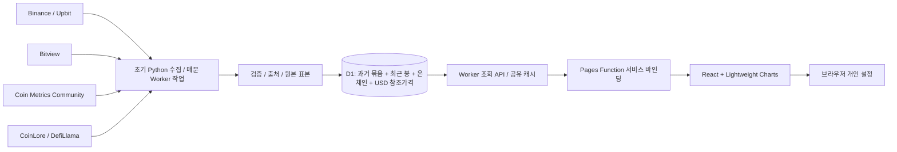

# Coin Desk

**BTC 중심으로 DOGE·ETH의 가격·온체인·선물을 함께 확인하는 분석 작업공간입니다.**

작업·운영 버전 **0.15.0**. 2026-09-26 원격 마이그레이션과 Worker·Pages 배포를 완료했고, 서버 Cron의 시세 갱신과 09:10 일일 브리핑 생성을 확인했습니다. 지연 원천 회복과 하루 전체 쓰기 사용량은 후속 관찰 중입니다. [구현·검증·배포 상태](docs/RELEASE15.md)

[운영 사이트](https://coin-desk.pages.dev) · [경쟁 기능 비교표](docs/RELEASE15.md#기능-비교) · [데이터 정의](docs/DATA.md)

## 새 사용 흐름

1. 상단에서 BTC·DOGE·ETH를 선택합니다. 새 작업공간은 BTC·전체 기간·로그축·USD 참조 이력으로 시작하며, 기존 URL의 선택은 보존합니다.
2. 가격 기준을 **USD 참조 / Upbit KRW / Binance USDT**로 선택합니다. 가격·이동평균·월별 수익률은 같은 원천을 사용합니다. USD 참조는 일별 종가이며 실시간 시세가 아닙니다.
3. **온체인·선물**에서는 선택 지표가 주 차트를 바꿉니다. 가격 비교는 선택 사항입니다. **가격·기술**에서는 지표 추가로 가격 아래 같은 시간축에 기본 두 개, 최대 여섯 개의 비교 지표를 표시합니다.
4. **가격 위치 밴드**, 로그축, 기간을 변경하거나 지표를 눌러 산식·출처를 확인합니다. 차트 아래에서 CSV·이미지·URL 공유, 날짜별 표, 작업공간 저장을 엽니다.
5. **알림함**에서 확정 관측 신호와 일일 브리핑을 확인합니다. 읽음과 관심 규칙은 기기에 보관합니다.

공개 리서치와 역사 메뉴 및 자동 수집은 최신 요청에 따라 제외했습니다. 기존 보관 자료를 삭제하지 않으며 옛 화면 링크는 코인 분석으로 이동합니다. 예전 릴리스 문서는 당시 기능의 기록입니다.

| 분석 영역 | 제공 기능 |
|---|---|
| 가격·기술 | 원천별 전체 이력, 가격 위치 밴드, SMA·EMA·RSI·볼린저·MACD, 낙폭, 월별 수익률 |
| 온체인 | 선택 코인의 지원 지표만 표시, BTC 보유자·SOPR·NUPL 등 추가 지표, 출처·산식 확인 |
| ETH 체인 | DefiLlama TVL·스테이블코인 공급의 실제 USD 이력; ETH 토큰 가격과 별도 축 |
| 선물 | Bybit 확정 펀딩률(%), 미결제약정(코인 수량), 롱 계정 비중(%); 전체 시장 집계가 아님 |
| 시장·비교 | 코인 시세, 공통 날짜 성과 비교, 코인별 도미넌스 |
| 작업공간 | 자산·가격 원천·기간·지표·시각화를 URL/저장 구성에 보존, 기기별 JSON 백업 |
| 고급 차트 | 거래소 차트의 추세선·수평선·사용자 지표 설정 도구 유지 |

원천이 없는 관측이나 결측 구간을 생성하지 않습니다. 가격 위치 밴드는 과거 730일 분포를 나타내며 미래 가격·적정가 예측이 아닙니다. 주문·계좌 연결·매수/매도 지시는 제공하지 않습니다.

## 데이터가 의미하는 것

| 데이터 | 실제 원천 | 표시 기준 |
|---|---|---|
| 거래소 가격·거래량 | Binance 공개 REST/WebSocket, Upbit 공개 REST | 각 거래소가 제공하는 일봉 전체, 최근 90일 시간봉 |
| BTC·DOGE·ETH·XRP·LINK 장기 가격 | Coin Metrics Community `PriceUSD` | 실제 확보된 USD 일별 종가 참조가격; 거래소 OHLCV와 별도 |
| BTC 온체인 | Bitview / Bitcoin Research Kit | 확정 일별 관측, 같은 원천의 **추정 USD 가격**과 비교 |
| BTC·ETH 거래소 온체인 | Coin Metrics Community `FlowInExNtv`·`FlowOutExNtv`·`SplyExNtv` | 원천의 거래소 주소 식별 범위; 순유입은 같은 날 유입−유출의 **계산값**. 분류 변경으로 과거 수정 가능 |
| DOGE 블록·발행 | Coin Metrics Community `BlkCnt`·`IssTotNtv` | 확정 UTC 일별 원천값; 가격이나 거래소 수요로 해석하지 않음 |
| Bybit 선물 | V5 공개 REST | BTC·DOGE·ETH USDT 무기한 계약 한 거래소의 펀딩비(%)·미결제약정 코인 수량; 실제 확보 시작일 표시 |
| BTC 네트워크 현황 | mempool.space 공개 API | 권장 수수료(sat/vB)와 미확인 거래 수·가상 크기; 관측 시각과 지연 상태 표시 |
| 코인·USDT·USDC 도미넌스 | CoinLore 개별·전체 시가총액 | 같은 제공자의 개별 시가총액 / 전체 시가총액 × 100 |
| 스테이블코인 전체 ≈ | DefiLlama 일별 USD 총액 / CoinLore 전체 시가총액 | **서로 다른 원천·시점의 근사 비중**; 일별 기준일을 별도 표시 |

- `전체`는 선택한 원천의 확보 이력 전체입니다. 장기 USD 참조가격은 BTC **2010-07-18**, DOGE **2014-01-23**, ETH **2015-08-08**부터입니다. 2026-09-18까지 각각 **5,907·4,622·4,060일**, XRP **2014-08-15**부터 **4,418일**, LINK **2017-09-29**부터 **3,277일**을 더해 합계 **22,284개 일별 관측값**의 원본 일치와 내부 날짜 결측 0을 확인했습니다. 제공 시작 이전 가격은 생성하지 않습니다.
- 거래소 캔들은 Binance BTC 2017-08-17·DOGE 2019-07-05부터이며 장기 USD 참조가격으로 이전 캔들이나 거래량을 합성하지 않습니다. 시간·4시간봉은 최근 90일입니다. 거래소 성과 비교에도 Coin Metrics 가격을 섞지 않습니다.
- Bitview BTC MVRV는 시가총액 / 실현시가총액으로 검산합니다. 새 Coin Metrics 5개 코인의 MVRV는 원천값이며, 실현시총·실현가격·NUPL은 그 MVRV로 역산합니다. 역산값을 독립적인 검산 근거로 사용하지 않습니다. MVRV-Z는 그날까지의 유효 시가총액으로 누적 모집단 표준편차를 계산하며, 최소 365개 유효 표본 이후 표시합니다.
- Upbit 24시간 등락률은 전일 같은 시각의 1분봉 종가와 비교한 **24H≈**입니다. 고가·저가는 UTC 당일, 거래대금은 실제 24시간 값입니다.
- CoinLore의 개별 시장값은 별도 기준 시각이 없어 **조회 시각**을 표시합니다. 스테이블 전체는 USD로 환산된 합계만 더합니다. USDT·USDC와 중복 합산하지 않습니다.
- 도미넌스 과거 이력은 서비스를 시작한 뒤 실제 관측값을 쌓습니다. 다른 산식·제공자의 이력을 이어 붙이지 않습니다.
- CoinGecko는 조사 때 무료 응답을 확인했지만 배포 서버에서 반복적인 429가 발생해 현재 운영 원천에서 제외했습니다.
- 성과 비교는 모든 선택 코인의 공통 UTC 확정 종가를 사용합니다. 결측일을 보간하지 않으며, 날짜 결측이 있으면 변동성을 표시하지 않습니다. 변동성은 최소 20개의 연속 일간 로그수익률의 표본 표준편차를 √365로 연환산한 값입니다. [비교 산식·검산·참고 서비스](docs/COMPARISON.md)에 정의를 기록했습니다.

산식·단위·초기 반올림 차이·결측 처리·API 계약은 [데이터 정의서](docs/DATA.md)에 있습니다.

## 로컬 실행

**Node.js 24 이상, Python 3.11 이상**이 필요합니다. 수집·검산 Python 도구는 표준 라이브러리만 사용합니다. 이미 포함된 브랜드 아이콘을 다시 그리는 선택 작업에만 Pillow가 필요합니다.

```sh
git clone https://github.com/pollmap/coin-desk.git
cd coin-desk
npm ci
npm run seed
npm run db:local
npm run seed:assets
npm run db:assets
python scripts/bootstrap_reference.py
node scripts/import_reference.mjs
python scripts/bootstrap_network.py
node scripts/import_network.mjs
npm run dev
```

브라우저에서 `http://127.0.0.1:5173`을 엽니다. 같은 Worker 코드를 실행하는 로컬 API는 `http://127.0.0.1:8787/api/v1/status`입니다. 최초 수집에는 네트워크와 몇 분이 필요하며 API 호출 제한에 따라 더 걸릴 수 있습니다. 이미 데이터를 적재했다면 `npm run dev`만 실행합니다. 종료는 Ctrl+C입니다.

BTC 수집·검산 자료, 추가 자산 자료와 장기 참조가격을 분리합니다. 원본·체크포인트·SQL·로컬 DB는 Git에 넣지 않는 `work/` 아래에 생성합니다. 거래소 수집은 중단 후 같은 명령으로 재개할 수 있고 페이지 캐시는 1시간 후 새로 받습니다. 장기 가격 수집은 `work/reference/`에 자산별 원본·SQL·감사 기록을 남기며, 재실행 시 해당 자산을 다시 조회합니다. 로컬 DB 어댑터가 모든 마이그레이션을 적용합니다. 도미넌스는 개발 서버의 매분 수집 작업으로 초기화되며 처음에는 수집 대기 상태가 표시될 수 있습니다.

| 명령 | 용도 |
|---|---|
| `npm run check` | TypeScript 검사 + 외부 API를 호출하지 않는 회귀 테스트 |
| `npm run build` | 정적 프런트 배포 번들 생성 |
| `python scripts/verify.py` | BTC 초기 수집 자료의 Python 독립 검산; `npm run seed` 이후 실행 |
| `python scripts/verify_custom.py` | Decimal 기반 사용자 기술지표 참조값 재현성 검사; 네트워크 불필요 |
| `python scripts/verify_reference.py --base http://127.0.0.1:8787` | 보관한 Coin Metrics 원본과 로컬 API의 장기 가격 전체 비교; 개발 API 실행 필요 |
| `python scripts/verify_reference.py --base https://coin-desk.pages.dev` | 같은 원본과 공개 API의 장기 가격 전체 비교 |
| `python scripts/check_live.py --base https://coin-desk.pages.dev` | 공개 8개 코인·양쪽 시장·BTC 지표·도미넌스 상태 확인 |
| `python scripts/check_assets.py --base https://coin-desk.pages.dev` | 추가 자산 수집본과 공개 페이지별 OHLCV 전체 비교 |
| `python scripts/backup_check.py` | 로컬 DB 백업→별도 파일 복구, 테이블 해시 비교 |

새 온체인 지표를 포함해 재수집할 때는 `python scripts/bootstrap_network.py --assets BTC,DOGE,ETH` 뒤 `node scripts/import_network.mjs BTC,DOGE,ETH`를 실행합니다. 선물·BTC 네트워크 현황은 로컬 API의 정기 작업 또는 배포된 Cloudflare Cron이 **실제로 받은 값부터** 축적합니다. Bybit 미결제약정은 최근 30일을 먼저 적재하고 이후 서버에 축적하며, 더 오래된 값을 생성하지 않습니다.
| `python scripts/package_release.py` | 인증·캐시·DB를 제외한 재현용 소스 ZIP 생성 |

## 구조와 무료 운영



화면은 **Cloudflare Pages**, API·Cron은 **Workers**, 데이터는 **D1**입니다. Pages Function이 `/api/*`만 같은 계정의 Worker로 전달하므로 사용자 브라우저의 주소와 API 요청은 `coin-desk.pages.dev`에 머뭅니다. 배포 인증 외에 거래소 키나 데이터 구독은 필요하지 않습니다.

추가 코인의 과거 봉은 256개씩 묶어 D1에 보관합니다. 최근 일봉 501개·시간봉 32개는 일반 행으로 초기 적재하고 이후 정기 갱신합니다. 조회 시 중복 시각은 최근 수집 행을 우선하므로 수정값을 반영합니다. 7개 추가 자산 초기 적재는 **D1 쓰기 15,532행**, 적재 직후 전체 DB 약 **8.96MB**였습니다. 전체 계정의 사용량이나 트래픽 증가 시 무료 운영을 보장하는 수치는 아닙니다.

서버 Cron은 **방문자나 PC 실행 여부와 관계없이 매분** 실행됩니다. 현재가는 거래소별 8개 자산을 묶은 2개 배치로 1분 갱신을 시도하고, 과거 이력 작업과 공개 리서치 수집은 독립적으로 진행합니다. 실패·호출 제한 시 백오프하며 마지막 정상값을 유지합니다. 상세 주기는 [운영 문서](docs/OPERATIONS.md)에 있습니다. 48시간 표시는 갱신 간격이 아닌 운영 관찰 구간입니다.

긴 가격 이력은 작은 날짜 구간으로 나누어 최대 4개씩 조회합니다. 같은 조회의 중복 요청과 최근 결과를 브라우저에서 공유하고, 비교 화면은 이미 확보한 긴 기간을 짧은 기간에 재사용합니다. 차트·보조 화면 번들을 분리해 처음부터 모든 기능을 내려받지 않게 했습니다. 무료 한도 준수는 실제 CPU·D1 사용량으로 판단하며, 0.3.0의 일별 쓰기 약 6.6만 행 추산은 현재 실측값으로 사용하지 않습니다.

무료 공개 배포, 신규 계정 설정, 수집 지연, 백업·복구와 되돌리기는 [운영 안내](docs/OPERATIONS.md)를 따라 진행합니다. 저장소 CI는 타입·계산·API·빌드·문서·패키지를 확인하며 **운영 배포나 외부 API 검사를 자동 실행하지 않습니다**. 배포 자격증명은 GitHub에 저장하지 않았습니다.

## 이전 릴리스 검증 기록

최신 구현 검증은 [0.15 기록](docs/RELEASE15.md)을 우선합니다. 아래는 이전 버전의 기록입니다.

**0.4.0 현재 검증 — 2026-09-20 KST**

- 장기 USD 원본 14,589개 값과 공개 API의 날짜·가격이 모두 일치했습니다. 원본·감사 SHA-256·검산 결과를 `work/reference/`와 `work/reference-verification.json`에 보관합니다.
- 비교 화면의 달력 기간·직접 날짜·긴 이력 캐시 검증을 통과했습니다. 실제 로컬 API의 기본 3개 코인 공통 2,633일과 직접 기간 1,461일을 확인했고, 전체 조회 후 7개 기간 전환의 추가 요청은 0개였습니다.
- 최근 CPU 관측 최대 **14ms**, Cron 최대 **13ms**였습니다. 해당 응답이 정상 완료됐더라도 무료 10ms 예산의 지속 충족은 확인되지 않았습니다. **0.4.0의 48시간 관찰은 미완료**입니다.
- 최종 테스트 수, 번들·공개 화면·배포 식별자와 남은 조건은 [0.4 개선·검증 보고서](docs/UPGRADE04.md)에 기록합니다.

**0.3.0 과거 검증 — 2026-09-20 KST; 아래 수치는 당시 버전의 기록입니다.**

- 타입 검사·**129개 테스트** 통과. HTTP 클라이언트 오류·중단·시간 초과 등 15개 사례와 기존 계산·API 회귀를 포함합니다.
- 프런트 JavaScript **542.21KB, gzip 176.15KB**. Decimal 기반 기술지표 참조값 3개 시나리오 검사 통과.
- 실제 로컬 API의 16개 가격 시계열로 **20개 비교·110개 결과 행**을 검산했습니다. Python 독립 계산과 수익률·낙폭 차이 0, 변동성 최대 차이 약 `1.56e-13`%p입니다.
- Worker·Pages 공개 배포 완료. 03:36:36 공개 검사 이슈 0, 이전 주소 308 이전·정적 파일 일치·모바일 조작 확인. CPU 58표본 최대 12ms, 48시간 관찰은 진행 중입니다. [레드팀 보고서](docs/REDTEAM.md)에서 문제와 개선 근거를 확인할 수 있습니다.

**0.2.0 공개 검증 이력**은 56개 테스트, 추가 7개 자산의 28개 이력·60,132개 확정 봉 원본 일치, 16개 시장 현재가·BTC 온체인·도미넌스 응답 확인입니다. 48시간 관찰은 완료 판정을 내리지 않았으며, 이 결과를 0.3.0 공개 검증으로 대신하지 않습니다.

측정값, 화면 기록과 남은 조건은 [검증 기록](docs/VERIFICATION.md)에 있습니다. 다른 코인의 온체인 지표, 청산 히트맵, UTXOs in Loss %, 특정 업체의 MVRV-Z 730일 가격 밴드와 구리/금 비교는 구현 범위에 포함하지 않았습니다.

## 파일 안내

```text
src/             화면, 차트, 개인 설정
shared/          자산·지표 정의, 산식, 입력 검증, 응답 타입
worker/          원천 연결, 조회 API, 수집·갱신·백오프
pages/           짧은 공개 주소용 설정과 API 서비스 바인딩
migrations/      D1 스키마
scripts/         수집, 독립 검산, 운영 검사, 복구, 소스 포장
tests/           회귀 테스트와 독립 Python 참조값
docs/            데이터 정의·운영·검증·화면 기록
.github/         PR/main CI
```

## 출처와 귀속

- [Binance 공개 시장 데이터](https://developers.binance.com/docs/binance-spot-api-docs/rest-api/market-data-endpoints), [Upbit](https://docs.upbit.com/kr)
- [Bitview](https://bitview.space/api), [Bitcoin Research Kit](https://github.com/bitcoinresearchkit/mono), [가격 모듈](https://github.com/bitcoinresearchkit/mono/blob/main/crates/brk_oracle/README.md)
- [Coin Metrics Community 데이터](https://github.com/coinmetrics/data/blob/master/README.md), [PriceUSD 정의](https://docs.coinmetrics.io/network-data/network-data-overview/market/price), [CC BY-NC 4.0](https://creativecommons.org/licenses/by-nc/4.0/). 장기 USD 참조가격에 출처·라이선스·비상업 이용을 표시합니다. 상업적 재사용 권한을 제공하는 데이터로 취급하지 않습니다.
- [CoinLore 무료 API](https://www.coinlore.com/cryptocurrency-data-api), [DefiLlama Stablecoins](https://defillama.com/stablecoins)
- [TradingView Lightweight Charts](https://github.com/tradingview/lightweight-charts), Apache-2.0. 화면의 귀속 로고와 저작권 표시를 유지합니다.

Coin Desk는 독립적으로 만든 개인 분석 도구이며 CoinDesk 뉴스, CoinGlass, TradingView 또는 데이터 제공자의 공식 서비스가 아닙니다. 타사 화면 이미지를 제품 자산으로 재배포하지 않습니다. 저장소 자체 소스에는 별도의 배포 라이선스를 아직 지정하지 않았습니다.
