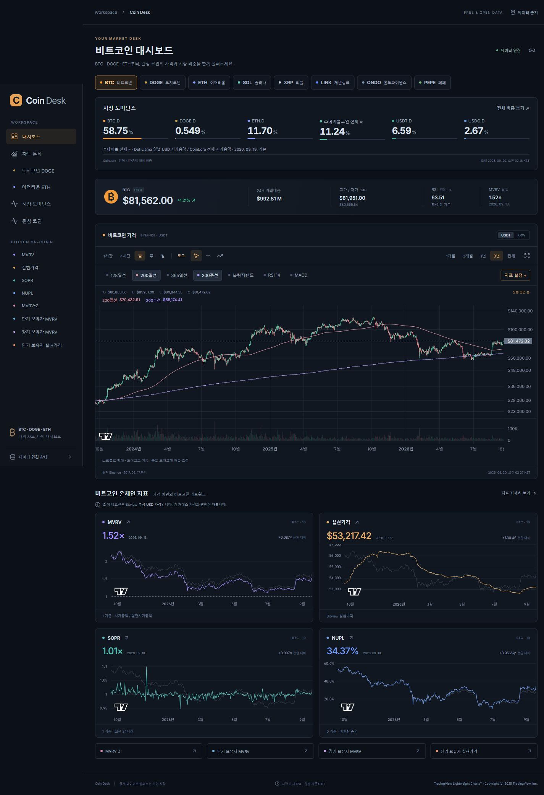
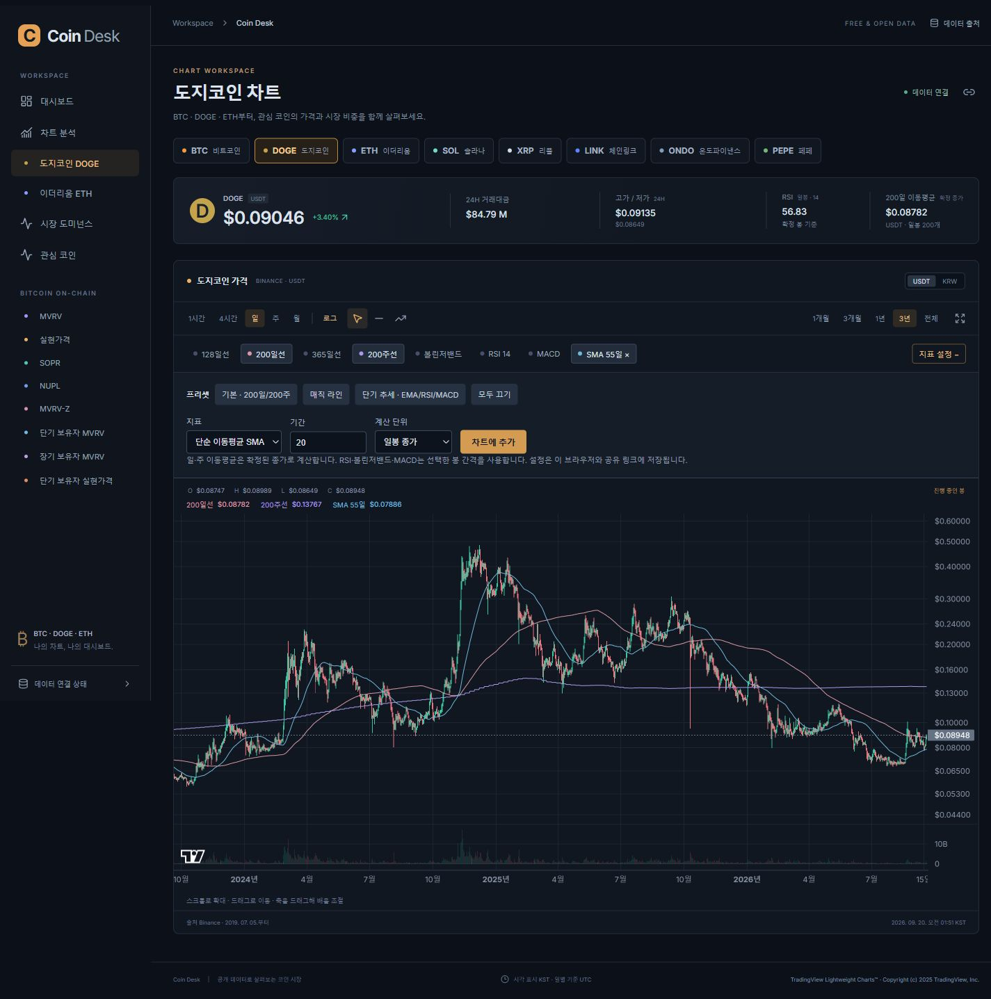
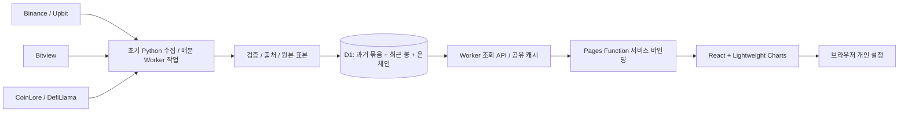

# Coin Desk

[](https://github.com/pollmap/coin-desk/actions/workflows/ci.yml)
[사이트 열기](https://coin-desk.pages.dev) · [도지코인 차트](https://coin-desk.pages.dev/chart/DOGE) · [코인 성과 비교](https://coin-desk.pages.dev/compare) · [관심 코인](https://coin-desk.pages.dev/coins) · [시장 도미넌스](https://coin-desk.pages.dev/dominance)

**BTC·DOGE·ETH를 중심으로 8개 코인의 가격, 기술지표, 시장 비중과 비트코인 온체인을 분석하는 한국어 대시보드입니다.** 무료 공개 데이터를 수집하고 출처·기준일·계산식을 함께 표시합니다. 관심 코인을 비교하고, 지표와 기간을 조절한 뒤 나만의 구성을 작업공간으로 저장할 수 있습니다.

현재 소스는 **0.3.0**입니다. 타입검사·129개 테스트·빌드, 공개 API·화면·배포 파일 일치 검증을 통과했습니다. 무료 CPU 10ms 예산을 넘는 표본이 있어 장기 운영 확인은 남아 있습니다. 측정과 48시간 관찰은 [검증 기록](docs/VERIFICATION.md)에서 구분합니다.



## 사용할 수 있는 기능

| 영역 | 구현 내용 |
|---|---|
| 관심 자산 | **BTC → DOGE → ETH** 우선 배치, SOL·XRP·LINK·ONDO·PEPE 포함 |
| 관심 코인 `/coins` | 별표 즐겨찾기·검색, 즐겨찾기/상승률/하락률/거래대금 정렬, RSI 14·200일선 대비 가격 위치 |
| 실제 거래소 가격 | 8개 모두 Binance USDT / Upbit KRW, 환율 환산 없이 시장 전환 |
| 성과 비교 `/compare` | 공통 UTC 확정일을 100으로 맞춘 상대 성과, 수익률·종가 기준 최대 낙폭·연환산 변동성, 비교 CSV |
| 차트 | 캔들·거래량, 1시간·4시간·일·주·월, 5개 기간 프리셋·KST 날짜 직접 선택, 로그축·확대·이동·십자선·전체화면·키보드·보이는 구간 CSV |
| 이동평균 | SMA·EMA 기간 **2~1,000** 직접 입력, 일봉·주봉·선택한 봉 기준 선택 |
| 프리셋 | 기본 200일/200주, 매직 라인 128·200·365일/200주, 단기 EMA 20·50 + RSI + MACD |
| 기술지표 | RSI 기간 변경, 볼린저밴드 기간·표준편차 배수 변경, MACD 12·26·9; 기존 지표 수정·날짜별 값 표시 |
| BTC 온체인 | MVRV, 실현가격, SOPR 24h, NUPL, MVRV-Z, STH·LTH MVRV, STH 실현가격 |
| 지표 탐색 `/explore` | 검색·분류·산식 확인, 실제 차트 진입, BTC 온체인 8개 중 대시보드에 담기·순서 변경 |
| 시장 비중 | 8개 코인 도미넌스, USDT.D·USDC.D, 스테이블코인 전체 근사 비중과 누적 관측 차트 |
| 개인 설정 | 마지막 코인 복원, 이름 붙인 작업공간 최대 12개, 즐겨찾기·카드·작업공간 JSON 백업·가져오기, URL 공유 |
| 차트 메모 | 수평선·추세선 그리기, 가격 입력으로 수평선 추가, 자산·시장·봉별 저장·복원·선별 삭제·마지막 선 실행 취소 |

지표는 동시에 최대 10개를 표시합니다. 데이터가 부족한 장기 이동평균은 이유를 표시합니다. 주문, 거래소 계정 연결, 결제, AI 투자추천이나 자체 투자 점수는 포함하지 않습니다.

## 먼저 사용해 보기

1. [관심 코인](https://coin-desk.pages.dev/coins)에서 **DOGE**를 검색하고 별표로 즐겨찾기에 둡니다. 시장과 정렬을 바꿔 현재가·거래대금·기술지표를 살펴봅니다.
2. **즐겨찾기 성과 비교**를 눌러 BTC·DOGE·ETH를 같은 시작일에 맞춰 비교합니다. 코인을 추가하면 상장일에 따라 공통 기간이 달라질 수 있으므로 차트 위 날짜를 확인합니다.
3. [지표 찾아보기](https://coin-desk.pages.dev/explore)에서 산식을 읽고 필요한 BTC 온체인을 대시보드에 담습니다. [대시보드](https://coin-desk.pages.dev)에서 카드 순서를 조절할 수 있습니다.
4. DOGE 차트의 **지표 설정 → SMA 또는 EMA → 기간 입력 → 차트에 추가**로 이동평균을 만듭니다. 이미 추가한 지표는 수정 버튼으로 바꿉니다. 날짜 직접 선택·선 관리·CSV는 차트 아래에 있습니다.
5. **작업공간 저장·불러오기**에서 `DOGE 장기 추세`처럼 이름을 붙여 저장합니다. 코인·시장·봉·기간·지표·로그축·온체인 카드 구성을 함께 복원합니다.
6. 같은 화면은 링크로 공유하고, 다른 브라우저로 개인 설정을 옮길 때는 **설정 백업·이동**을 이용합니다. 개인 설정과 그린 선은 서버에 전송하지 않습니다.




설정은 기기·브라우저·사이트 주소별로 분리됩니다. JSON 백업에는 **즐겨찾기·온체인 카드·저장한 작업공간**이 포함됩니다. 가져오기는 형식·지원 항목·크기를 검증하고, 같은 이름의 작업공간은 기존 것을 유지하며 새 항목만 추가합니다. 즐겨찾기와 카드 구성은 가져온 설정으로 바뀝니다. 그린 선·직접 선택한 날짜 범위·비교 화면 설정은 이 백업에 포함하지 않습니다.

기존 `workers.dev` 웹 주소는 경로·쿼리를 보존해 새 `pages.dev` 주소로 이동하도록 구현했습니다. 기존 공유 URL의 차트 설정은 이어지지만, 이전 주소에만 저장한 개인 설정과 그린 선이 자동 이전되지는 않습니다.

## 데이터가 의미하는 것

| 데이터 | 실제 원천 | 표시 기준 |
|---|---|---|
| 거래소 가격·거래량 | Binance 공개 REST/WebSocket, Upbit 공개 REST | 각 거래소가 제공하는 일봉 전체, 최근 90일 시간봉 |
| BTC 온체인 | Bitview / Bitcoin Research Kit | 확정 일별 관측, 같은 원천의 **추정 USD 가격**과 비교 |
| 코인·USDT·USDC 도미넌스 | CoinLore 개별·전체 시가총액 | 같은 제공자의 개별 시가총액 / 전체 시가총액 × 100 |
| 스테이블코인 전체 ≈ | DefiLlama 일별 USD 총액 / CoinLore 전체 시가총액 | **서로 다른 원천·시점의 근사 비중**; 일별 기준일을 별도 표시 |

- `전체`는 거래소 제공 이력 전체입니다. 예를 들어 Binance BTC는 2017-08-17부터, DOGE는 2019-07-05부터이며 코인 탄생일부터의 이력이 아닙니다. 시간·4시간봉은 최근 90일입니다.
- 온체인 MVRV는 시가총액 / 실현시가총액으로 검산합니다. MVRV-Z는 그날까지의 유효 시가총액으로 누적 모집단 표준편차를 계산하며, 최소 365개 유효 표본 이후 표시합니다.
- Upbit 24시간 등락률은 전일 같은 시각의 1분봉 종가와 비교한 **24H≈**입니다. 고가·저가는 UTC 당일, 거래대금은 실제 24시간 값입니다.
- CoinLore의 개별 시장값은 별도 기준 시각이 없어 **조회 시각**을 표시합니다. 스테이블 전체는 USD로 환산된 합계만 더합니다. USDT·USDC와 중복 합산하지 않습니다.
- 도미넌스 과거 이력은 서비스를 시작한 뒤 실제 관측값을 쌓습니다. 다른 산식·제공자의 이력을 이어 붙이지 않습니다.
- CoinGecko는 조사 때 무료 응답을 확인했지만 배포 서버에서 반복적인 429가 발생해 현재 운영 원천에서 제외했습니다.
- 성과 비교는 모든 선택 코인의 공통 UTC 확정 종가를 사용합니다. 결측일을 보간하지 않으며, 날짜 결측이 있으면 변동성을 표시하지 않습니다. 변동성은 최소 20개의 연속 일간 로그수익률의 표본 표준편차를 √365로 연환산한 값입니다. [비교 산식·검산·참고 서비스](docs/COMPARISON.md)에 정의를 기록했습니다.

산식·단위·초기 반올림 차이·결측 처리·API 계약은 [데이터 정의서](docs/DATA.md)에 있습니다.

## 로컬 실행

**Node.js 24 이상, Python 3.11 이상**이 필요합니다. Python 도구는 표준 라이브러리만 사용합니다.

```sh
git clone https://github.com/pollmap/coin-desk.git
cd coin-desk
npm ci
npm run seed
npm run db:local
npm run seed:assets
npm run db:assets
npm run dev
```

브라우저에서 `http://127.0.0.1:5173`을 엽니다. 같은 Worker 코드를 실행하는 로컬 API는 `http://127.0.0.1:8787/api/v1/status`입니다. 최초 수집에는 네트워크와 몇 분이 필요하며 API 호출 제한에 따라 더 걸릴 수 있습니다. 이미 데이터를 적재했다면 `npm run dev`만 실행합니다. 종료는 Ctrl+C입니다.

BTC 수집·검산 자료와 추가 자산 자료를 분리합니다. 원본·체크포인트·SQL·로컬 DB는 Git에 넣지 않는 `work/` 아래에 생성합니다. 수집 중단 후 같은 명령으로 재개할 수 있고 페이지 캐시는 1시간 후 새로 받습니다. 도미넌스는 개발 서버의 매분 수집 작업으로 초기화되며 처음에는 수집 대기 상태가 표시될 수 있습니다.

| 명령 | 용도 |
|---|---|
| `npm run check` | TypeScript 검사 + 외부 API를 호출하지 않는 회귀 테스트 |
| `npm run build` | 정적 프런트 배포 번들 생성 |
| `python scripts/verify.py` | BTC 초기 수집 자료의 Python 독립 검산; `npm run seed` 이후 실행 |
| `python scripts/verify_custom.py` | Decimal 기반 사용자 기술지표 참조값 재현성 검사; 네트워크 불필요 |
| `python scripts/check_live.py --base https://coin-desk.pages.dev` | 공개 8개 코인·양쪽 시장·BTC 지표·도미넌스 상태 확인 |
| `python scripts/check_assets.py --base https://coin-desk.pages.dev` | 추가 자산 수집본과 공개 페이지별 OHLCV 전체 비교 |
| `python scripts/backup_check.py` | 로컬 DB 백업→별도 파일 복구, 테이블 해시 비교 |
| `python scripts/package_release.py` | 인증·캐시·DB를 제외한 재현용 소스 ZIP 생성 |

## 구조와 무료 운영



화면은 **Cloudflare Pages**, API·Cron은 **Workers**, 데이터는 **D1**입니다. Pages Function이 `/api/*`만 같은 계정의 Worker로 전달하므로 사용자 브라우저의 주소와 API 요청은 `coin-desk.pages.dev`에 머뭅니다. 배포 인증 외에 거래소 키나 데이터 구독은 필요하지 않습니다.

추가 코인의 과거 봉은 256개씩 묶어 D1에 보관합니다. 최근 일봉 501개·시간봉 32개는 일반 행으로 초기 적재하고 이후 정기 갱신합니다. 조회 시 중복 시각은 최근 수집 행을 우선하므로 수정값을 반영합니다. 7개 추가 자산 초기 적재는 **D1 쓰기 15,532행**, 적재 직후 전체 DB 약 **8.96MB**였습니다. 전체 계정의 사용량이나 트래픽 증가 시 무료 운영을 보장하는 수치는 아닙니다.

0.3.0은 시세 수집에 180초 공유 갱신 잠금을 적용하고 변경되지 않은 봉의 반복 쓰기를 줄입니다. 화면은 60초마다 조회하지만 원천 시세는 **약 3분 주기**로 공유하며 HTTP 캐시·거래 시각·장애 상태에 따라 지연이 달라집니다. 일별 쓰기 약 6.6만 행은 조건부 계산 추정으로, 운영 실측이나 무료 한도 충족 판정이 아닙니다.

무료 공개 배포, 신규 계정 설정, 수집 지연, 백업·복구와 되돌리기는 [운영 안내](docs/OPERATIONS.md)를 따라 진행합니다. 저장소 CI는 타입·계산·API·빌드·문서·패키지를 확인하며 **운영 배포나 외부 API 검사를 자동 실행하지 않습니다**. 배포 자격증명은 GitHub에 저장하지 않았습니다.

## 검증 상태

**0.3.0 검증 — 2026-09-20 KST**

- 타입 검사·**129개 테스트** 통과. HTTP 클라이언트 오류·중단·시간 초과 등 15개 사례와 기존 계산·API 회귀를 포함합니다.
- 프런트 JavaScript **542.21KB, gzip 176.15KB**. Decimal 기반 기술지표 참조값 3개 시나리오 검사 통과.
- 실제 로컬 API의 16개 가격 시계열로 **20개 비교·110개 결과 행**을 검산했습니다. Python 독립 계산과 수익률·낙폭 차이 0, 변동성 최대 차이 약 `1.56e-13`%p입니다.
- Worker·Pages 공개 배포 완료. 03:36:36 공개 검사 이슈 0, 이전 주소 308 이전·정적 파일 일치·모바일 조작 확인. CPU 58표본 최대 12ms, 48시간 관찰은 진행 중입니다. [레드팀 보고서](docs/REDTEAM.md)에서 문제와 개선 근거를 확인할 수 있습니다.

**0.2.0 공개 검증 이력**은 56개 테스트, 추가 7개 자산의 28개 이력·60,132개 확정 봉 원본 일치, 16개 시장 현재가·BTC 온체인·도미넌스 응답 확인입니다. 48시간 관찰은 완료 판정을 내리지 않았으며, 이 결과를 0.3.0 공개 검증으로 대신하지 않습니다.

측정값, 화면 기록과 남은 조건은 [검증 기록](docs/VERIFICATION.md)에 있습니다. 다른 코인의 온체인 지표, 청산 히트맵, UTXOs in Loss %, 특정 업체의 MVRV-Z 730일 가격 밴드와 구리/금 비교는 구현 범위에 포함하지 않았습니다.

## 파일 안내

```text
src/             화면, 차트, 개인 설정
shared/          자산·지표 정의, 산식, 입력 검증, 응답 타입
worker/          원천 연결, 조회 API, 수집·갱신·백오프
pages/           짧은 공개 주소용 설정과 API 서비스 바인딩
migrations/      D1 스키마
scripts/         수집, 독립 검산, 운영 검사, 복구, 소스 포장
tests/           회귀 테스트와 독립 Python 참조값
docs/            데이터 정의·운영·검증·화면 기록
.github/         PR/main CI
```

## 출처와 귀속

- [Binance 공개 시장 데이터](https://developers.binance.com/docs/binance-spot-api-docs/rest-api/market-data-endpoints), [Upbit](https://docs.upbit.com/kr)
- [Bitview](https://bitview.space/api), [Bitcoin Research Kit](https://github.com/bitcoinresearchkit/mono), [가격 모듈](https://github.com/bitcoinresearchkit/mono/blob/main/crates/brk_oracle/README.md)
- [CoinLore 무료 API](https://www.coinlore.com/cryptocurrency-data-api), [DefiLlama Stablecoins](https://defillama.com/stablecoins)
- [TradingView Lightweight Charts](https://github.com/tradingview/lightweight-charts), Apache-2.0. 화면의 귀속 로고와 저작권 표시를 유지합니다.

Coin Desk는 독립적으로 만든 개인 분석 도구이며 CoinDesk 뉴스, CoinGlass, TradingView 또는 데이터 제공자의 공식 서비스가 아닙니다. 타사 화면 이미지를 제품 자산으로 재배포하지 않습니다. 저장소 자체 소스에는 별도의 배포 라이선스를 아직 지정하지 않았습니다.
