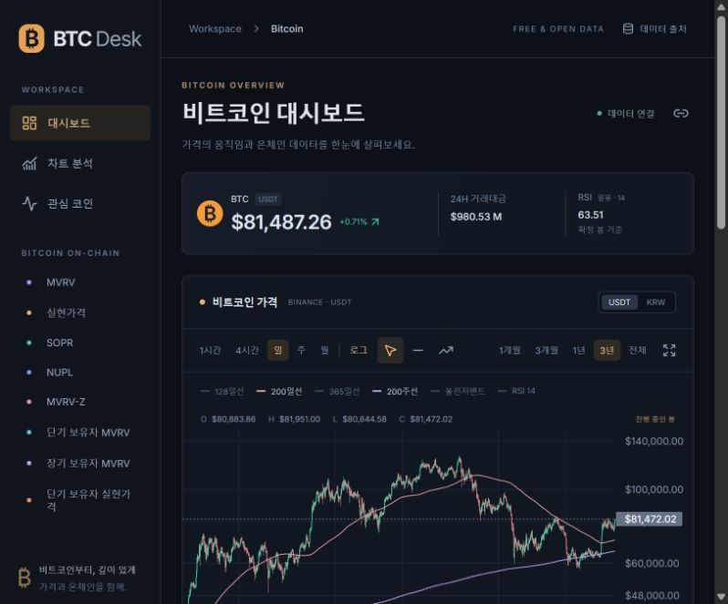
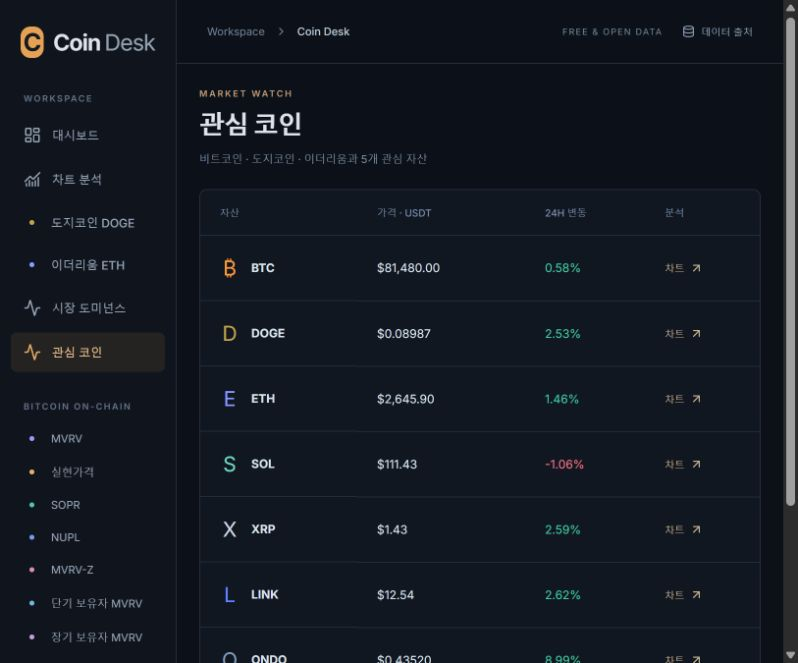
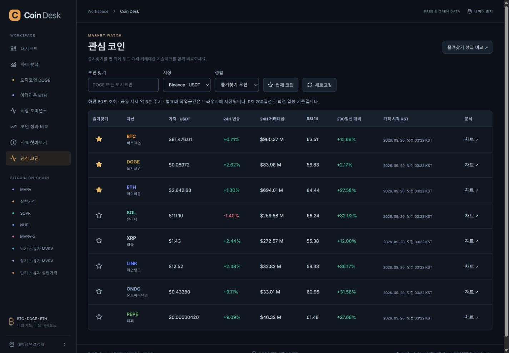
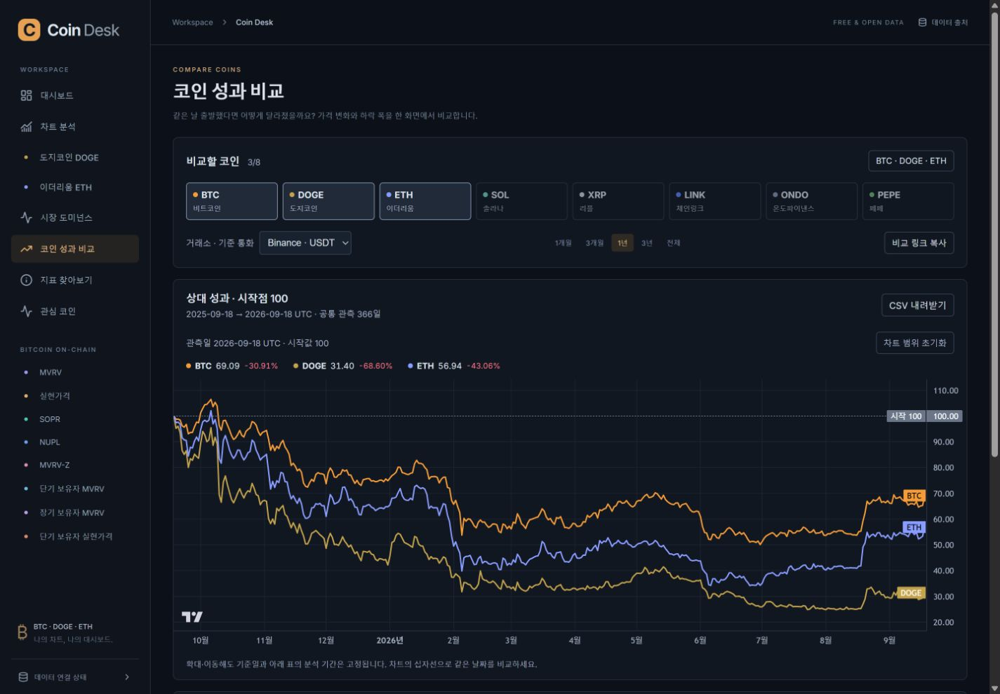
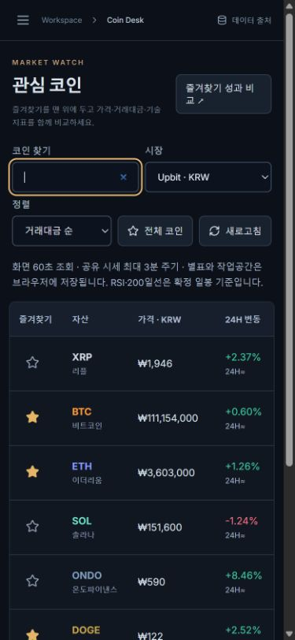
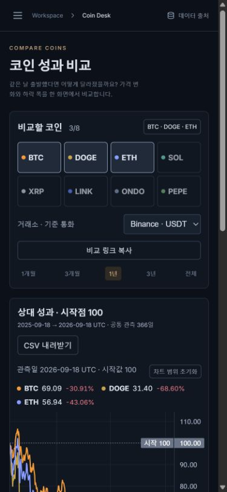
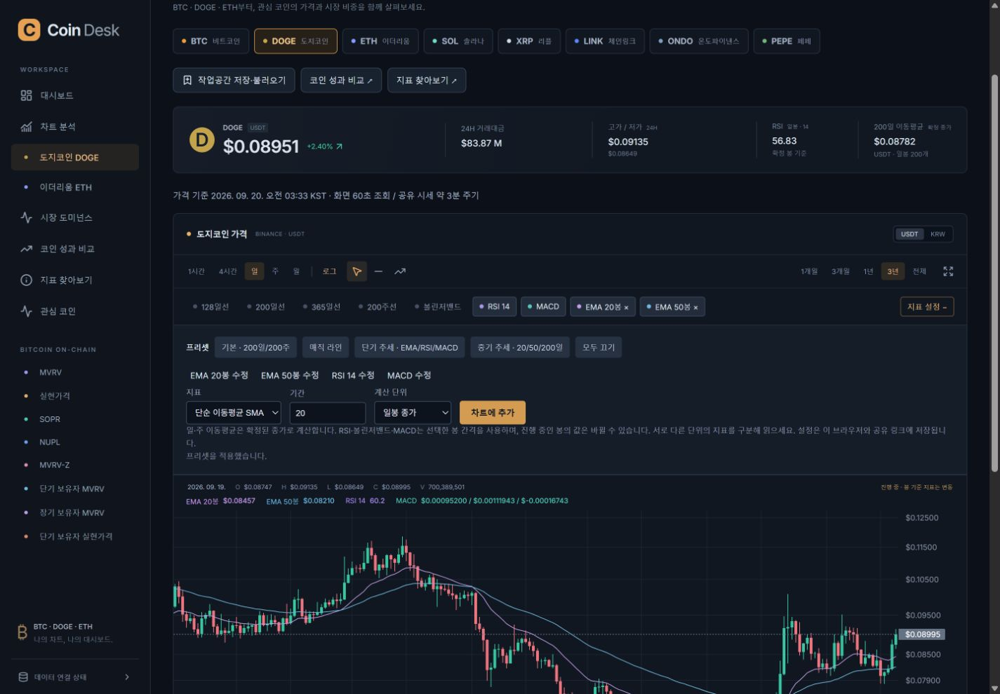

# Coin Desk 0.3 — 레드팀 점검과 개선 결과

기준일: 2026-09-20 KST. 대상: Coin Desk 소스, 수집된 거래소 이력, 로컬 앱과 공개 서비스. 차트·계산, API·운영, 유사 서비스·사용 흐름을 세 담당이 독립 점검하고 통합 검수했습니다. 외부 서비스에는 공개 문서 조회만 수행했으며 부하 시험은 로컬 모형에 한정했습니다.

## 결과와 읽는 순서

BTC·DOGE·ETH를 반복 분석할 때 필요한 비교·즐겨찾기·작업공간·지표 탐색을 추가했습니다. 실제로 재현한 차트 상태 초기화, 손상된 설정 처리, 시세 최신성, 중복 수집과 오류 노출 문제도 수정했습니다. 구현과 운영 상태는 구분합니다. 모든 결함을 제거했다거나 무료 운영을 영구 보장한다는 의미는 아닙니다.

1. [개선한 사용자 흐름](#개선한-사용자-흐름)
2. [확인한 문제와 수정](#확인한-문제와-수정)
3. [검증과 증거](#검증과-증거)
4. [남은 제약과 다음 우선순위](#남은-제약과-다음-우선순위)

## 개선한 사용자 흐름

| 단계 | 사용자가 하는 일 | 개선 결과 |
|---|---|---|
| 1. 관심 자산 확인 | 관심 코인에서 DOGE 검색, 별표, 상승·하락·거래대금 순 정렬 | 8개 코인과 양쪽 시장, 현재가·24H·RSI·200일선 대비·가격 시각을 한 표에 표시. 실패한 코인의 보관값은 지연으로 표시 |
| 2. 같은 조건에서 비교 | BTC·DOGE·ETH를 선택해 같은 시작값 100으로 비교 | 공통 확정 UTC 일봉, 기간 수익률·종가 최대 낙폭·연환산 변동성. 상장·결측·최신일 차이를 명시. CSV와 공유 링크 제공 |
| 3. 차트에 집중 | 이동평균 기간 수정, 선 추가, 날짜 범위 선택 | 기존 지표 수정과 중기 프리셋, 확대·축소 버튼·키보드, 수평선 가격 입력·개별 삭제·마지막 선 취소, 보이는 봉 CSV |
| 4. 내 분석 환경 보관 | DOGE 장기 추세라는 이름으로 저장하고 재방문 | 최대 12개 작업공간, 마지막 코인 복원, 온체인 카드 선택·순서 변경. UTF-8 64,000바이트 이하 설정 JSON 검증·백업·이동 |
| 5. 지표 이해·추가 | MVRV-Z 검색 → 산식 확인 → 대시보드에 담기 | BTC 온체인 8개와 기술지표 4종 안내를 검색·분류. 날짜별 지표와 같은 원천의 추정 USD 가격을 함께 확인 |

기존 URL에 들어온 방문자는 새 Pages 주소로 이동합니다. 이전 주소의 개인 브라우저 저장소를 새 주소가 읽을 수는 없으므로 로컬 설정이 자동 이전된다고 표시하지 않습니다. 공유 URL의 차트 설정은 경로·쿼리를 유지해 전달합니다.

### 외부 서비스에서 참고한 근거

- [TradingView 기준 100 비교](https://www.tradingview.com/support/solutions/43000477709-when-comparing-symbols-i-only-see-detached-lines-on-the-chart/): 가격 수준이 다른 자산을 같은 출발점으로 비교하는 방식을 실제 거래소 종가에 적용했습니다.
- [CoinGlass 분석 화면](https://www.coinglass.com/pro): 지표 검색·분류 접근을 참고했습니다. 확보하지 않은 유료 지표를 가짜 값으로 채우지 않았습니다.
- [CoinMarketCap 관심목록 설명](https://coinmarketcap.com/academy/article/cmc-launches-new-watchlist): 별표와 목록 중심의 반복 탐색을 반영했습니다.
- [Glassnode 시점별 데이터 설명](https://docs.glassnode.com/data/point-in-time-metrics): 관측일·수집일과 이후 수정 가능성을 구분했습니다. 전략 백테스트의 당시 이용 가능 데이터를 확보했다는 의미는 아닙니다.

상세 산식·출처·독립 검산은 [비교 기능 문서](COMPARISON.md)에 있습니다.

## 확인한 문제와 수정

등급은 이번 제품 사용과 운영에 미치는 영향입니다. 외부 침해 사고가 발생했다는 판정은 아닙니다.

| 우선순위 | 재현하거나 코드에서 확인한 문제 | 수정과 검증 |
|---|---|---|
| P1 | 사용자가 열어 둔 옛 주소가 BTC 전용 화면에 머무름 | 정확한 이전 hostname의 비API 요청을 새 주소로 308 이전. 경로·쿼리 유지, Pages 서비스 바인딩에는 적용하지 않아 순환 방지 |
| P1 | 임의 쿼리와 동시 조회로 캐시를 쪼개 원천 호출·DB 쓰기를 증폭할 수 있음 | 허용 파라미터·중복·범위 검증, 캐시 키 정규화, 진행 중 요청 공유, 동시 64개 제한, 원천별 DB 갱신 lease. 다른 isolate의 실패한 lease는 변경 0행 |
| P1 | 수집 시각만 새로우면 오래된 거래 시각도 최신으로 취급 | 실제 거래·봉 기준 시각으로 지연 판단. 미래 시각·불가능한 OHLCV 거부. quote 실패·원천 지연 안내 유지 |
| P1 | 새 데이터·지표·로그축 변경 시 가격·온체인 차트 확대 구간 초기화 | 같은 분석 범위의 표시 구간 보존. 도미넌스도 같은 자산 갱신에 적용 |
| P1 | 손상된 브라우저 선 데이터가 차트 렌더링을 멈출 수 있음 | 타입·시각·양수 가격·중복 ID·최대 개수 검증. 잘못된 항목은 제외 |
| P2 | 화면에서 계속 그려 30개 제한을 넘거나 삭제한 선 잔상이 남음 | 화면과 저장소 모두 30개 제한, 개별 삭제·마지막 선 취소·그리기 상태 초기화 |
| P2 | 거래소 상장 첫 부분 주봉이 완전한 주봉 표본처럼 이동평균에 포함 | 첫 부분 주 제외. 미래 확정 종가 미사용과 최초 유효 지점 회귀 시험 |
| P2 | 지표 최대 개수에서 추가·동일 지표 편집 결과가 불명확 | 같은 산식·기간을 동치로 인식, 기존 항목 수정, 10개 제한 설명, 부족한 신호선까지 확인 |
| P2 | 십자선에서 진행 중인 봉의 확정 여부가 사라짐 | 원본 날짜별 OHLCV의 상태를 보존. 요약 확정 지표와 진행 값 구분 |
| P2 | Upbit 24시간 변동과 UTC 당일 고저가를 같은 기간으로 오해 | 응답 `rangeBasis`와 화면 기준 구분. 분봉 기준 24H≈ 표시 |
| P1 | 공개 PEPE 원화 검수에서 전일 비교 분봉의 거래 공백 때문에 정상 현재가까지 갱신을 막음 | 현재가와 파생 등락률을 분리. 5분 기준은 유지하며 등락률만 `null`·사유 표시. 현재가 오류는 계속 실패로 판정 |
| P2 | 동일한 과거 데이터를 반복 UPSERT | 가격·온체인 값이 바뀐 행만 업데이트. 변경 없는 최근 구간 쓰기 제거 |
| P2 | 가격 수집의 중간 저장 실패로 원본·봉·성공 기록이 서로 다른 상태가 될 수 있음 | 4종 기록을 하나의 순차 트랜잭션에 저장. D1 왕복 7→3회, 각 테이블 강제 실패 시 모두 롤백되는 회귀 검증 |
| P2 | 원천 오류 원문·손상된 JSON 파서 문구 노출, 네트워크 무한 대기 | 정제된 공개 오류, 한국어 클라이언트 오류, 20초 제한, 취소·타이머·리스너 정리, 마지막 정상값 유지 |
| P2 | 도미넌스 실패 후 재시도 시간이 지나면 경고가 사라질 수 있음 | 성공하기 전까지 실패 경고 유지, 공개 조회와 cron이 lease 공유 |
| P2 | 온체인 카드에 공통 설명을 사용하거나 Z 변화량을 배수로 표시 | 각 실제 산식과 단위를 표시. 결측 날짜의 변화는 전일 대비 대신 이전 관측 대비 |
| P2 | 모바일에서 닫힌 메뉴에 키보드가 접근하고 열린 메뉴 뒤 화면으로 이동 | 닫힌 메뉴·배경 `inert`, 메뉴 첫 포커스·순환·복원, Escape와 닫기 버튼 |
| P2 | 설정 저장 실패·손상된 import의 피드백 부족 | 실패 안내, 원자적 검증 후 적용, 지원 자산·지표·이름·개수·UTF-8 크기 검사, 동명이름 보존 |
| P2 | 로컬 SSR Vite가 웹 설정·캐시·WebSocket 포트와 얽힘 | SSR 설정·캐시 분리, HTTP/WS 비활성화. 별도 실행으로 포트 없이 Worker 로딩·응답 확인 |

차트별 상세 내용은 [차트 감사](redteam/chart-audit.md)를 참고하세요. 일반 차트와 도미넌스의 화면 갱신을 모두 점검했습니다.

## 검증과 증거

- `npm run check`: 03:34:20 KST, 타입 검사와 **129개 테스트** 통과. 쿼리·동시성·변경 행·원천 검증, 계산과 설정 복구, HTTP 오류·타임아웃·취소, 등락률 결측 분리와 가격 수집 트랜잭션을 포함합니다.
- 실제 로컬 API **16시계열 → 20비교 → 110결과 행**을 Python으로 독립 재계산했습니다. 수익률·낙폭 차이 0, 변동성 최대 차이 약 `1.56e-13`%p. [기계 판독 결과](evidence/comparison-validation.json).
- 기존 Decimal 기술지표 참조 시나리오 3개 검증 통과. 기존 실제 OHLCV 검산은 [0.2 검증 기록](VERIFICATION.md)에 남깁니다.
- 브라우저에서 DOGE 200일선을 120일로 수정 → 이름 저장 → ETH 이동 → DOGE 설정 복원, 가격 수평선 추가·삭제, KST 날짜 직접 적용·CSV 동작을 확인했습니다.
- 검색·즐겨찾기 제거/복원·빈 결과·거래대금 정렬·USDT/KRW 전환, MVRV-Z 검색·카드 추가·순서 변경, 잘못된 JSON 거부 후 정상 JSON 복원을 확인했습니다.
- 비교는 기본 3개와 ONDO를 추가한 원화 전체 기간에서 실제 공통 시작·마지막일을 확인했습니다. MVRV 가격선 숨김/표시, DOGE 도미넌스 관측 표시를 확인했습니다.
- 1440px PC와 390px 모바일에서 화면을 직접 확인했습니다. 표는 자체 가로 스크롤이며 전체 페이지 가로 넘침은 없습니다. 메뉴 포커스와 배경 비활성 상태를 확인했습니다. 브라우저 앱 오류 로그는 0개였습니다.

### 화면 증거

점검 시작 당시 열린 이전 화면:

단순 시세 목록에서 정렬·즐겨찾기·기술지표를 포함한 관심 목록으로 확장했습니다.

가격대가 다른 BTC·DOGE·ETH의 같은 기간 비교:

390px 모바일에서 검색·시장·정렬과 표를 조작할 수 있습니다.

### 공개 배포 검증

최종 Worker `aadce5f8-cb32-4745-a5dd-5ae33fb00dda`, Pages `c6e9c999`. [공개 사이트](https://coin-desk.pages.dev)에서 다음을 확인했습니다. [검증 JSON](evidence/redteam-release.json)에 파일 해시·응답·시각을 기록했습니다.

- 03:36:36 KST 공개 검사: 8코인 × 2시장 현재가, BTC 지표 8개, 시장 비중·수집 상태에서 **issues 0, warnings 0**.
- 최종 HTML·JS·CSS가 로컬 배포 빌드와 바이트 단위 일치. JS 542.78KB/gzip 176.33KB. 새 데이터 API와 공개 모바일 DOGE KRW·코인 비교 정상.
- 이전 주소의 `/chart/DOGE?market=upbit&period=1y`는 동일 경로·쿼리의 새 주소로 HTTP 308 이동. 잘못된 중복·임의 파라미터·초과 조회 세 사례는 400으로 거부.
- 처음 옛 주소에서 새 사이트로 이동한 한 차례의 가격 차트 표시 계측은 **1,721ms**. 모든 네트워크·캐시 상태에서 3초 이내를 보장하는 결과는 아닙니다.
- 최종 버전 **58개 Worker 표본 모두 정상 처리**, 최대 CPU **12ms**, 무료 10ms 예산 초과 1개. 이 표본의 cron은 12·2·2ms입니다. 앞선 중간 배포의 16ms와 서로 다른 작업·시점이므로 최적화 효과 비율로 해석하지 않습니다.
- D1 최근 하루 쿼리 분석에서 반환한 41개 그룹은 읽기 235,901행·쓰기 1,887행이었습니다. **해당 DB의 쿼리 분석 결과**이며 계정 과금 합계·대량 적재 합계를 모두 포함한다고 보장하지 않습니다.

첫 공개 검사에서 PEPE 원화의 파생 등락률 부재가 현재가까지 막히는 문제가 발견됐고, 분리 처리 후 최종 검사를 다시 통과했습니다. 당시 실패 관측은 운영 로그에 보존합니다. 무료 CPU 예산 충족과 **2026-09-20 03:36:36 KST부터 48시간 관찰**은 남은 항목으로 유지합니다. 기존 자동화를 새 버전으로 갱신했고 관찰 종료 판단은 9월 22일 03:36:36 이후 실제 기록을 확인해 내립니다.

## 남은 제약과 다음 우선순위

| 우선순위 | 남은 항목 | 완료 판단 |
|---|---|---|
| 운영 확인 | 48시간 수집 관찰, 실제 Worker CPU·계정 D1 사용량 | 경과 시간과 로그·쿼리 사용량으로 판정. 테스트 통과나 작은 DB 크기로 대체하지 않음 |
| 현재 제약 | 대시보드·비교는 조회용 분석이며 실시간 틱 단위 거래 도구가 아님 | 화면 60초 조회, 공유 시세 약 3분 주기와 실제 가격 시각 명시 |
| 현재 제약 | 정확한 확대 구간·직접 날짜·그린 선·비교 설정은 작업공간 JSON 대상이 아님 | 작업공간 백업 범위를 UI와 문서에 표시. 선은 해당 브라우저/자산/시장/봉에 저장 |
| 후속 | 개인 선·전체 환경의 파일 백업, 드래그 편집, 세밀한 지표 색상 선택 | 기존 저장자료와 호환되는 버전 스키마와 실제 조작 검증을 먼저 준비 |
| 후속 | 가격·지표 조건 알림, 표 표시 열 설정 | 서버 비용·중복 알림·지연 조건을 실측하고 정의한 뒤 구현 |
| 원천 확보 후 | DOGE/ETH 온체인, UTXOs in Loss %, 특수 MVRV-Z 밴드, 청산 히트맵 | 공개 원자료·정확한 산식·재배포 조건을 확인한 지표만 추가 |

비교는 현재 수집된 확정 일봉으로 과거 성과를 설명합니다. 이후 수정된 원천 자료와 당시 이용 가능 데이터가 같다는 보장이 없으므로 전략 백테스트 성과로 소개하지 않습니다. 도미넌스는 실제 수집 이후의 관측만 쌓으며 긴 과거 이력을 만들어 붙이지 않습니다.
