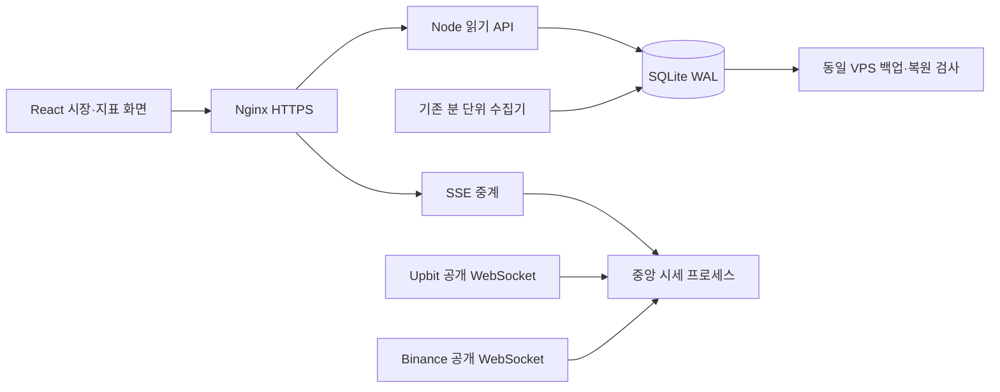

# Coin Desk 0.21 — 시장에서 지표로

현재 상태: 시장·상세·시세 전달 로컬 구현 및 관련 검사 완료, 전체 계획은 미완료. 원격 CI·운영 VPS 전환·HTTPS·48시간 운영 완료를 의미하지 않습니다. [검증 기록](audit-21/README.md)의 통과 범위와 남은 관문을 함께 확인합니다.

## 사용자 흐름

`시장 → 코인 → 지표 → 날짜 → 설명 → 저장 → 다시 열기`에 집중했습니다. 시장 홈은 Upbit KRW가 기본이고 Binance USDT로 바꿀 수 있습니다. 여덟 코인을 하나의 표에서 정렬하며 관심 코인과 최근 본 코인을 옆에 둡니다. 현재가는 스트림, 24시간 변동률·거래대금은 검증된 분 단위 스냅샷입니다. 시각과 지연을 숨기지 않습니다.

`/coins/:asset`에서는 기존 지표를 큰 주 차트로 엽니다. 분류·검색은 선택창, 자주 보는 지표는 바로가기입니다. MVRV 지원 코인과 RSI 기본 코인의 차이를 유지합니다. 1440px 이상에서 설명을 오른쪽에 배치하고 작은 화면에서는 차트 아래 설명을 펼칩니다. 기존 URL·원천·날짜·주석·저장 자료를 보존합니다. 사전에서 차트를 자동으로 추가하지 않습니다.

어두운 배경, 숫자 오른쪽 정렬, 상승 빨강·하락 파랑과 부호, 짧은 상단 메뉴를 적용했습니다. 사용자 요청에 따라 기존 시바견 캐릭터를 로고·빈 관심목록·브랜드 페이지·공유 이미지에 복원했습니다. 과거 브랜드 파일은 기존 링크를 위해 보존합니다. 교체한 사이드바 제어 코드와 충돌하던 차트 여백 규칙을 제거했습니다. 이전 화면의 모든 CSS를 삭제한 상태는 아닙니다.

## 데이터와 실행 구조

- `/api/v1/market?market=upbit|binance`: 스냅샷 8개 일괄 조회와 코인별 확정 일봉 최대 30개. 공급자 요청과 DB 쓰기가 없습니다. 홈에서 무거운 overview 8개를 요청하지 않습니다.
- `/api/v1/quotes/stream?market=…`: 별도 프로세스의 공개 가격을 중계합니다. 거래소별 연결 하나, 코인별 최신값, 초당 최대 한 번 전달하며 틱은 DB에 쓰지 않습니다. 현재 접속 상한은 200명입니다.
- 잘못된 시장·단위·미래 시각·역순 체결을 거부합니다. 재접속, 90초 무응답 감지, 23시간 연결 교체, 제한된 출력 버퍼를 둡니다. 클라이언트는 연결 중단 시 분 단위 값으로 돌아가고 이전 코인의 값을 섞지 않습니다.
- 가격 컴포넌트의 1초 갱신은 지표 차트의 역사 계산과 분리했습니다. 확정 관측·730일 위치 밴드·로그회귀 레인보우·날짜축·확대 유지 조건을 변경하지 않았습니다.
- Upbit `signed_change_rate`는 전일 대비이므로 24시간 변화율로 사용하지 않습니다. 현물 PEPE와 `1000PEPEUSDT` 선물 계약을 혼동하지 않습니다. [Upbit 정의](https://docs.upbit.com/kr/reference/websocket-ticker), [Binance 스트림](https://developers.binance.com/docs/binance-spot-api-docs/web-socket-streams).

## VPS 이전

새 시세 서비스는 기존 프로젝트 compose 안에서만 실행하며 외부 포트를 열지 않습니다. API·DB·수집·백업 구성은 유지합니다. Nginx SSE 버퍼링을 끄고 이전 빌드의 해시 파일을 공유 디렉터리에 보존합니다. 내용이 다른 동일 이름의 파일과 경로 이탈은 거부합니다.

기존 [VPS 배포 안내](../DEPLOYMENT.md)의 데이터 export·전체 지문 검증·읽기 전용 검사·기존 쓰기 동결·최종 이관·자연 갱신 순서를 유지합니다. 이번 실행에서는 원격 접근이 차단되어 실제 서버에 적용하지 않았습니다. 새 주소의 IndexedDB는 기존 Pages와 별개이므로 사용자가 로컬 백업을 내보내고 복원해야 합니다. 원본을 서버에 올리지 않습니다.

## 강아지 복원·분 단위 수집 후속 수정

기존 시바견 원본을 재사용합니다. VPS에서는 여덟 코인의 저장 시세를 모두 60초마다 확인하도록 보조 코인의 300초 조건을 수정했습니다. Cloudflare의 기존 비용 정책과 모든 원천의 실패 재시도는 유지합니다. 온체인 값의 실제 관측 주기는 바꾸지 않습니다.

상태 화면은 실행 환경별 목표 주기, 네 수집 작업의 실행 기록, 검증된 백업 여부를 표시합니다. 상태 조회 실패·실행 기록 없음·백업 없음은 정상으로 표시하지 않습니다. [최신 검증](audit-21/dog-minute-followup.json).

응답 소요 시간이 다음 예약의 60초 경과 조건을 막지 않도록 VPS 시세의 분 경계 판정과 잠금을 함께 수정했습니다. 실제 체결 시각과 원천별 재시도 기준은 유지합니다.
