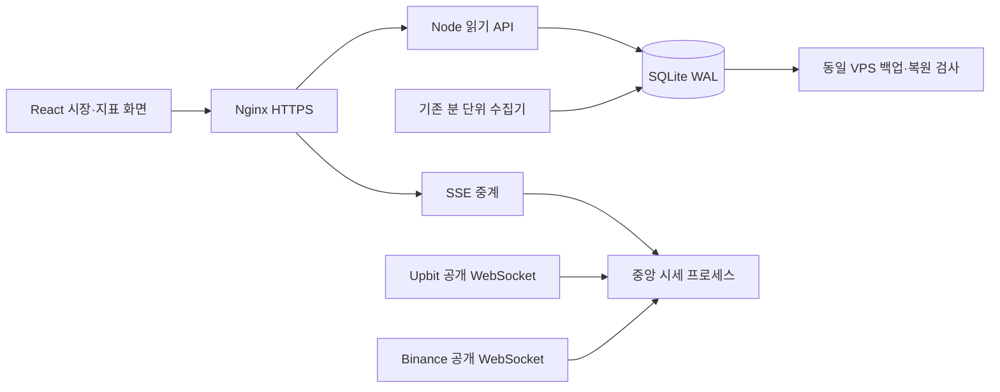

# Coin Desk 0.21 — 시장에서 지표로

현재 상태(2026-10-03 KST): **VPS 운영 전환과 후속 UX 수정의 원격 CI·배포 완료**입니다. [기존 운영 주소](https://coin-desk.pages.dev/)와 [VPS HTTPS](https://coin-desk.62.171.141.206.sslip.io/)에서 사용할 수 있습니다. [실제 전환 증거](audit-21/live/README.md)를 확인합니다.

후속 PR #42·43으로 API/SSE 복구 경로와 키보드 날짜 이동 후 구간 유지를 보완했습니다. API `vps-7e72771fa7feac35`, Pages `bfd4bcd0`이며 수집기·hub·백업은 유지했습니다. 원격 CI, 실제 데이터, 100명 스트림 검사, 성능 한계는 [최신 점검](audit-21/completion/README.md)을 따릅니다. 이 문서 변경만으로 재배포하지 않습니다.

## 사용자 흐름

`시장 → 코인 → 지표 → 날짜 → 설명 → 저장 → 다시 열기`에 집중했습니다. 시장 홈은 Upbit KRW가 기본이고 Binance USDT로 바꿀 수 있습니다. 여덟 코인을 하나의 표에서 정렬하며 관심 코인과 최근 본 코인을 옆에 둡니다. 현재가는 스트림, 24시간 변동률·거래대금은 검증된 분 단위 스냅샷입니다. 시각과 지연을 숨기지 않습니다.

`/coins/:asset`에서는 기존 지표를 큰 주 차트로 엽니다. 분류·검색은 선택창, 자주 보는 지표는 바로가기입니다. MVRV 지원 코인과 RSI 기본 코인의 차이를 유지합니다. 1440px 이상에서 설명을 오른쪽에 배치하고 작은 화면에서는 차트 아래 설명을 펼칩니다. 기존 URL·원천·날짜·주석·저장 자료를 보존합니다. 사전에서 차트를 자동으로 추가하지 않습니다.

어두운 배경, 숫자 오른쪽 정렬, 상승 빨강·하락 파랑과 부호, 짧은 상단 메뉴를 적용했습니다. 사용자 요청에 따라 기존 시바견 캐릭터를 로고·빈 관심목록·브랜드 페이지·공유 이미지에 복원했습니다. 과거 브랜드 파일은 기존 링크를 위해 보존합니다. 교체한 사이드바 제어 코드와 충돌하던 차트 여백 규칙을 제거했습니다. 이전 화면의 모든 CSS를 삭제한 상태는 아닙니다.

## 데이터와 실행 구조

- `/api/v1/market?market=upbit|binance`: 스냅샷 8개 일괄 조회와 코인별 확정 일봉 최대 30개. 공급자 요청과 DB 쓰기가 없습니다. 홈에서 무거운 overview 8개를 요청하지 않습니다.
- `/api/v1/quotes/stream?market=…`: 별도 프로세스의 공개 가격을 중계합니다. 거래소별 연결 하나, 코인별 최신값, 초당 최대 한 번 전달하며 틱은 DB에 쓰지 않습니다. 현재 접속 상한은 200명입니다.
- 잘못된 시장·단위·미래 시각·역순 체결을 거부합니다. 재접속, 90초 무응답 감지, 23시간 연결 교체, 제한된 출력 버퍼를 둡니다. 클라이언트는 연결 중단 시 분 단위 값으로 돌아가고 이전 코인의 값을 섞지 않습니다.
- 가격 컴포넌트의 1초 갱신은 지표 차트의 역사 계산과 분리했습니다. 확정 관측·730일 위치 밴드·로그회귀 레인보우·날짜축·확대 유지 조건을 변경하지 않았습니다.
- Upbit `signed_change_rate`는 전일 대비이므로 24시간 변화율로 사용하지 않습니다. 현물 PEPE와 `1000PEPEUSDT` 선물 계약을 혼동하지 않습니다. [Upbit 정의](https://docs.upbit.com/kr/reference/websocket-ticker), [Binance 스트림](https://developers.binance.com/docs/binance-spot-api-docs/web-socket-streams).

## VPS 이전

새 시세 서비스는 기존 프로젝트 compose 안에서만 실행하며 외부 포트를 열지 않습니다. API·DB·수집·백업 구성은 유지합니다. Nginx SSE 버퍼링을 끄고 이전 빌드의 해시 파일을 공유 디렉터리에 보존합니다. 내용이 다른 동일 이름의 파일과 경로 이탈은 거부합니다.

기존 [VPS 배포 안내](../DEPLOYMENT.md)의 데이터 export·전체 지문 검증·읽기 전용 검사·기존 쓰기 동결·최종 이관·자연 갱신 순서로 실제 이전했습니다. D1 최종 19개 테이블·149,190행, 스키마·내용 해시·복원·원격 행 수가 일치합니다. 기존 Pages는 읽기 전용 중계로 VPS에 연결하므로 현재 주소의 IndexedDB를 그대로 사용합니다. VPS 직접 주소의 저장 공간은 별개이므로 이동할 경우 기기 백업·복원이 필요합니다. 개인 원본은 서버에 올리지 않습니다.

## 강아지 복원·분 단위 수집 후속 수정

기존 시바견 원본을 재사용합니다. VPS에서는 여덟 코인의 저장 시세를 모두 60초마다 확인하도록 보조 코인의 300초 조건을 수정했습니다. Cloudflare의 기존 비용 정책과 모든 원천의 실패 재시도는 유지합니다. 온체인 값의 실제 관측 주기는 바꾸지 않습니다.

상태 화면은 실행 환경별 목표 주기, 네 수집 작업의 실행 기록, 검증된 백업 여부를 표시합니다. 상태 조회 실패·실행 기록 없음·백업 없음은 정상으로 표시하지 않습니다. [최신 검증](audit-21/dog-minute-followup.json).

응답 소요 시간이 다음 예약의 60초 경과 조건을 막지 않도록 VPS 시세의 분 경계 판정과 잠금을 함께 수정했습니다. 실제 체결 시각과 원천별 재시도 기준은 유지합니다.

## 실제 운영 검증

- 코드 main `7ff1811b2011695f6c8ec7ba4a4261682cb805c2`, main CI `37061890773`: 타입·단위 487, Node 15, VPS Python 7, 복구 2, Chromium/WebKit 132개 통과. 개인 경로 2개 제외, 브라우저 재시도 0입니다.
- VPS `vps-f1546991c2aab31a`, Pages `5fe080db`. 공개 파일 110개가 빌드와 일치합니다. HTTPS 인증서 발급·갱신 모의 실행을 통과했습니다.
- 직접 수집/overview 없는 300초 관찰: 네 수집 작업 각각 5회 성공, 양 거래소 16개 시세의 실제 체결·확인 시각 증가, 선물 12개 확인 시각 증가. 읽기 API 29개, 활성 원천 103/103 정상, 백업 복원 대조 성공입니다. 다른 방문자 부재나 장기 안정성을 뜻하지 않습니다.
- 응답 없이 열린 SSE는 10초 뒤 새 연결을 만들며, 화면 복귀와 오래된 연결의 지연 이벤트를 처리합니다. 최초 차트 날짜의 하루 오차와 320px 넘침도 수정했습니다. 실제 8코인 탐색과 ONDO 미지원 MVRV 안내, 양 테마 axe를 검사했습니다. 1280×800에서 차트 시작 226px, 높이 440px입니다.
- 기존 주소의 고정 조건 5회 측정: LCP p95 1,004ms, 실제 가격 변경 18개에서 수신→화면 p95의 시계 오차 포함 상한 1,228ms. LCP는 첫 큰 화면 요소 기준이며 모든 데이터의 준비 시간을 뜻하지 않습니다. VPS 직접 주소의 초기 LCP 미달 기록도 보존합니다.

## 남은 운영 조건

10월 3일 후속 수정은 [정적 파일 전달·API 교체 기록](audit-21/followup/README.md)을 따릅니다. API만 `vps-d1307aabbe7ab4ec`로 바꿨고 수집기·시세 hub·백업은 최초 운영 릴리스를 유지합니다. 압축과 ETag로 전송량을 줄였으며 실제 가격 반영 지연은 오차 포함 p95 1.376초였습니다. VPS 직접 주소의 첫 접속 LCP p95는 4.992초로 2.5초 목표 미달이며 별도 과제로 남깁니다. 기존 CDN 주소의 결과와 혼동하지 않습니다.

2026-10-03 찬희님의 요청으로 **48시간 점검과 대기 조건을 폐지했습니다.** 전환 공백 2,700초와 과거 오류 및 API의 호환용 `observation48h` 통계는 참고 이력으로 보존합니다. 이 값의 `ready`는 출시·운영 마감을 막는 조건이 아닙니다. 배포 직후 실제 읽기 API·시세/선물/온체인 갱신·검증된 백업을 확인합니다. 기존 완전 UTC 하루의 자원·디스크 증가량·브리핑·백업 확인은 별도 운영 검증으로 유지하며, 48시간 판정과 구분합니다. 실제 Apple Safari/VoiceOver와 X 전수 검토는 완료 범위가 아닙니다.

이전 임시 자동화 `coin-desk`는 앞선 조회에서 존재하지 않는 것으로 반환됐습니다. 10월 3일 초기 재확인은 승인 제약으로 차단됐습니다. 이후 전체 접근 환경에서 조회 도구는 앱 카드를 열었으나 상태 메타데이터를 반환하지 않았고, 로컬 설정 파일도 없었습니다. 자동화 수정·중지를 확인한 것으로 표현하지 않습니다. 자동 후속 실행이 예약됐다고 보고하지 않습니다. VPS 제품 수집기는 브라우저·Codex 실행과 독립적으로 계속 동작합니다.

## 사용 흐름 재점검 · PR #41 배포 완료

[10월 3일 UX 감사](audit-21/ux-review/README.md)에서 실제 시장·MVRV·설명·ONDO·비교·운영 상태를 확인했습니다. 선택 날짜와 최근 관측값 구분, 구간을 유지하는 최근값 복귀, 미지원 지표 분류의 이유·대안, 원천 기준일과 차트 관측일 구분, 사전과 연결한 계산 예시를 로컬 구현했습니다. 이 수정은 네트워크·SSH 권한 확인 후 PR #41/main CI를 통과했고 VPS·Pages에 배포했습니다. [최신 배포 기록](audit-21/closeout/deployment/README.md)을 확인합니다. 검증 결과는 해당 감사 폴더에 기록합니다.
