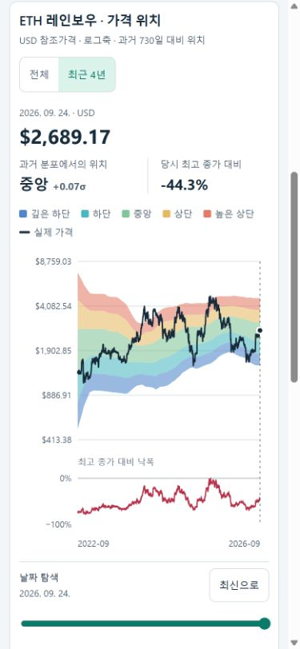
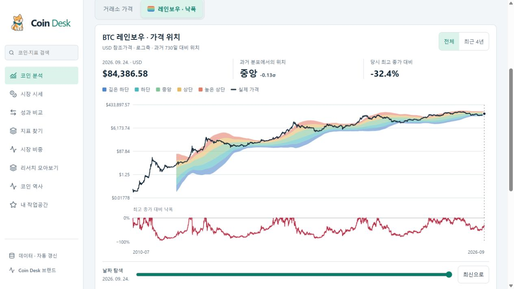

# 모바일·레인보우 작업공간 검증 — 0.14.1

2026-09-25. BTC 우선, DOGE·ETH까지 동일한 가격 탐색을 제공한다.

## 사용자 흐름

- 메인 가격 화면의 `거래소 가격 / 레인보우 · 낙폭`으로 전환한다. `visual=rainbow`는 URL과 코인 전환에 유지된다. 거래소 시세는 KRW/USDT, 레인보우는 Coin Metrics USD 참조가격이라고 각각 표시한다.
- 모바일에도 거래대금·고저가·RSI·200일선(또는 BTC MVRV)과 7개 분석 메뉴가 남는다. 작은 화면에서 정보를 제거하지 않는다.
- 역사 화면의 모바일 사건 선택은 당시 차트를 바로 연다. 상세 목록·검색·분류는 필요할 때 펼친다. 데스크톱의 목록+차트 배치는 유지한다.

## 시각화 정확성

- BTC·DOGE뿐 아니라 ETH를 지원한다. 이전 730일 분포 계산 전의 가격도 첫 관측부터 보여준다.
- 가격과 밴드 계산은 기존 Coin Metrics USD 시계열을 사용한다. 당일·미래 가격은 밴드 계산에 사용하지 않는다.
- 일반적인 로그회귀 비트코인 레인보우 모델이 아니라, 이전 730개 연속 UTC 로그가격의 평균·표준편차를 색으로 표시하는 설명용 시각화다. 밴드 계산에 필요한 자료가 없으면 색상을 만들지 않는다.
- 낙폭은 0%가 위, −100%가 아래다. 과거 최고 종가는 표시 기간 이전까지 포함하며 미래 고점은 쓰지 않는다.
- 전체 일별 관측을 그려 짧은 급등·급락을 생략하지 않는다. 가격·밴드의 결측 구간을 선이나 다각형으로 연결하지 않는다.
- 날짜 슬라이더는 실제 관측 하루 단위이며 방향키·Home·End로 탐색할 수 있다. 선택일 가격·위치·낙폭을 텍스트와 aria-valuetext로 함께 제공한다. 터치 선택도 유지한다.
- 밝은 테마의 흰 가격선 문제를 수정했다. SVG의 좌표 폭을 ResizeObserver로 갱신해 글씨를 축소하거나 최신 구간을 가로 스크롤 뒤로 숨기지 않는다.

## 접근성 설계 근거

[Apple UI Design Dos and Don’ts](https://developer.apple.com/design/tips/)의 화면에 맞는 배치, 누르기 쉬운 조작, 대비와 명확한 정보 관계를 참고했다. 웹 주요 모바일 조작은 44 CSS px 높이를 목표로 설정했다. Apple의 pt와 웹 CSS px는 동일한 규격 인증 단위가 아니다.

[WCAG 2.2 Target Size Minimum](https://www.w3.org/WAI/WCAG22/Understanding/target-size-minimum.html)은 AA에서 24 CSS px 또는 지정된 간격 예외를 설명한다. [Reflow](https://www.w3.org/WAI/WCAG22/Understanding/reflow.html)를 참고해 320px 폭에서도 탐색을 확인했다. 색상 외 텍스트, 키보드 입력, 포커스 표시, 기존 reduced-motion 및 모바일 메뉴 inert 처리를 유지한다.

실제 iPhone Safari·VoiceOver 검증이나 사이트 전체 WCAG 적합성 인증을 수행한 것은 아니다.

## 검증

- 타입 검사와 Vitest 297개 통과. 가격 첫 구간 보존·낙폭 방향·과거 고점·날짜 결측·단일일 급등/급락 보존 회귀 검증 포함.
- 프로덕션 빌드, 문서 링크, 브랜드 자산, Decimal 지표 검산 통과.
- 브라우저 320px/390px에서 역사·선물·온체인·레인보우 이동을 확인했다. 검사 화면의 문서 가로 넘침은 0이었다.
- 모바일 역사에서 FTX 선택: 2022-11-11 USD 16,916.85, 전후 90일 차트, 7/30/90일 후 −1.51%/+1.05%/+28.97%를 확인했다.
- DOGE Home: 2014-01-23. ETH Home: 2015-08-08, ArrowRight: 2015-08-09. 초기 밴드는 계산 전으로 표시했다.
- ETH 최근 4년, 라이트 테마 가격선 rgb(23,43,59)/흰 배경, 모바일 메뉴 닫힘 시 inert를 확인했다.

## 운영 범위

프런트엔드 변경이며 Worker·D1 설정은 바꾸지 않았다. 2026-09-25 검수에서 Cron은 stalled=false이고 최근 성공 기록이 확인됐다. BTC·DOGE·ETH 주요 원천은 지연 사유에 없었으나 XRP·LINK 참조/온체인 및 보조 코인 거래소 원천의 SOURCE_DELAYED가 남아 전체 health는 503이다. 무료 쓰기 한도 문제의 영구 해결이나 유료 업그레이드 완료를 의미하지 않는다.

768px 태블릿에서 코인 바로가기가 11px 넘치고 일부 시장 요약이 숨겨지는 문제도 수정했다. 재검수에서 문서 폭 753px와 스크롤 폭 753px가 같고 요약 4개 모두 표시됐다. 기본 데스크톱 1280px에서도 가로 넘침 0을 확인했다.

추가 320px BTC 원화 가격 검수에서 긴 현재가와 등락률이 한 줄에 겹치는 문제를 발견해 가격/등락률을 두 줄로 분리했다. 접힌 작업공간과 BTC 온체인 제목의 좁은 화면 배치도 함께 보강했다.
