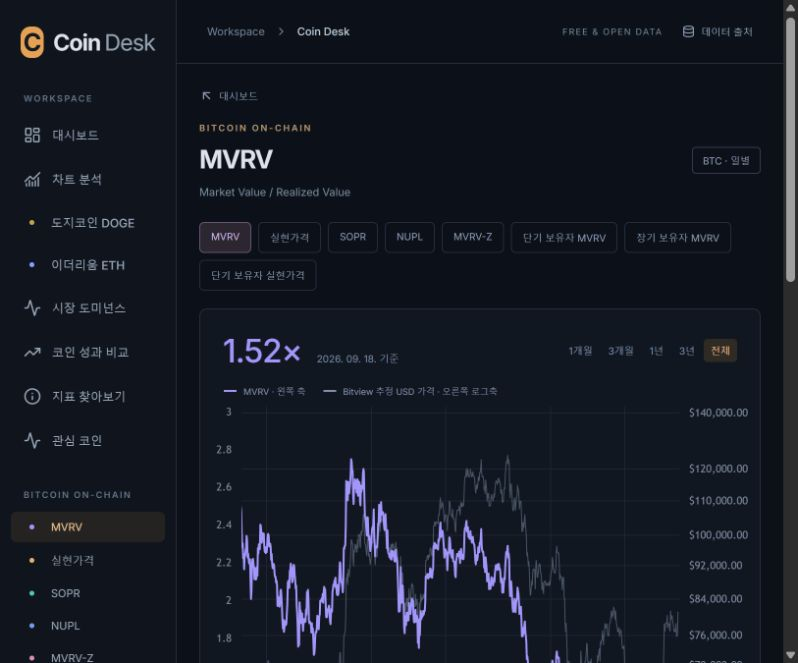
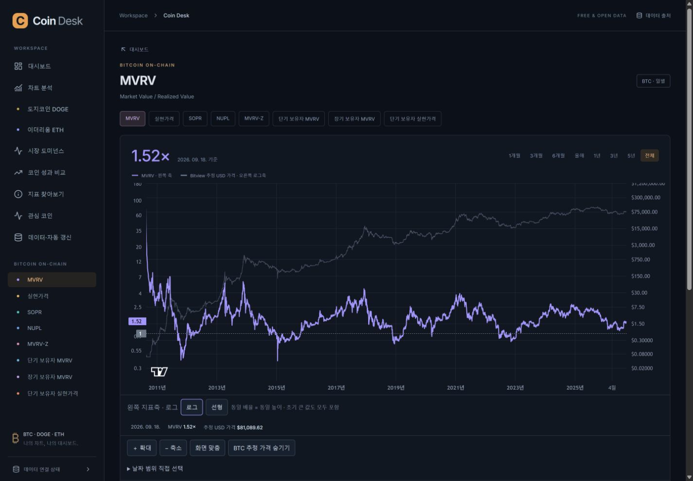
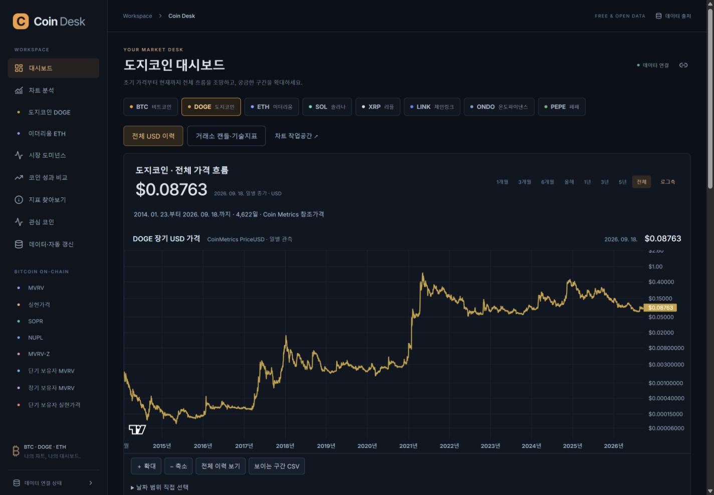
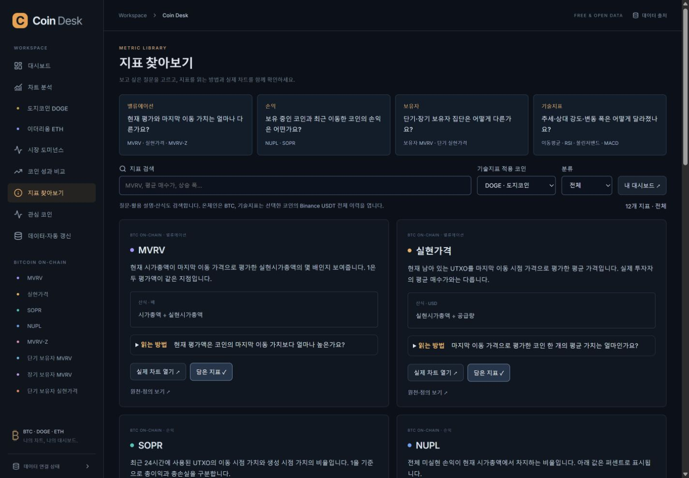
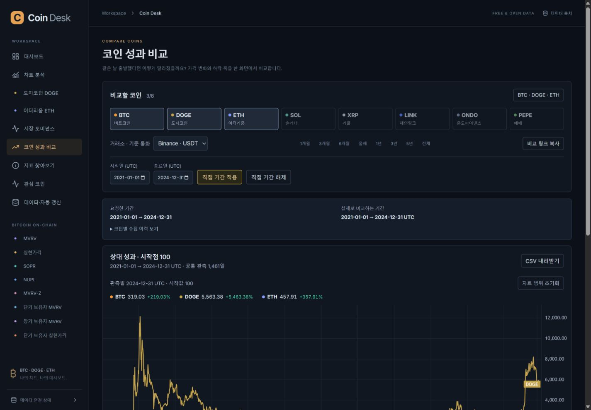
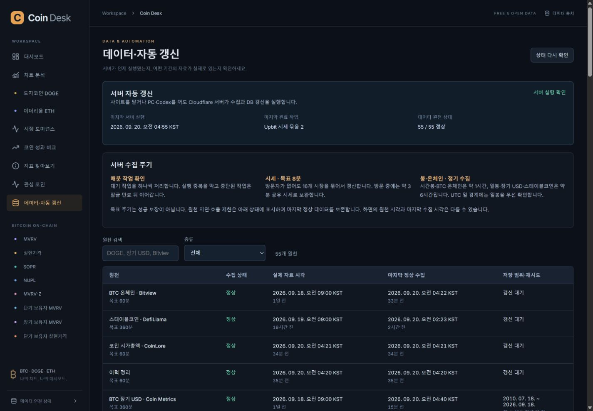

# Coin Desk 0.4 — 전체 이력·분석 UX·서버 자동 운영

기준: 2026-09-20 KST. [공개 사이트](https://coin-desk.pages.dev) · [MVRV](https://coin-desk.pages.dev/metrics/mvrv?period=all) · [DOGE 전체 이력](https://coin-desk.pages.dev/?asset=DOGE&period=all) · [자동 갱신 상태](https://coin-desk.pages.dev/status)

## 가장 큰 문제와 수정

`전체`를 눌러도 약 2년 반만 보였던 원인은 차트의 최소 봉 간격이었습니다. MVRV 원본은 5,878일인데, 기본 `minBarSpacing=0.5` 때문에 450px 화면에서는 약 900일만 보였습니다. 최소 간격을 0.01로 낮추고 **제공 시작·끝과 실제 화면 시작·끝이 일치하는지** 브라우저에서 검증했습니다. 버튼의 선택 표시만으로 완료 판정하지 않았습니다.

거래소 상장 전 역사가 없었던 문제는 별도의 Coin Metrics 일별 USD 참조가격으로 보완했습니다. 이전 거래소 OHLCV를 확장했다고 표시하거나 일별 한 가격으로 캔들을 생성하지 않습니다.

| 원천 이력 | 시작 | 확인한 마지막 일자 | 실제 관측 수 |
|---|---|---|---:|
| BTC · Coin Metrics PriceUSD | 2010-07-18 | 2026-09-18 | 5,907 |
| DOGE · Coin Metrics PriceUSD | 2014-01-23 | 2026-09-18 | 4,622 |
| ETH · Coin Metrics PriceUSD | 2015-08-08 | 2026-09-18 | 4,060 |
| BTC MVRV · Bitview | 2010-08-16 | 2026-09-18 | 5,878 |

장기 가격 14,589개를 보관한 원본과 공개 API 전량 대조했습니다. 중복·역순·날짜 공백 없이 값이 일치합니다. 일자는 UTC 가격 관측일이며 화면의 시간 안내는 KST입니다. BTC의 네트워크 시작일을 가격 데이터 시작일로 사용하지 않습니다.

## 사용자 흐름별 검수

### 1. 전체 시장 흐름에서 필요한 구간으로 — 개선 확인

1. BTC·DOGE·ETH 대시보드는 전체 장기 USD 가격부터 표시합니다. DOGE·ETH 사이드바도 장기 조망으로 연결합니다.
2. 1·3·6개월, 올해, 1·3·5년, 전체를 선택하거나 실제 관측 범위 안에서 날짜를 지정합니다.
3. 거래소 캔들·기술지표로 전환하면 원천과 제공 시작일이 바뀜을 안내합니다. 시간봉은 최근 90일입니다.
4. 상단의 기간·축 변경은 차트 인스턴스를 유지합니다. 빈 구간에는 이유와 전체 복원을 제공합니다.

모바일에서도 실제 `visibleFrom/To = availableFrom/To`를 확인했습니다. 390px에서 DOGE 4,622일 전체를 표시하며 문서 가로 넘침이 없습니다. 전체 기간의 최초 MVRV가 매우 높아 최근 변화가 눌리는 문제는 **양수 MVRV 계열 기본 로그축**으로 보완했습니다. 축 상태를 명시하고 선형으로 전환할 수 있습니다. 0·음수·0 기준선이 있으면 로그를 적용하지 않습니다.

### 2. 지표를 이해하고 원하는 코인에 적용 — 개선 확인

1. 지표 탐색에서 밸류에이션·손익·보유자·기술지표 질문으로 찾습니다.
2. 산식과 함께 ‘먼저 볼 것·함께 볼 것·해석의 한계’를 읽습니다. 검색에도 질문과 활용 설명을 포함합니다.
3. 기술지표는 8개 중 코인을 골라 전체 차트에 적용합니다.
4. 지표 설정을 프리셋·직접 설정·적용 중으로 나눴습니다. MA·RSI·볼린저·MACD 설정과 선별 값을 확인할 수 있습니다.

가이드의 계산 예시는 현재 시세가 아닙니다. MVRV와 NUPL의 같은 원천 산식 관계를 밝혀 독립적인 두 신호처럼 제시하지 않습니다. 온체인 이동이 실제 매매와 같지 않다는 한계도 설명합니다.

### 3. 여러 코인을 같은 기간으로 비교 — 개선 확인

1. 비교 기본값은 전체이며 공통 관측 시작을 명시합니다.
2. 요청한 기간과 실제 가능한 기간을 나란히 보여 줍니다. DOGE 또는 ONDO의 상장 이력 때문에 짧아지면 해당 코인과 날짜를 설명합니다.
3. UTC 직접 기간과 URL 복원, 수익률·종가 낙폭·변동성 설명을 제공합니다.
4. 확대만 할 때 수익률의 기준일이 바뀌지 않는다고 안내합니다.

실제 API 검산에서 BTC·DOGE·ETH Binance 공통 이력은 2019-07-05~2026-09-18, 2,633일입니다. 2021-01-01~2024-12-31 직접 범위는 1,461일입니다. 전체 로딩 이후 짧은 7개 기간 전환은 추가 수집 요청 0개였습니다. 비교는 거래소 종가이며 장기 USD 참조가격과 섞지 않습니다.

### 4. 사람이 없어도 유지되는 데이터 — 서버 실행 확인

Cloudflare Cron이 매분 한 작업을 수행합니다. 브라우저·PC·Codex를 닫아도 같은 서버 스케줄이 실행됩니다. 정기 수집과 DB 쓰기에 데스크톱 에이전트가 필요하지 않습니다.

| 작업 | 목표 주기·복구 |
|---|---|
| 현재가 | 4개 자산씩 4개 묶음, 전체 16시장 약 8분 목표. 10분 수집 지연 표시 |
| 방문 중 시세 | 화면 60초 조회, 원천 요청은 180초 공유 잠금. 실제 시세 300초 초과는 별도 표시 |
| 시간봉·BTC 온체인 | 약 1시간 |
| 일봉·장기 USD·스테이블 총액 | 약 6시간. UTC 날짜 변경 때 거래소 일봉 우선 |
| 누락·실패 | 재시도, 최근 수정 구간 재조회, 마지막 정상값 유지 |
| 초기 이력 복구 | 작은 페이지 + 체크포인트. null 날짜도 진행하되 가격을 생성하지 않음 |
| 중복·중단 | DB 임대 잠금, 동일 분 중복 방지, 만료 후 재예약 |
| 상태·기록 | `/api/v1/health` 읽기 전용, 오류 시 503. DB 최근 실행 120슬롯 유지, 화면 최근 20회 |

화면에는 수집 성공 시각과 실제 데이터 일자를 분리합니다. 원천이 이전 날짜까지만 제공하면 새로 수집해도 최신 일자로 바꾸지 않습니다. 상태 화면은 수집 상태, 제공 기간, 재시도, 서버 실행 기록을 보여 줍니다.

## 성능과 검증

- TypeScript·181개 회귀시험(18파일) 통과. 기간·중복 요청·중단, 전체 페이지·값 검증, Cron 중복·중단·부분 실패, 긴 null 구간 복구를 포함합니다.
- 사용자 기술지표는 독립 Python Decimal 3개 시나리오를 재검산했습니다.
- 필요한 페이지·차트 코드를 분할하고, 공유 요청을 합치며 화면 밖 지표는 가까워질 때 로딩합니다.
- 메인 JS는 333.27KB / gzip 107.29KB입니다. 차트 공통 모듈 171.93KB / gzip 55.51KB 등이 별도로 로드되므로 메인 파일 감소율을 총 다운로드·로딩시간 개선율로 해석하지 않습니다.
- 장기 가격 범위 메타데이터 쿼리를 전체 스캔에서 인덱스 양끝 조회로 바꿨습니다. BTC 5,907개 기준 로컬 SQLite 실행 단계는 47,270에서 41로 줄고 날짜는 같습니다.
- 새 가격의 초기 적재는 D1 쓰기 29,184행, 직후 DB 약 9.77MB였습니다. 인덱스 쓰기가 포함되어 관측 14,589개와 다릅니다.
- 실제 공개 DB 내보내기와 새 파일 복원, 로컬 11테이블 백업·복원 검증을 구분합니다. 운영 DB를 복구 시험으로 덮어쓰지 않습니다.

**공개 실행 증거와 최종 버전은 [릴리스 증거](evidence/upgrade-04-release.json)에 기록합니다.** 최종 Worker는 `42592a72-6e5f-408a-88f9-89b0a922bdf1`, Pages는 `ef873329`입니다. 공개 정적 파일 14개의 SHA-256이 로컬 빌드와 일치했습니다. 공개 검사에서 55개 원천 정상·issues 0, 최종 버전의 Cron 실행을 확인했습니다.

[공개 브라우저 검증](upgrade-04/public-browser-validation.json)은 1440px·390px의 MVRV 전체 5,878일, DOGE 전체 4,622일, 날짜 직접 적용과 표시 범위를 기록합니다. DOGE 모바일의 첫 장기 차트는 이번 브라우저 표본에서 968ms였습니다. 단일 환경의 측정이며 모든 네트워크에서 3초 이내임을 보장하지 않습니다.

[장기 원천 Cron 실행 기록](evidence/reference-cron-04.json)도 보관합니다. 검증을 위해 세 작업의 다음 실행 시점을 앞당긴 뒤, Cloudflare Cron이 BTC·DOGE·ETH를 각각 재조회해 DB에 기록한 것을 확인했습니다. 이후 정기 수집은 6시간 목표 주기로 이어집니다. 수집 성공 시각은 바뀌고 원천 마지막 관측일은 그대로 유지됐습니다.

무료 Worker의 [CPU 예산](https://developers.cloudflare.com/workers/platform/limits/)은 HTTP·Cron 각각 10ms입니다. 초기 배포 표본에 13~14ms가 있었고 처리 결과는 `ok`였습니다. 일시 허용과 장기 한도 준수는 다르므로 **무료 CPU 한도 충족·48시간 무중단을 완료로 판정하지 않습니다.** D1 Query Insights도 해당 질의 표본이며 계정 전체 청구 사용량은 아닙니다. 현재까지 유료 서비스로 변경하지 않았습니다.

## 이번에 확장하지 않은 데이터

Coin Metrics 장기 USD는 BTC·DOGE·ETH 세 자산입니다. 나머지 5개는 거래소 제공 이력이며, 도미넌스는 실제 관측을 시작한 시점부터 쌓입니다. BTC 이외 온체인, 청산 히트맵, 특정 업체의 730일 특수 가격 밴드 등 확보하지 못한 값은 만들지 않았습니다.

## 출처·실행

- [Coin Metrics PriceUSD 정의](https://docs.coinmetrics.io/network-data/network-data-overview/market/price), [Community 데이터와 CC BY-NC 4.0](https://github.com/coinmetrics/data)
- [Cloudflare Cron](https://developers.cloudflare.com/workers/configuration/cron-triggers/), [Workers 제한](https://developers.cloudflare.com/workers/platform/limits/)
- [데이터 정의](DATA.md), [운영·백업·롤백](OPERATIONS.md), [이전 검증 기록](VERIFICATION.md)

`npm run check`, `npm run build`, `python scripts/verify_reference.py --base https://coin-desk.pages.dev`로 코드·빌드·장기 원본 대조를 재현합니다. 원본 대조 전에는 `python scripts/bootstrap_reference.py`로 원본을 확보합니다. 배포·인증 파일과 실제 데이터는 Git에 포함하지 않습니다.
