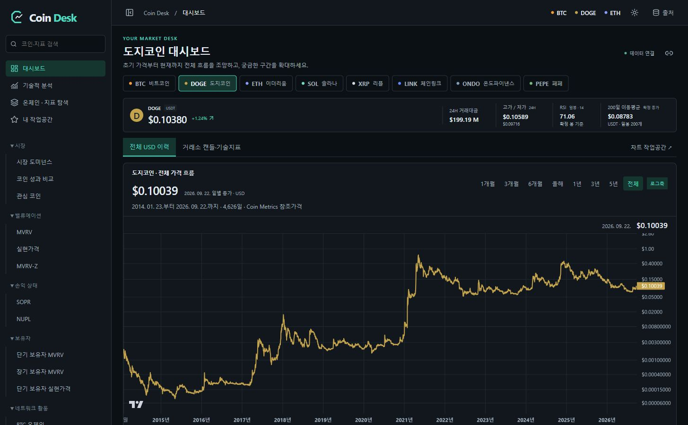
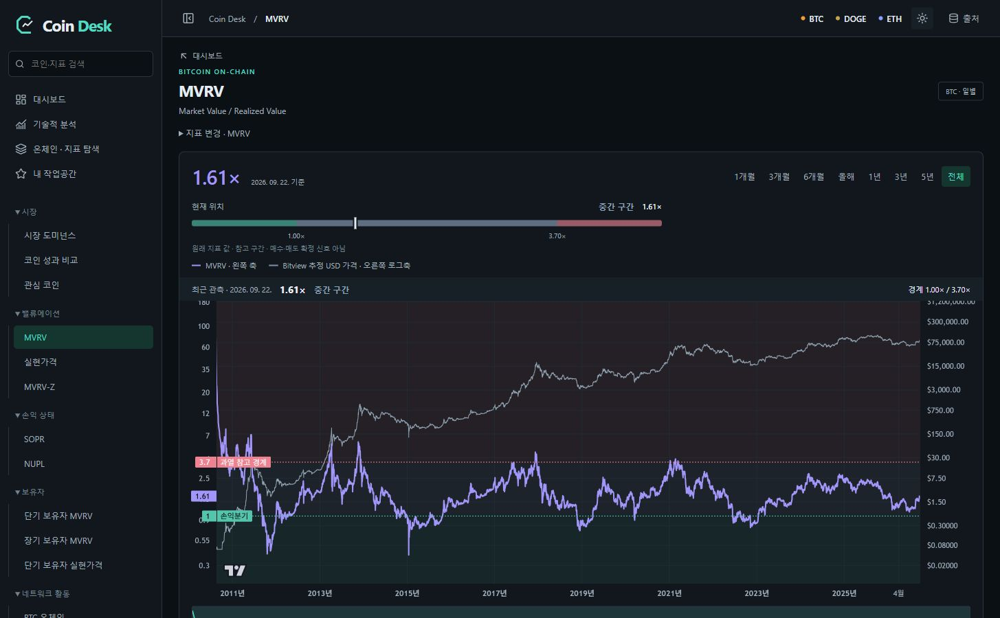
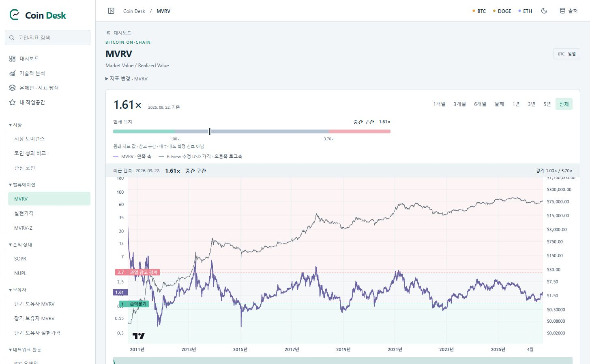
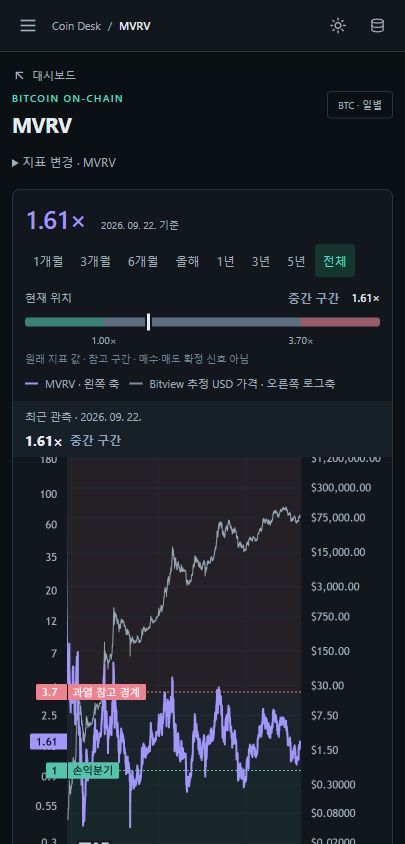

# Coin Desk 0.6 — 분석 화면·브랜드 개편

검증일: 2026-09-23. 기존 React·TypeScript·Lightweight Charts·Cloudflare D1 구조, URL, 브라우저 설정 키와 그리기 저장 형식을 유지했습니다.

## 바뀐 사용 흐름

- 검색과 시장/밸류에이션/손익/보유자/네트워크 분류로 이동합니다. BTC·DOGE·ETH를 우선 배치하고 나머지 자산을 유지합니다.
- 전체 USD 참조가격과 실제 거래소 캔들을 구분합니다. 기간은 최초 전체, 이후 저장값, 명시한 URL 순으로 존중합니다.
- 지표의 현재 값·관측일·실제 기준값을 먼저 표시합니다. 미니 차트와 두 범위 슬라이더로 긴 이력을 유지하며 확대합니다.
- 읽는 방법 / 함께 볼 지표 / 산식·출처 탭을 통일했습니다. DOGE·ETH 등 Coin Metrics 지표에는 같은 제공자의 USD 가격을 비교선으로 사용하고, BTC Bitview는 기존 추정 가격을 유지합니다.
- 밝은 테마는 캔버스 옵션을 제자리에서 갱신하므로 데이터 재수집·기간 초기화를 유발하지 않습니다. 모바일 상세 지표 설정은 하단 패널입니다.
- MACD 단기·장기·신호 EMA 기간을 2~1,000 범위에서 조절합니다. 단기 < 장기를 검증하고 기본 12·26·9와 기존 공유 URL을 유지합니다. 8·21·5 계산은 Python Decimal의 독립 표본과 대조했습니다.
- C 형태와 시계열을 조합한 자체 SVG 심볼, 워드마크·단색·밝은 배경 변형, PNG/ICO, Apple 아이콘, 1200×630 공유 이미지가 브랜드 페이지와 메타데이터에 반영됐습니다. 참고 서비스의 로고·이미지를 복사하지 않았습니다.

## 전체 조회 오류

구버전 공개 브라우저에서 MVRV와 DOGE 참조가격의 `Invalid to`를 재현했습니다. 네트워크 요청의 마지막 구간 `to=1790221828`은 브라우저 요청 시각 `1790135428`에 하루를 더한 값이었습니다. 서버 역시 자체 시각 + 하루를 상한으로 검사하므로 시계 차이가 경계에서 실패를 만들 수 있는 구조였습니다. 정확한 최초 장애 당시 시계 오차량은 측정하지 않았습니다.

새 응답의 `range`를 이용해 서버에서 확정한 종료 시각을 공유합니다. 구 캐시는 순차 커서 방식으로 호환하고, 중간 실패 시 부분 이력을 완료로 표시하지 않습니다. DB·스키마·자동 수집 주기는 바꾸지 않았습니다.

## 검증

- `npm run check`: 24개 파일, 220개 테스트 통과. 시계 ±5분/1년 차이, 구 캐시, 다중 페이지 누락·중복, 중간 오류 회귀 포함.
- `npm run build`: 타입 검사와 프로덕션 빌드 통과. 주 번들 gzip 약 114KB, 금융 차트 공유 청크 약 58KB.
- `python scripts/verify_custom.py`: 독립 Decimal 계산 통과.
- `python scripts/check_brand.py`: SVG·아이콘·이미지 크기와 메타데이터 검증.
- 조회 데이터 비교는 원자료 공급자의 정확성 인증이 아니라, 이번 UI/API 개편이 기존 저장 관측값을 바꾸지 않았는지 확인하는 검증입니다.

[배포 전 6개 시계열 검증](evidence/redesign-before.json). [배포 후 같은 6개 시계열 검증](evidence/redesign-after.json)의 전체 SHA-256, 최초·최종·중간 표본이 모두 같았습니다.

## 재현·배포·복구

```sh
npm ci
npm run check
npm run build
python scripts/verify_custom.py
python scripts/check_brand.py
python scripts/check_docs.py
node scripts/verify_redesign.mjs https://coin-desk.pages.dev before
npx wrangler deploy
npm run deploy:pages
node scripts/verify_redesign.mjs https://coin-desk.pages.dev after
```

`before`는 비교할 배포 이전에만 실행합니다. 기존 감사 파일을 재검사 중 덮어쓰지 마세요. 서버 우선 배포가 API의 추가 필드를 먼저 제공하고, 구 클라이언트는 새 필드를 무시합니다. DB 변경이 없어 데이터 롤백은 필요하지 않습니다. 문제가 있으면 Pages의 이전 배포를 복원합니다. API까지 문제가 있으면 Worker 이전 버전을 Wrangler/대시보드에서 복원합니다. 이미 수정된 조회 버그가 구 프런트엔드에서 다시 나타날 수 있습니다.

## 범위와 한계

- 새 알트시즌 지수, 유료 데이터, 새 호스팅, 새 Codex 스케줄러를 추가하지 않았습니다.
- 모바일 실기기 성능, 모든 네트워크 조건의 3초 목표, 48시간 운영은 단기 데스크톱 브라우저 확인만으로 통과 처리하지 않습니다.
- 전체 기간은 원천이 실제 제공한 첫 관측부터이며 결측·미지원 값을 만들지 않습니다. Coin Metrics의 비상업 라이선스와 출처 표시를 유지합니다.
- 공유 URL은 기존 코인·시장·봉·프리셋·지표를 보존합니다. 마우스 확대·미니 차트의 임시 구간과 그린 선은 공유 URL에 포함되지 않습니다.


## 공개 검증 결과

| 시계열 | 관측 수 | 실제 확보 기간 | 배포 전후 |
|---|---:|---|---|
| BTC USD | 5,911 | 2010-07-18 → 2026-09-22 | 전체 일치 |
| DOGE USD | 4,626 | 2014-01-23 → 2026-09-22 | 전체 일치 |
| ETH USD | 4,064 | 2015-08-08 → 2026-09-22 | 전체 일치 |
| BTC Bitview MVRV | 5,882 | 2010-08-16 → 2026-09-22 | 전체 일치 |
| DOGE CM MVRV | 4,626 | 2014-01-23 → 2026-09-22 | 전체 일치 |
| ETH CM MVRV | 4,063 | 2015-08-08 → 2026-09-21 | 전체 일치 |

최초 공개 측정에서 MVRV 첫 캔버스 표시 2,556ms, DOGE 대시보드 장기 가격 3,029ms였습니다. 브라우저의 실제 차트 준비 DOM 속성(performance.now)을 읽었으며 네트워크 제한 없이 측정했습니다. 두 값은 보장 SLA가 아닙니다. 구버전은 같은 브라우저에서 전체 차트 조회 자체가 실패했으므로 유효한 속도 개선 백분율은 계산하지 않았습니다. 추가로 로딩 공간을 예약하고 화면 아래 차트의 선행 로딩 범위를 줄였습니다.

MVRV 1년 → 전체 전환과 밝은/어두운 테마 전환 후 관측 수는 5,882, 차트 생성 횟수는 1로 유지됐습니다. 공개 페이지의 1440px PC·390px 모바일에서 문서 가로 넘침이 없었습니다. DOGE Upbit 기존 공유 링크는 KRW·일봉·전체·로그·200일/200주선을 복원했습니다. 로컬 모바일 패널에서 MACD 8·21·5 입력과 재접속 복원도 확인했습니다.

서버 기록은 12:32:54 → 12:59:42 KST의 약 27분 구간에서 Cron 실행 시각이 진행됐고, 마지막 coinlore 작업이 성공했습니다. 두 시점의 health.ok=true, stalled=false였습니다. 브라우저와 독립적인 Cloudflare Cron 설정을 유지했으며 이번 배포로 48시간 무중단이나 무료 한도 장기 충족을 주장하지 않습니다.







최종 배포 식별자: Worker `0f5ac903-495d-4bd0-9dd3-959fc435d173`, Pages `bd8656c6` ([해당 배포](https://bd8656c6.coin-desk.pages.dev)). 서비스 주소는 [coin-desk.pages.dev](https://coin-desk.pages.dev)입니다. 원천 재적재나 데이터 삭제 없이 배포했습니다.

공개 최종 배포에서도 DOGE Upbit 공유 URL의 `macd:8:bar:21:5`가 실제 MACD·신호 5·히스토그램으로 표시됐고 오류 알림이 없었습니다. 390px에서 검색 서랍의 `도지` 검색은 DOGE 결과로 연결됐습니다. 설정 패널 DOM 경계는 높이 844px 화면 안의 y=438.33~844px이며, 닫기·입력·적용을 사용할 수 있었습니다.

최종 지연 로딩 수정 후 DOGE 대시보드 재접속에서는 장기 차트 1,105ms, 초기 생성 차트 1개를 관측했습니다. 이 재접속은 캐시가 따뜻한 조건이므로 최초 3,029ms와 동일한 조건의 전후 성능 비교로 해석하지 않습니다.
