# Coin Desk 0.11 · 코인 중심 탐색과 차트 우선 화면

검수일: 2026-09-24 KST. 기존 Coin Desk의 색·브랜드·실제 API를 유지하면서 탐색 구조와 화면 밀도를 개선했습니다. 새 패키지는 추가하지 않았습니다.

## 적용한 판단 기준

1. 코인 선택은 하나, 분석 화면 선택은 하나로 분리합니다. 글로벌 메뉴에는 전체 서비스의 목적지만 둡니다.
2. 이름·현재값·기간·차트 순으로 읽도록 배치합니다. 원천·산식·추가 설정은 차트 아래 또는 펼침 안에 둡니다.
3. 전체 이력은 실제 확보한 시작일부터 표시합니다. 거래소 가격, 참조가격, 온체인, 선물의 시작일을 동일하게 만들지 않습니다.
4. 선택 상태를 색과 밑줄, `aria-current`/`aria-pressed`로 전달합니다. 모바일은 네이티브 코인·기간 선택과 44px 주요 탐색 영역을 사용합니다.
5. 시세 조회 주기와 원천 관측 주기를 구분합니다. 일별 종가를 실시간 시세로 표시하지 않습니다.

참고한 구조는 [Component Gallery의 탐색·선택·펼침 요소](https://component.gallery/components/)와 [탭의 정보 분리 방식](https://component.gallery/components/tabs/)입니다. [Navbar Gallery](https://www.navbar.gallery/)와 [Mobbin](https://mobbin.com/)은 참고 자료의 범위를 살펴봤습니다. 유료 화면 흐름을 열람하거나 그대로 복제한 것은 아닙니다. Pageflows의 상세 흐름은 이번 도구에서 확인하지 못했습니다. 외부 이미지·아이콘은 새로 복제하지 않았습니다.

## 화면별 검수

아래 사진은 이번 실행에서 브라우저 캡처 원본을 저장하고 다시 열어 확인했습니다. 로컬 화면은 운영 API를 프록시로 연결했으며 모의 데이터가 아닙니다. 시세와 관측 수는 캡처 시점에 따라 달라집니다.

### 1. 코인 선택 → 전체 가격 — 개선 확인

중복 코인 카드·선택 줄을 단일 코인 선택으로 합쳤습니다. 가격 화면 안에 다시 나오던 선물 패널은 전용 선물 탭으로 이동했습니다. 작업공간 저장은 차트 뒤에 둡니다. DOGE 검색 결과에서 전체 가격으로 이동하고, 2014-01-23부터의 참조가격 이력이 표시되는 것을 확인했습니다.

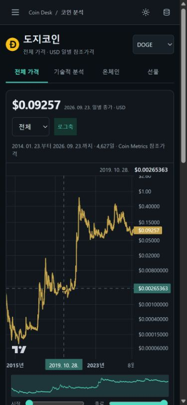

### 2. 기술적 분석 — 개선 확인

같은 코인 제목과 분석 탭을 사용하고 거래소·봉·지표 제어를 유지했습니다. 헤더의 중복 탐색을 줄여 차트를 앞당겼습니다. 장기 가격 분포 설명은 적정가·미래 경로로 표현하지 않습니다.

| 이전 | 이후 |
|---|---|
| 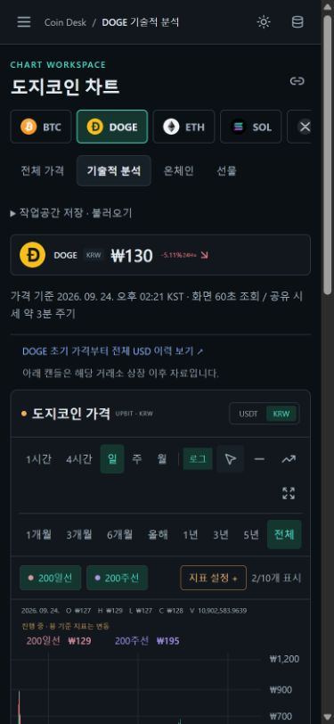 | 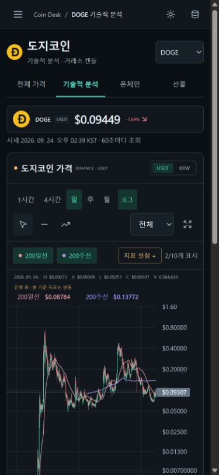 |

### 3. 온체인 지표 선택 — 개선 확인

코인별 지원 지표 검색·선택과 기간을 같은 줄에 배치했습니다. 지표 선택 뒤 목록을 접고 선택 제목으로 포커스를 돌려줍니다. MVRV에서 활성 주소로 변경할 때 URL과 제목이 일치했습니다. USD 가격 비교는 선택 기능으로 두어 최초 화면에서는 지표 자체에 집중합니다.

390×844 캡처에서 온체인 차트 상단은 종전 약 559px에서 약 359px로 이동했습니다. 숫자는 같은 화면 조건에서의 레이아웃 관측이며 사용성 실험 결과는 아닙니다.

| 이전 | 이후 |
|---|---|
| 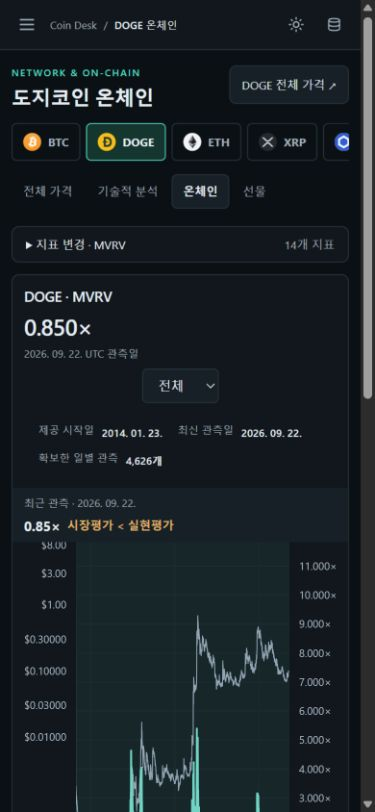 | 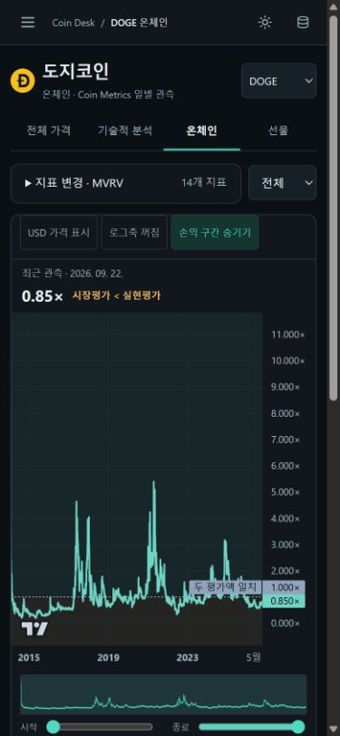 |

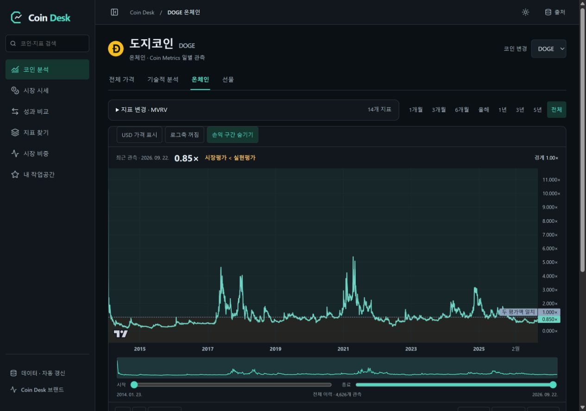

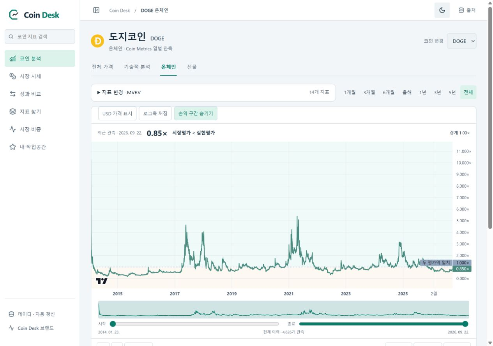

### 4. 선물 지표 → 기간 탐색 — 개선 확인

펀딩비·미결제약정·롱 계정 비중 3개 선택과 차트를 연결했습니다. 큰 계약 수량은 축약하되 코인 단위를 유지합니다. 시간별 최신 요약과 일별 차트 값에는 서로 다른 기준 시각을 표시합니다.

키보드 Home으로 DOGE 첫 펀딩 관측(2021-06-03)을 읽고, 1개월 선택 뒤 전체 이력 복원을 확인했습니다. ETH의 시간별 미결제약정에서 BTC로 전환해 `metric=open_interest&interval=1h`가 유지됐습니다. 공유 입력의 URL도 실제 화면과 일치했습니다.

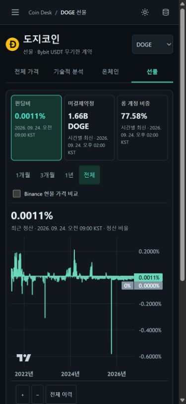

### 5. 시장 시세 → 코인 진입 — 개선 확인

데스크톱 표는 유지하고 모바일에서는 코인별로 가격·등락·거래대금·RSI·200일선·가격 시각을 읽도록 배치했습니다. DOGE 검색 결과가 한 행으로 좁혀지고, 코인 이름에서 DOGE 전체 가격으로 연결됐습니다. 설명 문장으로 링크 역할을 반복하지 않습니다.

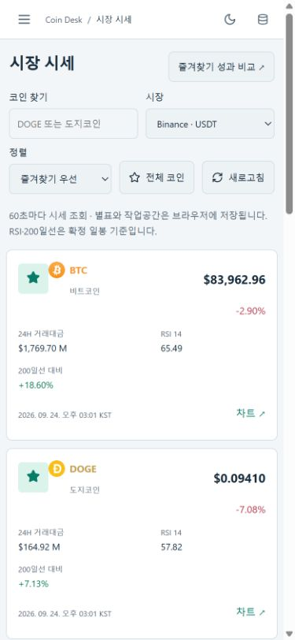

### 6. 성과 비교 — 기본 동작 확인

코인 선택과 기본 기간은 바로 보이고, 날짜 직접 지정은 펼쳐 사용합니다. URL에 직접 기간 또는 오류가 있으면 입력 영역을 열어 줍니다. 전체 비교의 공통 시작일과 요청 기간은 유지했습니다. CSV 이름은 실제 내보내는 비교 범위를 명시합니다.

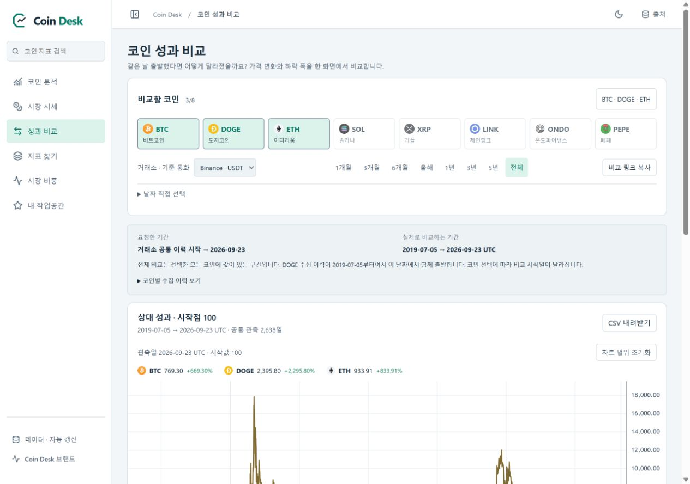

### 7. 지표 검색 → 실제 차트 — 개선 확인

질문으로 찾기는 펼침 메뉴로 제공하고, 검색과 분류를 먼저 사용합니다. 산식도 필요한 카드에서 펼칩니다. RSI 검색 결과가 한 항목으로 좁혀지고 DOGE 전체 차트 적용 링크가 해당 코인과 RSI 설정을 포함하는 것을 확인했습니다. 밝은 테마에서 옅은 금색이던 분류·읽기 라벨은 테마 강조색으로 맞췄습니다.

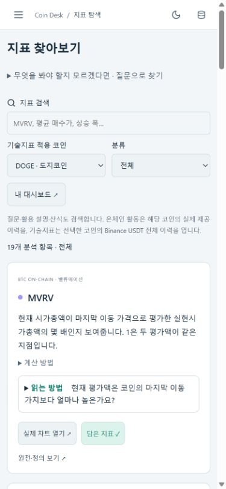

## 공통 접근성과 한계

- 주요 메뉴는 단일 활성 항목, 코인 분석 탭도 단일 활성 항목을 표시합니다.
- 모바일 메뉴 열기 시 닫기 버튼으로 포커스 이동, 배경 스크롤 잠금, Tab 순환, Escape 닫기와 메뉴 버튼 복원을 구현했습니다. 브라우저에서 열기·Escape·복원을 직접 확인했습니다.
- 선물의 방향키/Home/End 날짜 이동과 스크린리더용 값 알림, 공통 차트 확대·축소·전체 이력·전체화면·공유·CSV를 연결했습니다.
- 390px 모바일, 1280px 데스크톱을 시각 검수했습니다. 320px 온체인 미리보기의 문서 가로 넘침이 없었습니다. 밝은/어두운 테마를 확인했습니다.
- 실제 스크린리더, 모든 브라우저·기기, 모든 지표 조합의 검증을 의미하지 않습니다. WCAG 전체 준수나 사용자 만족도 개선을 입증했다고 주장하지 않습니다.
- 전체화면은 브라우저 지원에 따르며 실패 시 안내합니다. 데이터 원천 지연과 실제 제공 범위는 기존 상태 표시를 유지합니다.

## 코드·검증

핵심 파일: `AssetHeader.tsx`, `DeskNavigation.tsx`, `experience.css`, `App.tsx`, `NetworkPage.tsx`, `DerivativesPanel.tsx`, `ChartNavigator.tsx`, `WatchlistPage.tsx`, `MetricsExplorer.tsx`.

```powershell
npm run check
npm run build
python scripts/verify_custom.py
python scripts/check_docs.py
python scripts/check_brand.py
python scripts/package_release.py
```

타입 검사와 249개 테스트를 통과했습니다. 코인별 지원 메뉴·단일 선택을 회귀 검사하며 기존 계산·데이터·캐시 검사를 유지합니다. 운영 데이터 수집 Worker·Cron·DB 스키마는 이 UI 릴리스에서 변경하지 않습니다.
