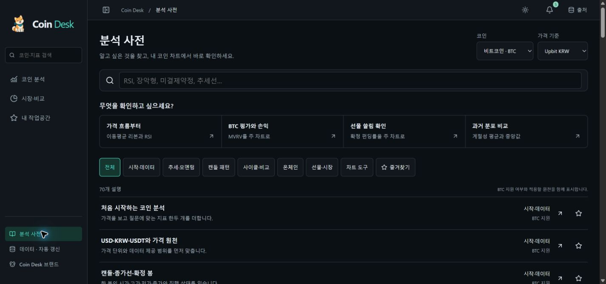
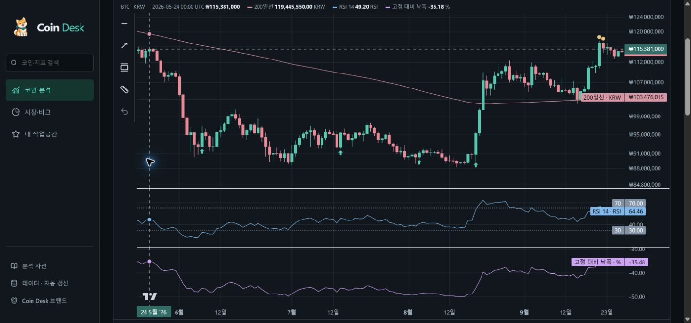

# 0.17.1 · 분석 사전·차트 연결과 시세 수집 보완

[분석 사전](https://coin-desk.pages.dev/learn)에서 설명을 검색하고 실제 차트에 적용한 뒤, 조건과 날짜 구간을 확인하고 저장·공유할 수 있습니다. 지원 범위·계산 정의는 [RELEASE17](../RELEASE17.md)에 있습니다. 기능 구현·운영 배포와 장기 안정성 관찰은 구분합니다.

## 배포와 검사

| 항목 | 확인 결과 |
|---|---|
| 기능 릴리스 | [PR #32](https://github.com/pollmap/coin-desk/pull/32), main `638142adf2496c88b71b9d6ba77fac0eb3ed4ce0` |
| 수집·표시 보완 | [PR #33](https://github.com/pollmap/coin-desk/pull/33), main `93b93d0647344b3b1557c43aaa20947f534e73c4` |
| 코드 CI | [PR 36339963477](https://github.com/pollmap/coin-desk/actions/runs/36339963477), [main 36340491951](https://github.com/pollmap/coin-desk/actions/runs/36340491951) 통과 |
| 단위·복구 | 타입검사, 단위/회귀 387개, DB 복구 2개, 빌드·독립 계산·문서·브랜드 검사 통과 |
| 브라우저 | main에서 Chromium/WebKit 74개 재시도 없이 통과, 개인 경로 opt-in 2개 제외 |
| main Worker | `7b917f0f-3b54-4c5c-bbed-3712db6b2100` |
| Pages | [c6b9458a.coin-desk.pages.dev](https://c6b9458a.coin-desk.pages.dev) |
| feed / quotes | `c08bd05d-4c05-4113-8b16-07d27fdf132b` / `649b29c4-5699-4770-8e1a-8bd1d271d7b7` |
| background / analysis | `75872efb-9be6-4651-8658-8a5133ca3e4e` / `5b47aec3-7b2e-4e5e-b0eb-f1475cf1fa4a` |
| 배포 완료 확인 | 2026-09-27 18:26:35 UTC. 비용 관찰의 보수적 기준이며 정확한 Worker 생성 시각은 아님 |

[검사 기록](verification.json)에는 PR CI의 WebKit 확장 연결 대기 1회 시간 초과와 재시도 통과도 남겼습니다. 그 검사만 별도로 재시도 없이 10회 연속 통과했고, 최종 main 전체 검사에서도 74개가 재시도 없이 통과했습니다. 최초 시간 초과의 원인은 확정하지 않았으며 재시도 이력을 삭제하지 않았습니다.

[공개 빌드 대조](public-build.json)에서 운영 `/learn` HTML과 차트 JS가 빌드한 dist와 바이트 단위로 같음을 확인했습니다. 최초 진입 JS는 약 415.65KB, gzip 135.70KB이며 차트·사전 화면을 분리 로딩합니다.

0.17.0은 PR #32로 배포한 기능 릴리스입니다. 0.17.1은 운영 점검에서 발견한 기존 시세 재시도 문제와 패턴 수치 표시를 보완합니다. 빌드 → 원격 추가형 마이그레이션 확인 → 수집 Worker → main Worker → Pages 순서를 유지했습니다. 기존 스키마 0009에서 추가 마이그레이션은 없으며 신규 유료 원천·DB를 사용하지 않았습니다. 문서만 추가하는 커밋으로 반복 배포하지 않습니다.

## 검증한 사용자 흐름

- 사전의 70개 설명은 기존 지표·시각화·도구에 대응합니다. 한국어·영어·별칭 검색, 7개 분류, 즐겨찾기, 핵심/자세한 설명, 관련 설명과 실제 적용 링크를 검사했습니다.
- BTC·DOGE·ETH, USD 참조·Upbit KRW·Binance USDT, 봉·기간·날짜 구간을 유지합니다. 지원하지 않는 코인/원천에는 가능한 대안을 제시하며, 실제 관측이 없는 온체인 자료를 확보했다고 표시하지 않습니다.
- 확정 OHLC가 필요한 9개 캔들 패턴은 거래소 자료에서만 계산합니다. 클릭한 관찰의 당시 구간과 실제 몸통·꼬리·이전 종가·SMA를 확인하며 단위에 맞게 수치를 표시합니다.
- 빠른 두 점 측정·세 점 채널, 실행 취소·Escape, 날짜 공유·새로고침·크기 변경 후 관찰 초점 유지, 전체 이력과 사용자 확대 유지가 브라우저 회귀에 포함됩니다.
- 320·390·768·1000·1280·1440px, 양 테마, 키보드·포커스·200% 확대·axe를 검사했습니다. Chromium/WebKit이며 실제 Safari·VoiceOver 검증으로 표현하지 않습니다.
- 운영 Chrome에서 사전 검색 → 상승 장악형 설명 → BTC Upbit 차트 적용 → 2026-08-19 관찰의 조건과 구간 → 사전 복귀를 확인했습니다. 당시 전체 이력은 2017-09-25부터였고, 선택한 관찰 구간은 2026-05-21부터 2026-09-27까지 표시됐습니다. 운영 관찰 수는 데이터 확보·봉·필터에 따라 변합니다.

## 계산·오류 복구

- 캔들 검사: 몸통/꼬리, 진행 봉·미래 마감·손상 OHLC, 0 거래량, 누락·중복·역순, 50/200 연속 표본, 실제 달력상 월/주/시간 간격, 가격 스케일, 미래 관측 추가 시 과거 결과 불변을 확인합니다. 임계값은 자체 공개 규칙이며 타사 탐지 결과와 동일하다고 표시하지 않습니다.
- 기존 독립 Decimal 계산·복구·문서·8개 코인 로고·브랜드·확장 CRC 검사를 유지합니다. 개인 원본 경로가 필요한 브라우저 2개 검사는 일반 CI에서 opt-in으로 제외합니다. 기존 개인 자료 전체 가져오기 검증은 [0.16 기록](../audit-16/README.md)을 참조합니다.
- 처음 실행한 통합 브라우저 검사에서 로컬 PC의 `ERR_NETWORK_IO_SUSPENDED`와 지연을 확인했습니다. 동시에 재현된 200% 확대 가로 넘침과 초기 레이아웃/StrictMode 이후 관찰 초점 초기화를 고쳤습니다. 실패를 통과로 바꾸지 않고 전체 재실행과 CI로 재검증했습니다.
- 0.17.1의 시세 오류 전파는 수정 전 2개 회귀로 재현했습니다. 수정 후 여러 분의 격리 DB 수집에서 정상 BTC·DOGE·ETH의 계속된 갱신, 실패 코인의 이전 스냅샷·오류·재시도 유지, 한 코인만 실행 대상인 경우와 거래소 요청 장애/복구를 구분합니다.

## 실제 운영 데이터와 비용

- [배포 후 API](production.json)와 [마지막 상태](final-status.json): 현재 원천 103/103 정상, health 200. 신호·브리핑·ETH TVL·시장 선물 및 BTC·DOGE·ETH의 MVRV·펀딩 등 12개 읽기 API가 모두 200입니다. 확장 ZIP 9개 파일의 CRC와 SHA-256도 확인했고 개인 원본은 없습니다.
- [자연 Cron 비교](natural-cron.json): 5분 동안 배경 원천 작업 5회가 완료됐고, BTC·DOGE·ETH × Binance·Upbit 시세 6개의 실제 체결 시각과 수집 성공 시각이 모두 증가했습니다. 최근 선물의 펀딩·미결제약정·롱 계정 비중 9개의 확인 시각도 증가했습니다. 새로운 펀딩 확정값 생성과 최근 관측 확인은 구분합니다. 조회 SQL의 쓰기 행은 모두 0입니다.
- [독립 시세 서버의 예약 로그](scheduled-quotes.json): 새 quotes Worker 버전에서 별도의 배포 후 구간에 매분 예약 3회가 `ok`, 예외 0으로 완료됐습니다. 측정된 CPU는 2~4ms이며 3개 표본을 하루 전체 성능 보장으로 확대하지 않습니다.
- 과거 수집 예산·커서는 이번 조회에서도 비어 있습니다. 생성되지 않은 키를 유실로 판정하지 않으며 하루 과거 후보 10,000개 예약 한도는 유지합니다.
- [공식 계정 일간 부분 집계](d1-partial-day.json): 2026-09-27 18:27 UTC 기준 읽기 3,497,988행·쓰기 44,658행입니다. 무료 일일 한도 5,000,000/100,000행 이내지만 **최종 배포 후 하루 전체 증거는 아닙니다**.
- 현재 원천 정상과 48시간 안정성 준비 완료는 다릅니다. 이전 중단·오류가 창에 남아 `observation48h.ready=false`이며, 기준을 완화하지 않았습니다. 최신 브리핑은 2026-09-27 기록이고 다음 날 생성은 별도로 관찰합니다.

초기 지연과 코드 수정 전 자연 복구는 [초기 기록](initial-delays.json)에 보존했습니다. 임시 후속 자동화는 최신 배포·검증 기준으로 갱신해 계속 실행하며 제품 Cron도 유지합니다.

0.17.0 첫 점검에서는 103개 원천 중 97개가 정상이고 health가 503이었습니다. LINK·ONDO·PEPE Binance 시간봉, SOL Upbit 시간봉, DOGE·PEPE Upbit 시세에 지연/오류가 있었습니다. 2026-09-27 18:16 UTC에는 코드 수정 배포 전에 자연 수집으로 103개 모두 회복했습니다. 이 회복을 0.17.1 수정의 효과라고 소급하지 않습니다. 별도로 확인한 코드 오류를 재발 방지 목적으로 수정했습니다.

운영 점검에서는 상태·신호·브리핑·ETH TVL·시장 선물·세 코인의 MVRV/펀딩 읽기 API를 사용합니다. 자연 Cron 관찰 중에는 직접 수집 API와 overview를 호출하지 않고, 사용한 분석 탭도 사전 화면으로 이동했습니다. 다른 방문자의 접근까지 배제했다고 주장하지 않습니다. 원격 SELECT와 예약 실행 로그를 대조하며 HTTP 요청·헤더·인증 정보는 증거에 보관하지 않습니다.

## 남은 실제 확인

1. 최종 코드 배포 이후 **완전한 UTC 하루**의 공식 계정 전체 D1 사용량·다음 날 브리핑·지속 갱신입니다. 첫 대상은 2026-09-28이며 2026-09-29 01:00 UTC 이후 확인합니다. 부분 시간창과 쿼리 insights 합계는 하루 총량을 대신하지 않습니다.
2. 엄격한 48시간 관찰의 기록률 99% 이상·최장 공백 180초 이하·미해결 오류 없음입니다. 이전 중단이 포함된 창을 초기화하거나 기준을 완화하지 않습니다. 임시 후속 자동화는 이 검증이 끝날 때까지 유지합니다.
3. 실제 Apple Safari·VoiceOver, 사용자 Chrome 확장 설치·로그인 X 전체 수집·개인 자료 전수 내용 검토는 별도 확인 사항입니다. 이번 사전 배포가 이를 완료했다는 뜻은 아닙니다. 공개 배포물·URL에 개인 글·이미지·메모를 포함하지 않습니다.

TradingView의 전체 도구, Pine Script, 모든 패턴·유료 데이터를 제공한 것은 아닙니다. 기존 Coin Desk 기능과 실제 데이터에 대응하는 사전 및 신규 9개 패턴을 구현한 범위입니다. 제품의 두 매분 Cron은 계속 실행하고, 모든 운영 조건이 충족되면 임시 배포 후속 자동화만 중지합니다.
