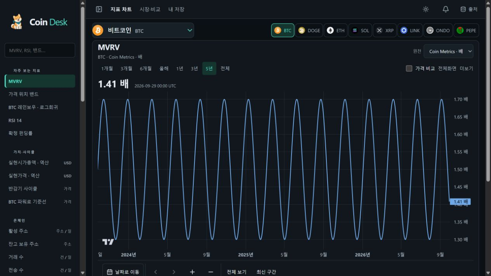
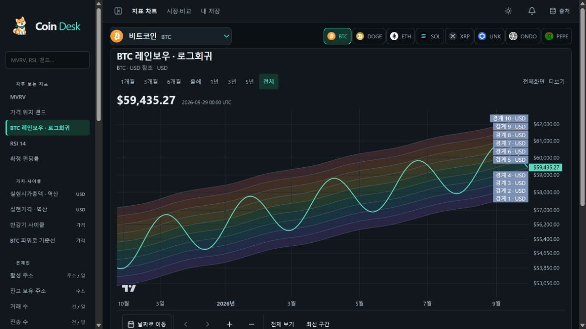

# 0.20 지표 화면 검증

이 기록은 웹 0.20의 구현·로컬 검증과 운영 배포를 구분합니다. 테스트 DB는 격리된 메모리 SQLite이며 서버의 실제 읽기 경로를 사용합니다. 운영 자료나 개인 원본을 fixture에 넣지 않았습니다.

## 구현과 검사

- 첫 진입 BTC MVRV 5년, 여덟 코인, 네 분류, 단일 지표 선택을 구현했습니다.
- 미지원 코인·USD 링크, 날짜·전체 범위·원천·URL·기기 저장, 가격 비교·보조 패널을 검사합니다.
- 로그회귀를 독립 최소제곱 및 Decimal 계산과 대조하고 미래 관측 추가·결측·평탄한 가격·표본 부족을 검사합니다. 기존 확정 봉·밴드·PEPE 계약 단위·복구 검사도 유지합니다.
- 320·390·768·1000·1280·1440px, 양 테마, 키보드·Escape·200% 확대·axe를 Chromium/WebKit에서 검사합니다.
- 첫 전체 실행은 108개 테스트 본문 통과·개인 경로 2개 제외 후 Windows 프로세스 종료가 끝나지 않아 중단했습니다. 이를 정상 종료로 기록하지 않습니다. 수동으로 시작한 격리 fixture 서버를 사용하는 별도 최종 실행과 CI에서 종료까지 확인합니다.
- 앞선 검사에서 옛 메뉴 기대값, 레인보우 설명 예제, 초기 알림 API 요청, 확대 시 가로 넘침, 날짜 대화상자 이름, 주석 CSS 누락, 옛 자료 연결의 지표 우선순위, 비교 추가 시 날짜 구간 초기화가 발견돼 수정했습니다. 실패를 재시도로 숨기지 않으며 최종 CI의 재시도는 0입니다.

최종 실행은 정상 종료했으며 **타입·단위 476개, 복구 2개, Chromium 54개·WebKit 54개**를 통과했습니다. 브라우저 실패·flaky·재시도는 0, 개인 경로 2개는 제외입니다. 최종 수치·CI·배포 여부는 [verification.json](verification.json)을 기준으로 보세요. 로컬 빌드 파일 70개의 해시는 [build-assets.json](build-assets.json)에 있습니다. 운영 파일 일치를 확인한 기록은 아닙니다.

## 화면 증거

아래 화면은 **로컬 통제 데이터**입니다. 운영 가격이나 운영 데이터 검증 증거가 아닙니다. 1280px 화면에서 주 차트 시작은 약 239px, 높이는 440px입니다.

## 운영과 남은 경계

2026-09-30 17:29 UTC 기존 운영 상태 화면에서 원천 103/103 정상, 48시간 기록률 99.72%, 누락 8회, 실제 최장 공백 353초, 미해결 0건을 읽었습니다. 기존 서버 관찰이며 웹 0.20 배포 증거가 아닙니다. 과거 공백을 포함하므로 엄격한 운영 완료를 선언하지 않습니다.

Cloudflare Pages 사전 조회는 기존 인증을 메모리에서 사용했으나 이 환경의 외부 요청이 `fetch failed`로 실패했습니다. 추가 네트워크 권한 요청도 허용 프로필을 반환하지 않았습니다. 인증 만료나 제품 장애라고 단정하지 않습니다. 비공개 로그는 Git 제외 `work`에 두며 인증 값·요청 헤더를 공개하지 않습니다. 배포 성공 여부는 별도로 기록합니다.

원천 수집 0.17.1, 기존 상태 API 0.19.1, 확장 0.18.0, 스키마 0009 및 제품 Cron을 유지합니다. Apple Safari·VoiceOver는 기기가 없어 실기기 검증 대기입니다. X 추가 수집·원본 전수 검토는 하지 않았습니다.

## 운영 반영이 남은 이유와 이어가기

GitHub 읽기는 가능했으나 branch 생성 쓰기 호출이 `MCP tool call requires approval, but approval policy is never`로 실행되지 않았습니다. PR·CI·main 병합을 완료로 표시하지 않습니다. Cloudflare도 추가 네트워크 권한이 없어 사전 조회를 완료하지 못했습니다. 승인된 작업을 수행할 수 있는 실행 환경에서 아래 순서로 이어가야 합니다. 기존 서버나 DB에는 변경을 가하지 않았습니다.

1. `feat/indicator-first-desk`를 원격에 push하고 [준비된 PR 설명](PR.md)으로 main 대상 PR을 만듭니다.
2. 기존 CI의 타입·계산·복구·브라우저·빌드 검사를 재시도 없이 확인하고 병합합니다.
3. 검증된 main에서 `npm run build` 후 `npm run deploy:pages`를 실행합니다. 이번 변경으로 전체 `npm run deploy`를 실행하지 않습니다.
4. 운영 BTC MVRV 첫 화면, 여덟 코인, 미지원 링크, 두 밴드, 날짜·공유·저장·도움말 복원을 확인하고 새 dist와 운영 공개 파일을 대조합니다.
5. 기존 Cron·공식 D1 하루 총량·다음 날 브리핑·엄격한 48시간 안정성은 별도 확인합니다. 웹 반영을 이유로 이력을 초기화하거나 임시 후속 자동화를 완료 처리하지 않습니다.
