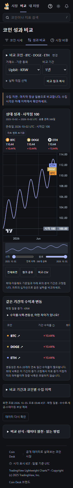
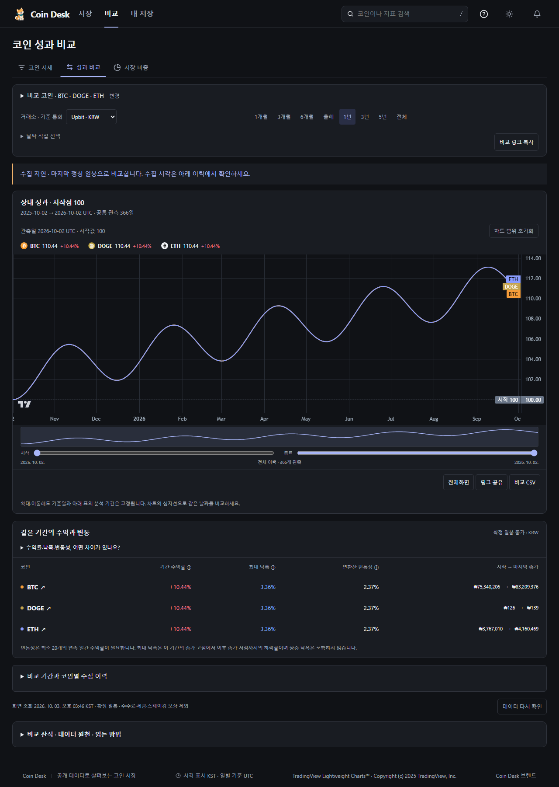

# 0.21 UX 후속 수정과 마감 기준 변경

2026-10-03 KST. 이 기록은 로컬 수정·검증이며 원격 CI 또는 운영 배포 완료 증거가 아닙니다.

## 48시간 점검 폐지

찬희님의 최신 요청으로 48시간 대기·통과 조건을 폐지합니다. 상태 화면의 기간 충족·운영 기준 충족 판정을 제거하고 수집 이력을 참고용으로 표시합니다. API `observation48h`는 기존 소비자 호환과 이력 확인을 위해 유지합니다. 기존 오류·누락·실제 실행 공백과 통계는 바꾸지 않습니다. 제품의 분 단위 수집과 백업은 중지하지 않습니다. 기존 완전 UTC 하루의 자원·브리핑·백업 확인은 48시간 판정과 별개의 운영 검증으로 유지합니다.

임시 Codex 자동화 조회는 도구가 승인을 요구했으나 현재 실행 환경은 승인을 허용하지 않아 차단됐습니다. 자동화 설정이 변경됐다고 보고하지 않습니다. 앞선 기록의 자동화 미존재 응답과 이번 확인 실패를 구분합니다.

## 화면 수정

- 비교 코인 선택은 선택 목록을 표시하는 접기/펼치기로 바꾸고, 좁은 화면에서는 기간 선택을 드롭다운으로 통합했습니다.
- 거래소·통화와 기간은 함께 표시합니다. 날짜 직접 지정과 공유 기능을 유지합니다.
- 요청 기간·실제 비교 기간과 코인별 수집 이력은 차트 아래에서 펼쳐 읽습니다. 지연·공통 이력 부족 안내는 숨기지 않습니다.
- 중복 CSV 버튼을 제거했습니다. 기존 차트 도구의 비교 CSV를 사용합니다.
- 320px에서 알림 버튼이 별도 줄로 밀려나던 상단 배치를 수정했습니다. 원본 강아지 이미지를 유지합니다.
- 비교 설정을 여닫아도 차트 확대 범위를 유지하며, 공유·새로고침에서 코인·거래소·날짜를 유지합니다.

## 첫 로딩

초기 App에서 상태·온체인 화면의 CSS를 미리 가져오던 중복 import를 제거했습니다. 각 화면의 지연 로딩 import를 유지합니다. 초기 CSS는 직전 빌드 124.34 kB(gzip 22.08 kB)에서 117.27 kB(gzip 20.93 kB)로 줄었습니다. 초기 JS는 346.01 kB(gzip 113.35 kB)입니다. 별도 원천 요청이나 계산 기준 변경은 없습니다.

이 결과는 파일 크기 비교입니다. VPS 직접 주소에서 측정했던 LCP p95 4.992초를 해결했다는 뜻이 아닙니다. 셸 네트워크 차단으로 운영 배포·동일 조건 재측정을 수행하지 못했습니다.

## 검증과 실패 기록

- 타입 검사와 단위 테스트 487개 통과, 프로덕션 빌드 성공.
- 비교 설정·상태·시장 화면의 Chromium/WebKit 검사에서 시장·상태 16개와 사용자 지정 날짜·공유 2개는 통과했습니다. 초기 새 비교 배치 테스트 2개는 차트 시작 위치에서 실패했습니다.
- 첫 320px 측정은 차트 시작이 약 868~874px로 늦었습니다. 설정 배치와 상단 줄바꿈을 수정했습니다.
- 비교 화면의 별도 480/600px 가정은 제품 계획의 지표 상세 화면 기준과 구분해야 하므로, 최종 비교 검사는 900px 높이의 첫 화면에서 차트 200px 이상이 보이고 설정 높이가 200px 미만이며 가로 넘침이 없음을 확인합니다. 지표 상세의 기존 위치 합격선을 변경하지 않습니다.
- 최종 검사 결과와 화면별 실측은 verification.json에 기록합니다. 자동 검사는 격리된 fixture이며 실제 시장 수치의 검증이 아닙니다.

## 배포 경계

로컬 선행 UX 커밋 2c68d3f와 감사 커밋 ca3df15 및 이번 변경은 아직 원격에 반영되지 않았습니다. GitHub main은 이번 세션 첫 조회에서 3cc0c807f16e2212ce9d03614118ca441398bd10였습니다. 후속 GitHub 443·VPS SSH 22 연결은 소켓 권한 오류로 차단됐습니다. 네트워크 제한을 우회하지 않았습니다.

배포 가능 시 기존 CI 통과 후 현재 파일로 빌드한 웹/API 릴리스만 반영하고, 수집기·시세 hub·백업을 불필요하게 재시작하지 않습니다. 마이그레이션은 없습니다. 마지막 운영 릴리스는 기존 [후속 배포 기록](../followup/README.md)을 따릅니다.

VPS 최초 로딩의 실측 목표, 원격 CI·배포 및 배포 후 실 API·자연 갱신 확인과 완전 UTC 하루의 운영 집계는 남아 있습니다. Apple Safari·VoiceOver는 기기 부재로 미검증입니다. X 수집과 개인 원본 전수 검토는 이번 범위가 아닙니다.

## 최종 결과와 로컬 화면

시장·상태 16개, 지표 설명 6개, 최종 비교 4개로 서로 다른 브라우저 검사 26개를 통과했습니다. 재시도는 0입니다. 비교 화면은 양 테마의 axe WCAG 2 A/AA를 통과했습니다. 중간 axe 검사에서는 TradingView 링크가 `role=img` 안에 들어가는 문제를 발견했고, 의미 있는 이름을 가진 `group`으로 수정했습니다. 복구 2개·문서 링크·원본 브랜드 검사도 통과했습니다. 전체 브라우저 묶음을 이번 턴에 다시 실행한 것으로 집계하지 않습니다.

아래는 최종 격리 검사 화면입니다. 실제 가격·배포 증거가 아닙니다.

VPS 배포 후보: `vps-710041fe2a2d533d`. 295개 허용 파일의 압축 후 내용 해시를 재검증했습니다. 개인 자료·DB·인증 환경 파일은 포함하지 않습니다. 배포하지 않은 패키지입니다.
