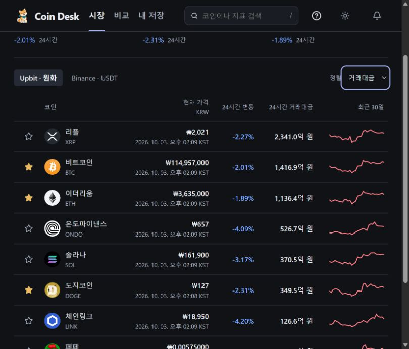
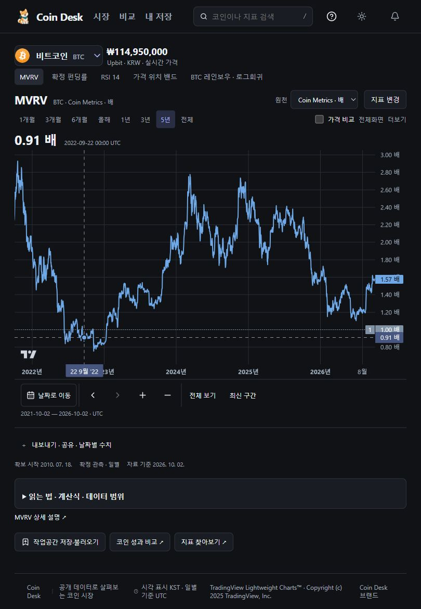
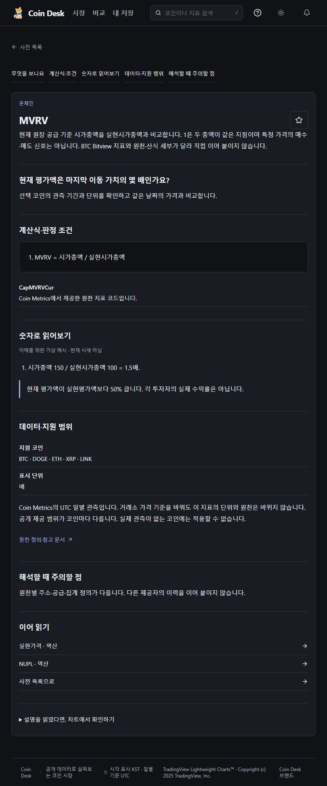
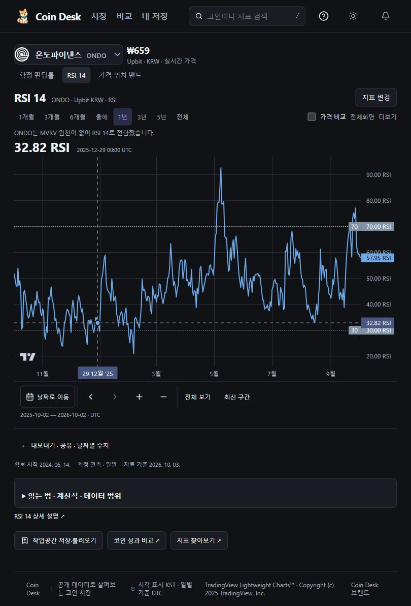
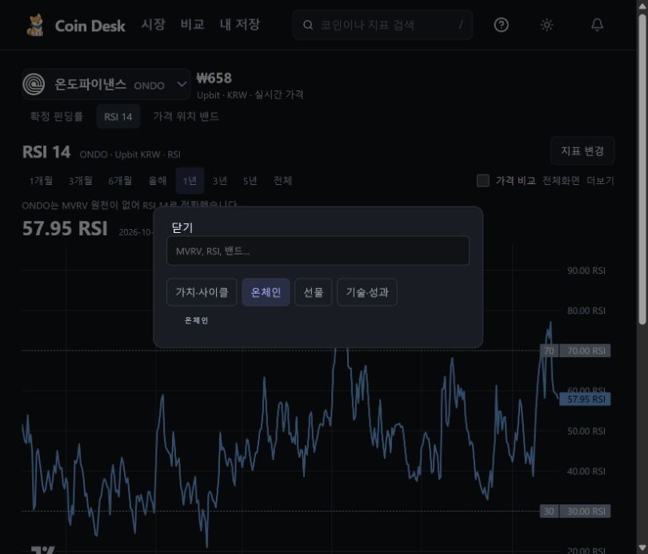
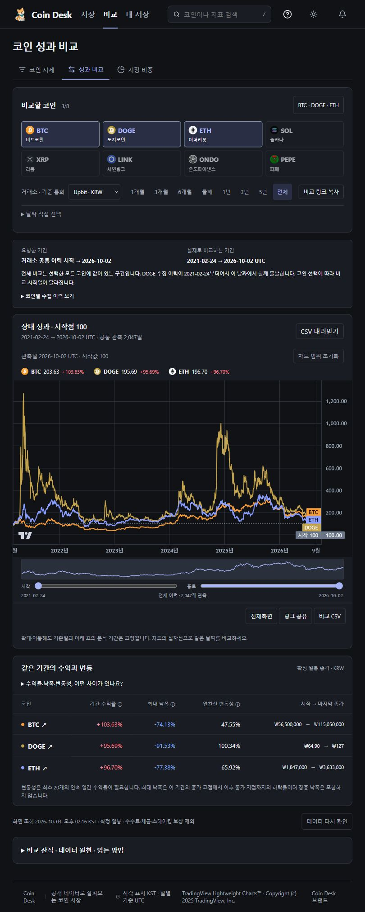
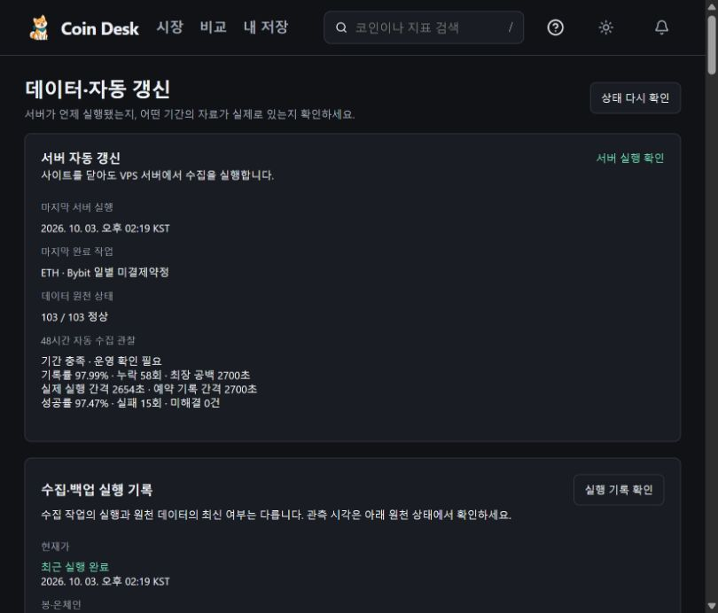
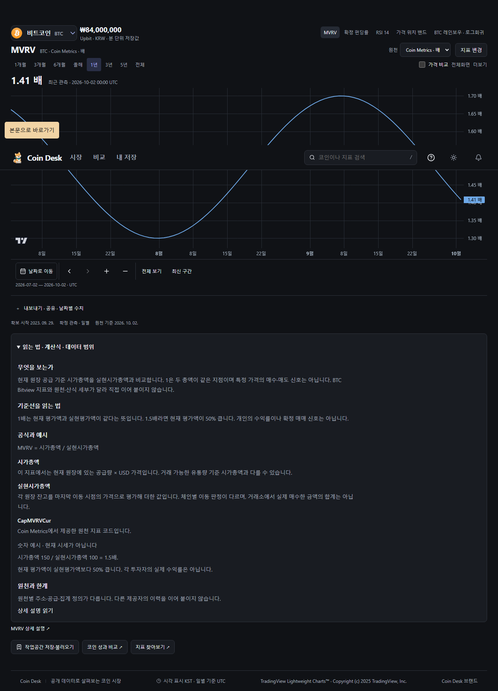
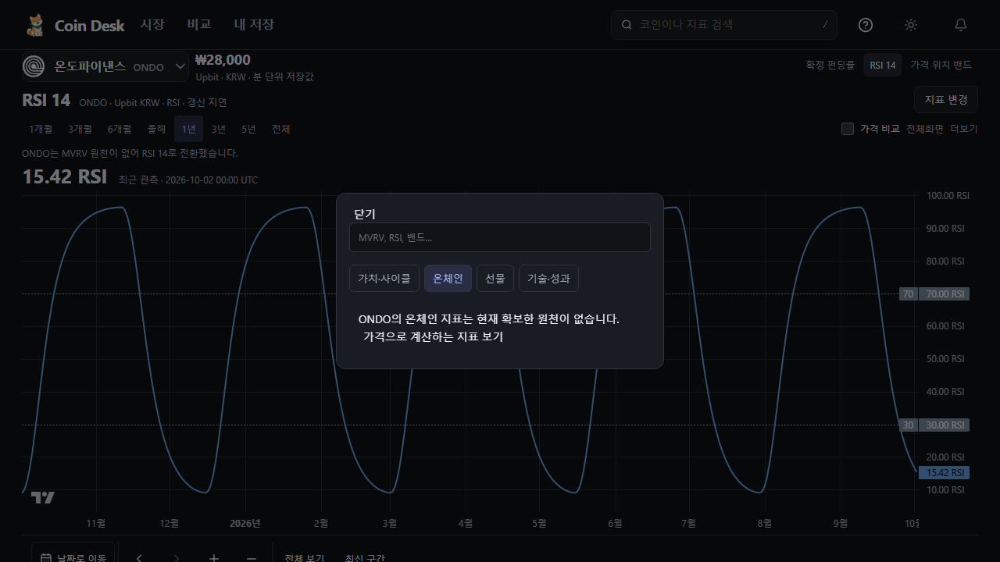

# 실제 사용 흐름 재점검 · 2026-10-03

시장 → BTC MVRV → 설명 → ONDO 전환 → 비교 → 데이터 상태 순서로 공개 운영 화면을 직접 조작했습니다. 운영 화면에서 발견한 혼동을 줄이는 수정이며 신규 데이터·거래소·기능 확장은 아닙니다. 기존 강아지와 개인 자료를 유지합니다.

## 확인한 흐름과 판정

| 단계 | 운영 화면 판정 | 수정·확인 내용 |
|---|---|---|
| 1. 시장에서 코인 선택 | 정상 | 거래대금 정렬, 여덟 코인, Upbit KRW와 체결 시각 확인. 선택 코인·가격 원천을 상세로 전달 |
| 2. MVRV 날짜 탐색 | 개선 필요 → 로컬 수정 | 선택한 과거 값과 최근값의 구분이 약했습니다. `선택한 날짜` / `최근 관측`을 표시하고, 확대 구간을 유지하는 `최근값 보기` 추가 |
| 3. 지표 설명 | 개선 필요 → 로컬 수정 | ‘공식과 예시’에 공식만 중복됐습니다. 사전과 동일한 계산 예시·용어를 연결하고 MVRV 1배의 의미, 실현시가총액과 실제 매수 금액의 차이를 설명 |
| 4. ONDO 전환·지표 선택 | 개선 필요 → 로컬 수정 | RSI로 대체되지만 선택창은 이전 분류에서 열리고 온체인 분류는 빈 화면이었습니다. 현재 지표 분류로 열며 미확보 이유·대체 분석 표시. 원천 기준일과 계산된 차트의 최근 관측일 구분 |
| 5. 코인 비교 | 핵심 기능 정상, 배치 개선 후보 | 실제 공통 구간·시작값 100·통화가 표시됩니다. 좁은 창에서 설정이 차트 위를 많이 차지하므로 후속 압축 대상으로 기록 |
| 6. 운영 상태 | 원천 정상, 장기 안정성 대기 | 14:19 KST 관찰에서 활성 103/103 정상, 네 수집 실행부 정상, 백업 확인. 엄격한 48시간은 기록률 97.99%, 최장 공백 2,700초로 미충족 |

### 변경 전 운영 화면

시장은 사용자가 보던 정렬·스크롤 상태에서 촬영했습니다. 화면 캡처는 약 810px 브라우저 폭이며 1280px 레이아웃 측정과 혼동하지 않습니다.

### 변경 후 로컬 검사 화면

아래 두 이미지는 격리된 자동 검사 데이터입니다. 실제 가격이나 운영 배포 완료의 증거가 아닙니다. 첫 이미지는 설명으로 스크롤한 뒤 전체 페이지를 촬영하여 고정 헤더가 중간에 표시됩니다.

## 제품 방향과 비교 근거

[CoinGlass](https://www.coinglass.com/)는 가격·펀딩·거래량·미결제약정·청산을 넓게 비교하는 정보 밀도가 강점입니다. Coin Desk는 여덟 코인과 한국어·원화 진입을 유지하면서, 선택한 온체인 지표의 값·시점·근거를 이해하는 경로에 집중합니다. 이는 이번 점검의 제품 판단이며 사용자 조사로 입증된 경쟁 우위라는 뜻은 아닙니다.

[TradingView 비교 안내](https://www.tradingview.com/support/solutions/43000543053-how-to-use-the-compare-tool/)처럼 가격 수준이 다른 자산에는 기준을 맞춘 비교가 필요합니다. 현재 Coin Desk의 시작값 100은 실제 공통 기간을 기준으로 합니다. 가시 구간마다 기준을 재설정하는 비교와 같은 계산이라고 표현하지 않습니다.

[Coin Metrics 공식 정의](https://docs.coinmetrics.io/network-data/network-data-overview/market/market-capitalization)로 MVRV = 현재 시가총액 / 실현시가총액을 대조했습니다. 실현시가총액은 원장 잔고의 마지막 이동 가격을 사용하며 체인별 판정이 다릅니다. 실제 거래소 매수 원가의 합계로 설명하지 않습니다. 가격 실시간 갱신과 온체인 일별 관측도 구분합니다.

## 구현과 검증 범위

- 지표 설명은 펼칠 때 별도 모듈을 로드합니다. 사전과 동일한 설명을 사용하며 추가 API 요청은 없습니다.
- 차트 초기 배치, 실제 사용자 확대, 키보드 날짜 선택, 최근값 복귀를 구분해 검사합니다. 최근값 복귀는 차트를 재생성하지 않습니다.
- 미지원 원천을 다른 코인이나 거래소 값으로 대체하지 않습니다. 서버 수집 주기·단위·300초 신선도 규칙은 변경하지 않았습니다.
- 타입·단위 487개 및 프로덕션 빌드 통과. 핵심 브라우저 18개와 전체 회귀 138개 통과, 개인 경로 선택 검사 2개 제외, 재시도 0입니다. 이후 최근값 복귀 버튼의 차트 초점 복원을 보완하고 관련 Chromium/WebKit 6개를 다시 통과했습니다. `verification.json`에 결과와 범위를 기록합니다.
- 첫 추가 테스트는 초기 배치 전의 범위를 읽어 WebKit 1개가 실패했습니다. 두 번째는 키보드 선택이 관측일로 이동하는 정상 동작 전의 구간과 비교해 양 브라우저 2개가 실패했습니다. 준비 상태 및 선택 이후 구간을 대조하도록 테스트를 수정했습니다. 실패를 제품 결함 해결로 집계하지 않습니다.

## 남은 조건

1. 이번 UX 수정의 원격 CI·운영 배포. 현재 실행 환경의 셸 외부 네트워크가 권한 오류로 차단되어 로컬 검증과 구분합니다. 앞선 정적 전달 패치 PR #40의 배포 완료와 혼동하지 않습니다.
2. 좁은 화면의 비교 설정 압축과 VPS 직접 주소의 첫 로딩 지연 원인 확인. 직접 주소 LCP p95 4,992ms로 2.5초 목표 미달이며 Pages 주소 측정과 분리합니다.
3. 완전 UTC 하루·엄격한 48시간 운영 확인. 과거 공백을 삭제하거나 판정 기준을 완화하지 않습니다.

실제 Apple Safari·VoiceOver는 기기 부재로 미검증입니다. WebKit 테스트로 대체 완료 처리하지 않습니다. X 전체 수집·개인 자료 전수 내용 검토는 이번 범위가 아닙니다.
