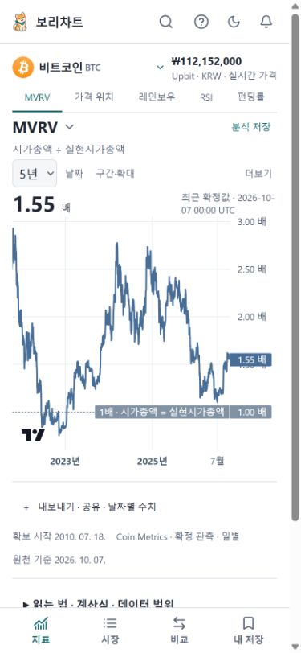
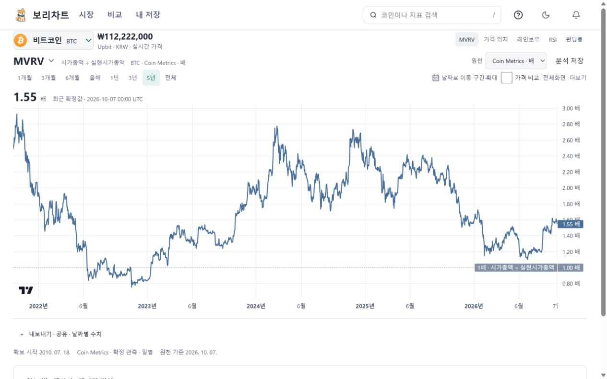
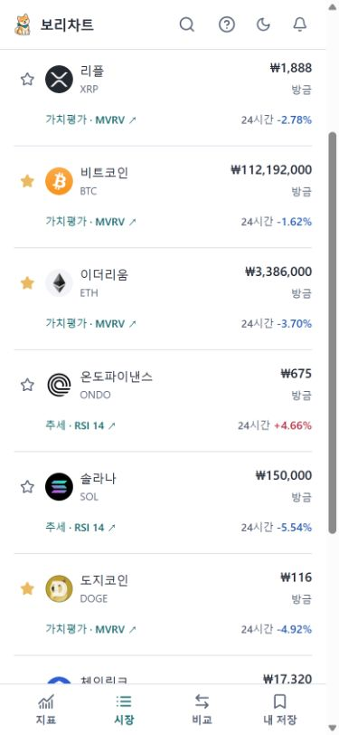

# 0.24 모바일 사용 흐름 검증

[변경·화면 명세](../RELEASE24.md). 2026-10-09 KST 작업 기록입니다.

## 현재 단계

모바일 지표 진입·날짜 탐색·저장 복원은 [PR #49](https://github.com/pollmap/coin-desk/pull/49), 운영 화면에서 추가 발견한 시장 행 높이는 [PR #50](https://github.com/pollmap/coin-desk/pull/50)으로 병합했습니다. 최종 코드 main은 `879382d1fba6b01b4454d2751fe5a9890ca25867`이며 Pages와 VPS에 배포했습니다. 두 PR과 최종 main의 전체 원격 CI가 통과했습니다. [검증 기록](verification.json)

## 배포 결과

- 운영 주소: [Pages](https://coin-desk.pages.dev/) · [VPS 직접 주소](https://coin-desk.62.171.141.206.sslip.io/).
- 최종 Pages: `01357c55`, VPS API/웹: `vps-f76588783920dcb4`.
- 최종 빌드의 공개 파일 83개가 두 주소에서 모두 SHA-256 일치합니다. VPS의 gzip·Brotli와 조건부 304 응답도 검증했습니다.
- API/웹만 교체했습니다. 수집기 4개·시세 허브·백업의 컨테이너와 시작 시각, DB·스키마·Nginx를 유지했습니다. 다른 서비스 컨테이너 12개도 동일합니다.
- 이전 릴리스와 해시가 포함된 정적 파일을 보존했습니다. 증거 문서 커밋만으로 재배포하지 않습니다.

[배포·복구 기록](deployment.json) · [배포 파일 대조](deployment-assets.json) · [API 교체 범위](api-upgrade-final.json) · [정적 응답](static-protocol.json) · [공유 서버 보존](shared-host.json)

## 발견과 처리

| 발견 | 처리 |
|---|---|
| 첫 화면 코인 표에서 분석으로 가는 흐름이 약함 | 모바일 기본 진입을 BTC MVRV로 변경. 시장은 하단 메뉴에서 접근 |
| 모바일 분석 링크가 가로 화면 밖에 있음 | 시장 행을 모바일에 맞춰 재배치 |
| 지표명·중복 분류·긴 설명이 차트를 밀어냄 | 지표명 자체로 선택창 열기, 지원 지표 바로가기, 한 줄 뜻과 상세 설명 분리 |
| 날짜 글자가 작게 눌림 | 과거 범례용 10×2px span 규칙 제거 |
| ONDO 이름·티커와 현재 가격 충돌 | 유연한 이름 폭과 작은 화면의 티커 표시 |
| 상대강도 설정이 두 줄로 밀리고 팝오버 배치에 영향 | 모바일 비교 버튼 압축, 현재 선택 코인 보존, 팝오버는 차트 위치 유지 |
| USD 참조 분석을 저장하면 현재 가격 거래소가 변경됨 | 분석 원천과 현재 가격의 거래소를 별도 보존 |
| 저장·공유 시 고정한 관측일이 사라짐 | 실제 관측일을 기존 설정 옵션과 URL로 복원, 명시한 확대 구간 보존 |
| 모바일 시장의 두 줄 행에 데스크톱 셀 높이가 남아 행이 165px까지 늘어남 | 모바일 셀의 고정 높이를 해제. 실데이터 후보에서 117px, 320·390·430px 두 엔진에서 130px 이내 확인 |

## 실제 사용과 데이터

Pages와 VPS에서 BTC MVRV 날짜를 2026-09-01로 고정하고 저장한 뒤 다시 열어 확인했습니다. 1.46배 관측값, 2026-07-10~10-07 확대 구간, 현재 가격 Upbit KRW, 지표의 USD 참조 설정을 각각 보존합니다. 생성한 검증용 저장 항목 두 개만 삭제했고 기존 항목에는 손대지 않았습니다.

390×844 첫 진입의 차트 시작점은 280px, 차트 높이는 330px입니다. 1280×800에서는 시작점 220px, 높이 440px입니다. 날짜 고정 상태의 해제 버튼은 한 줄을 추가하므로 첫 진입 치수와 구분합니다. 모바일 시장 → ONDO RSI, MVRV → 레인보우, Windows Chrome의 기존 다크 테마와 실제 차트 전환을 별도로 확인했습니다. [사용 흐름 기록](ux-verification.json)

2026-10-08 20:25 UTC(10월 9일 05:25 KST) 최종 확인 시 health HTTP 200, 활성 원천 103/103 정상입니다. BTC·DOGE·ETH·XRP·LINK의 최근 MVRV 관측일·값이 Coin Metrics 원천과 일치했습니다. 온체인의 최근 관측은 10월 7일이며 실시간 체결 가격과 다른 주기입니다. 배포 전 19:38 UTC에도 정상과 원천 일치를 확인했으므로 이 복구를 이번 UI 배포 효과라고 표현하지 않습니다. [배포 전](public-before-final.json) · [최종 배포 후](public-after.json)

직접 수집 API와 overview를 호출하지 않은 600초 표본에서 핵심 시세 6개의 체결·확인 시각 증가, 선물 확인 9개 증가, 수집 lane별 성공 9~10회를 확인했습니다. 예산·커서 키는 비교 전후 모두 없었습니다. 최초 180초 표본은 선물 4개 증가로 검사 도구의 9개 기준을 충족하지 못했으며 그 결과도 보존합니다. 다른 방문자의 부재나 하루 전체 지속성을 보장하는 검사는 아닙니다. [최초 표본](natural-first-sample.json) · [600초 자연 갱신](natural-cron.json)

## 개발 중 실패 기록

첫 검사에서 차트 위치·코인 이름 폭과 신규 테스트의 시장 조회 개수 가정이 실패했습니다. 상세 현재 가격도 시장 일괄 API를 한 번 사용하는 기존 구조를 확인해 요청 검사에 반영했습니다. 다음 검사에서는 날짜 대화상자 닫힘 전의 중복 버튼 선택과 긴 제목, 상대강도 도구 폭이 드러났습니다. 닫힘을 기다린 뒤 초점을 확인하도록 테스트를 수정했고 실제 화면도 보완했습니다. WebKit 768px 상대강도 시작점이 241px로 240px 기준을 넘은 것도 여백 수정 후 다시 검사합니다. 실패 기록은 최종 통과 기록과 구분합니다.

모바일 화면 변경의 로컬 전체 회귀는 178개 통과·개인 경로 2개 제외였습니다. 이후 실데이터 직접 조작에서 발견한 날짜·거래소 저장 결함에 회귀 검사를 추가했습니다. 첫 날짜 복원 수정은 React 개발 모드 재마운트 때 초기화에 의해 취소됐고(4개 실패), 다음 수정은 초기 커서 이동이 공유 구간을 덮어쓰거나 최근값 버튼을 누른 직후 레이아웃 변화가 미리 보기를 발생시켰습니다(7개 실패). 관측 복원을 구간 초기화 뒤로 옮기고 자동 이동을 막았으며, 최근값 전환 뒤 실제 포인터 이동이 있을 때만 미리 보기를 재개하도록 수정했습니다.

최종 날짜·저장 회귀 14개가 두 엔진에서 통과했고, PR #49의 원격 CI 37833411525는 전체 브라우저 180개·개인 경로 2개 제외, 재시도 0으로 통과했습니다. 최초 main CI 37835211122는 브라우저 의존성 설치에 1,050초가 걸린 뒤 브라우저 검사 도중 작업 전체 20분 제한으로 취소됐습니다. 원인은 설치 지연까지 확인했으며 근본적인 인프라 원인은 단정하지 않습니다. 해당 실행을 통과로 계산하지 않습니다. [CI 중단 기록](ci-initial-main-timeout.json)

마지막 행 간격 수정은 320·390·430px 두 엔진 6개 검사 후 PR #50의 전체 CI 37836953717에서 단위 513개·복구 2개·서버 35개·브라우저 180개(개인 경로 2개 제외), 재시도 0으로 통과했습니다. Storybook·문서·브랜드·패키지·Docker 실행 검사도 포함합니다. 병합 후 동일 소스 파일 312개를 대조한 뒤 배포했습니다.

최종 main CI [37838889113](https://github.com/pollmap/coin-desk/actions/runs/37838889113)도 같은 전체 검사에 통과했습니다. 최초 main의 시간 초과 기록은 유지하며, 최종 브라우저 검사에는 재시도가 없습니다.

## 한계

브라우저 자동화와 에이전트 직접 조작을 사람 대상 사용성 검사로 표현하지 않습니다. 실제 Safari·VoiceOver, 사용자 5명의 이해도 검사는 미검증입니다. 기존 개인 자료와 `docs/BORI_CHART_PRODUCT_PLAN.md`의 별도 사용자 파일은 변경하지 않습니다. 48시간 대기 조건은 없습니다.
